## 梯度下降优化

### 1、归一化 Normalization

#### 1.1、归一化目的

&emsp;&emsp;梯度下降的原理和应用，我们已经在前面课程中进行了学习，大家仔细观察下图。

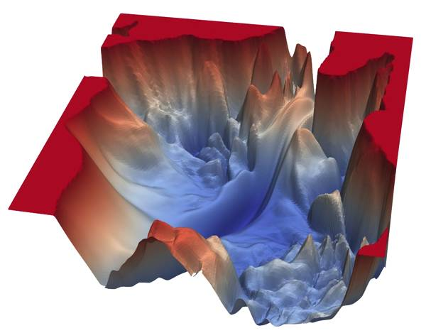

&emsp;&emsp;不同方向的**陡峭度**是不一样的，即不同维度的数值大小是不同。也就是说梯度下降的快慢是不同的：


<center class = "half">

</center>


&emsp;如果维度多了，就是**超平面**（了解一下霍金所说的宇宙十一维空间），很难画出来了，感受一下下面这张图的空间维度情况。


&emsp;&emsp;如果拿多元线性回归举例的话，因为多元线性回归的损失函数 MSE 是凸函数，所以我们可以把损失函数看成是一个碗。然后下面的图就是从碗上方去俯瞰！哪里是损失最小的地方呢？当然对应的就是碗底的地方！所以下图碗中心的地方颜色较浅的区域就是损失函数最小的地方。

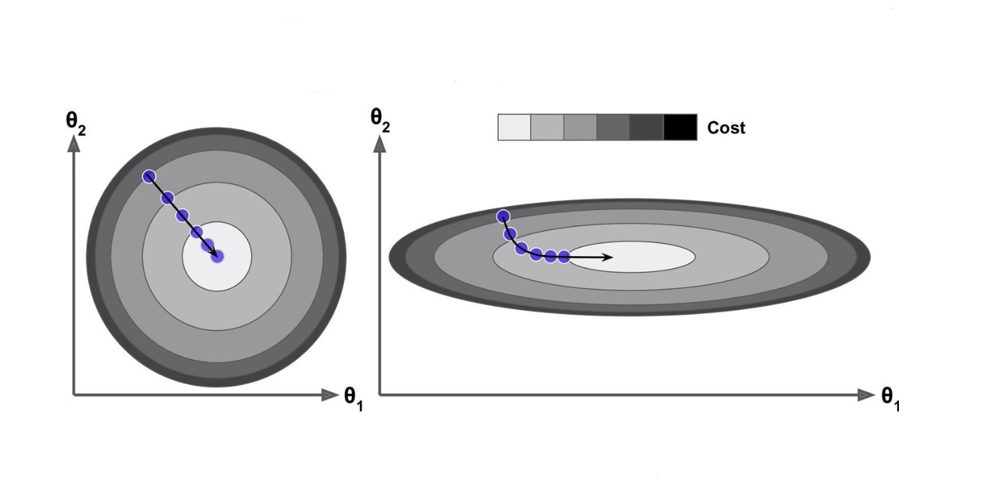

&emsp;&emsp;上面两张图都是进行梯度下降，你有没有发现，略有不同啊？两张图形都是鸟瞰图，左边的图形做了归一化处理，右边是没有做归一化的俯瞰图。

&emsp;&emsp;啥是归一化呢？请带着疑问跟我走~

&emsp;&emsp;我们先来说一下为什么没做归一化是右侧图示，举个例子假如我们客户数据信息，有两个维度，一个是用户的年龄，一个是用户的月收入，目标变量是快乐程度。

|  name  | age  | salary | happy |
| :----: | :--: | :----: | :---: |
| 路博通 |  36  |  7000  |  100  |
| 马老师 |  42  | 20000  |  180  |
| 赵老师 |  22  | 30000  |  164  |
|   ……   |  ……  |   ……   |  ……   |

&emsp;&emsp;我们可以里面写出线性回归公式， $y = \theta_1x_1 + \theta_2x_2 + b$ ，那么这样每一条样本不同维度对应的数量级不同，原因是每个维度对应的物理含义不同嘛，但是计算机能理解 36 和 7000 分别是年龄和收入吗？计算机只是拿到一堆数字而已。

&emsp;&emsp;我们把 $x_1$ 看成是年龄，$x_2$ 看成是收入， y 对应着快乐程度。机器学习就是在知道 X，y的情况下解方程组调整出最优解的过程。根据公式我们也可以发现 y 是两部分贡献之和，按常理来说，一开始并不知道两个部分谁更重要的情况下，可以想象为两部分对 y 的贡献是一样的即 $\theta_1x_1 = \theta_2x_2$ ，如果 $x_1 \ll x_2$ ，那么最终 $\theta_1 \gg \theta_2$ （<font color = 'red'>远大于</font>）。

&emsp;&emsp;这样是不是就比较好理解为什么之前右侧示图里为什么 $\theta_1 > \theta_2$ ，看起来就是椭圆。再思考一下，梯度下降第 1 步的操作，是不是所有的维度 $\theta$ 都是根据在期望 $\mu$ 为 0 方差 $\sigma$ 为 1 的正太分布随机生成的，说白了就是一开始的 $\theta_1$ 和 $\theta_2$ 数值是差不多的。所以可以发现 $\theta_1$ 从初始值到目标位置 $\theta_1^{target}$ 的距离要远大于 $\theta_2$ 从初始值到目标位置$\theta_2^{target}$。

&emsp;&emsp;因为 $x_1 \ll x_2$，根据梯度公式 $g_j= (h_{\theta}(x) - y)x_j$ ，得出 $g_1 \ll g_2$。根据梯度下降公式：$\theta_j^{n+1} = \theta_j^n - \eta * g_j$ 可知，每次调整 $\theta_1$ 的幅度 $\ll$ （<font color = 'red'>远小于</font>）  $\theta_2$ 的调整幅度。

&emsp;&emsp;总结一下 ，根据上面得到的两个结论 ，它俩之间是互相矛盾的 ，意味着最后 $\theta_2$ 需要比 $\theta_1$ 更少的迭代次数就可以收敛，而我们要最终求得最优解，就必须每个维度 $\theta$ 都收敛才可以，所以会出现 $\theta_2$ 等待 $\theta_1$ 收敛的情况。讲到这里对应图大家应该可以理解为什么右图是先顺着 $\theta_2$ 的坐标轴往下走再往右走的原因了吧。


**结论:**

&emsp;&emsp;归一化的一个目的是，使得梯度下降在不同维度 $\theta$ 参数（不同数量级）上，可以步调一致协同的进行梯度下降。这就好比社会主义，一小部分人先富裕起来了，先富带后富，这需要一定的时间，先富的这批人等待其他的人富裕起来；但是，更好途经是实现共同富裕，最后每个人都不能落下， 优化的步伐是一致的。

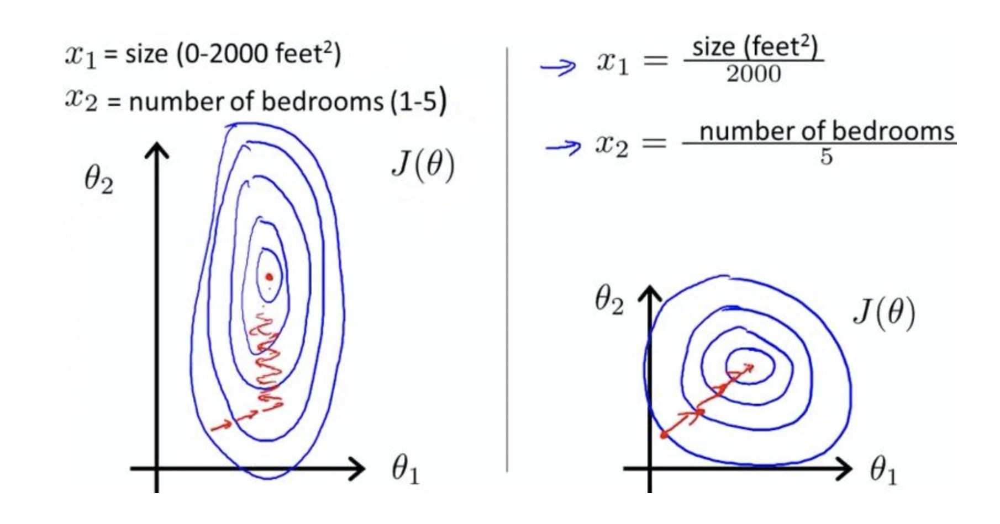

经过归一化处理，收敛的速度，明显快了！


#### 1.2、归一化本质

&emsp;&emsp;做归一化的目的是要实现**"共同富裕"**，而之所以梯度下降优化时不能达到步调一致的根本原因其实还是 $x_1$ 和 $x_2$ 的数量级不同。所以什么是归一化？

&emsp;&emsp;答案自然就出来了，就是把 $x_1$ 和 $x_2$ 的数量级统一，扩展一点说，如果有更多特征维度，就要把各个特征维度 $x_1、x_2、……、x_n$ 的数量级统一，来做到无量纲化。

#### 1.3、最大值最小值归一化

&emsp;&emsp;也称为离差标准化，是对原始数据的线性变换，**使结果值映射到[0 - 1]之间**。转换函数如下：

<font size = 12>$X^* = \frac{X - X\_min}{X\_max -X\_min}$</font>


&emsp;&emsp;其实我们很容易发现使用最大值最小值归一化（min-max标准化）的时候，优点是一定可以把数值归一到 0 ~ 1 之间，缺点是如果有一个<font color = 'red'>离群值</font>（比如马云的财富），正如我们举的例子一样，会使得一个数值为 1，其它数值都几乎为 0，所以受离群值的影响比较大！

**代码演示：**

```Python
import numpy as np
x_1 = np.random.randint(1,10,size = 10)
x_2 = np.random.randint(100,300,size = 10)
x = np.c_[x_1,x_2]
print('归一化之前的数据：')
display(x)
x_ = (x - x.min(axis = 0)) / (x.max(axis = 0) - x.min(axis = 0))
print('归一化之后的数据：')
display(x_)
```

**使用scikit-learn函数：**

```Python
import numpy as np
from sklearn.preprocessing import MinMaxScaler
x_1 = np.random.randint(1,10,size = 10)
x_2 = np.random.randint(100,300,size = 10)
x = np.c_[x_1,x_2]
print('归一化之前的数据：')
display(x)
min_max_scaler = MinMaxScaler()
x_ = min_max_scaler.fit_transform(x)
print('归一化之后的数据：')
display(x_)
```


#### 1.4、0-均值标准化

&emsp;&emsp;这种方法给予原始数据的均值（mean）和标准差（standard deviation）进行数据的标准化，也叫做Z-score标准化。经过处理的数据符合标准正态分布，即均值为0，标准差为1，转化函数为：

<font size = 12>$X^* = \frac{X - \mu}{\sigma}$</font>

其中μ为所有样本数据的均值，σ为所有样本数据的标准差。

$\mu = \frac{1}{n}\sum\limits_{i = 1}^nx_i$

$\sigma = \sqrt{\frac{1}{n}\sum\limits_{i = 1}^n(x_i - \mu)^2}$

&emsp;&emsp;相对于最大值最小值归一化来说，因为标准归一化除以了标准差，而标准差的计算会考虑到所有样本数据，所以受到离群值的影响会小一些，这就是除以方差的好处！但是，0-均值标准化不一定会把数据缩放到 0 ~ 1 之间了。既然是0均值，也就意味着，有正有负！

```Python
import numpy as np
x_1 = np.random.randint(1,10,size = 10)
x_2 = np.random.randint(100,300,size = 10)
x = np.c_[x_1,x_2]
print('归一化之前的数据：')
display(x)
x_ = (x - x.mean(axis = 0)) / x.std(axis = 0)
print('归一化之后的数据：')
display(x_)
```

**使用scikit-learn函数：**

```Python
import numpy as np
from sklearn.preprocessing import StandardScaler
x_1 = np.random.randint(1,10,size = 10)
x_2 = np.random.randint(100,300,size = 10)
x = np.c_[x_1,x_2]
print('归一化之前的数据：')
display(x)
standard_scaler = StandardScaler()
x_ = standard_scaler.fit_transform(x)
print('归一化之后的数据：')
display(x_)
```


&emsp;&emsp;那为什么要减去均值呢？其实做均值归一化还有一个特殊的好处（对比最大值最小值归一化，全部是正数0~1），我们来看一下梯度下降的式子，你就会发现 $\alpha$ 是正数，不管 A 是正还是负（ A 就是 $\hat{y} - y = h_{\theta}(x) - y$），对于所有的维度 X，比如这里的 $x_1$ 和 $x_2$ 来说，$\alpha$ 乘上 A 都是一样的符号，那么每次迭代的时候 $w_1^{t+1}$ 和 $w_2^{t+1}$ 的更新幅度符号也必然是一样的，这样就会像下图有右侧所示：要想从 $w_t$ 更新到 $w^*$ 就必然要么 $w_1$ 和 $w_2$ 同时变大再同时变小，或者就 $w_1$ 和 $w_2$ 同时变小再同时变大。不能如图上所示蓝色的最优解路径，即 $w_1$ 变小的同时 $w_2$ 变大！

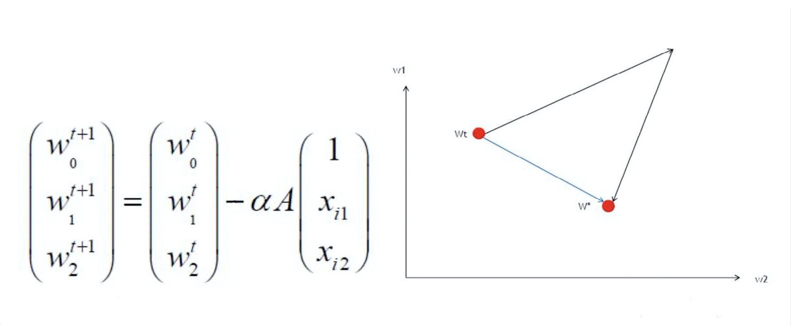

&emsp;&emsp;那我们如何才能做到让 $w_1$ 变小的时候 $w_2$ 变大呢？归其根本还是数据集 X 矩阵（经过min-max归一化）中的数据均为正数。所以如果我们可以让 $x_1$ 和 $x_2$ 它们符号不同，比如有正有负，其实就可以在做梯度下降的时候有更多的可能性去让更新尽可能沿着最优解路径去走。

&emsp;&emsp;结论：**0-均值标准化**处理数据之后，属性有正有负，可以让梯度下降沿着最优路径进行~


**注意：**

&emsp;&emsp;我们在做特征工程的时候，很多时候如果对训练集的数据进行了预处理，比如这里讲的归一化，那么未来对测试集的时候，和模型上线来新的数据的时候，都要进行**相同的**数据预处理流程，而且所使用的均值和方差是来自当时训练集的均值和方差!

&emsp;&emsp;因为我们人工智能要干的事情就是从训练集数据中找规律，然后利用找到的规律去预测新产生的数据。这也就是说假设训练集和测试集以及未来新来的数据是属于同分布的！从代码上面来说如何去使用训练集的均值和方差呢？就需要把 scaler 对象持久化， 回头模型上线的时候再加载进来去对新来的数据进行处理。

```Python
import joblib
joblib.dump(standard_scaler,'scale') # 持久化
standard_scaler = joblib.load('scale') # 加载
standard_scaler.transform(x) # 使用
```


### 2、正则化 Regularization

#### 2.1、过拟合欠拟合

1.  欠拟合（under fit）：还没有拟合到位，训练集和测试集的准确率都还没有到达最高，学的还不到位。
2.  过拟合（over fit）：拟合过度，训练集的准确率升高的同时，测试集的准确率反而降低。学的过度了（走火入魔），做过的卷子都能再次答对（死记硬背），考试碰到新的没见过的题就考不好（不会举一反三）。
3. 恰到好处（just right）：过拟合前，训练集和测试集准确率都达到巅峰。好比，学习并不需要花费很多时间，理解的很好，考试的时候可以很好的把知识举一反三。

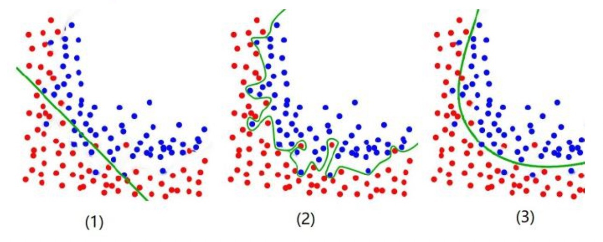

&emsp;&emsp;正则化就是防止过拟合，增加模型的**鲁棒性**，鲁棒是 Robust 的音译，也就是强壮的意思。就像计算机软件在面临攻击、网络过载等情况下能够不死机不崩溃，这就是软件的鲁棒性。鲁棒性调优就是让模型拥有更好的鲁棒性，也就是让模型的泛化能力和推广 能力更加的强大。

&emsp;&emsp;举例子说明：下面两个式子描述同一条直线那个更好？

$y = 0.3x_1 + 0.4x_2 + 0.5$

$y = 3x_1 + 4x_2 + 5$

&emsp;&emsp;第一个更好，因为下面的公式是上面的十倍，当 w 越小公式的容错的能力就越好。因为把测试数据带入公式中如果测试集原来是 [32, 128] 在带入的时候发生了一些偏差，比如说变成 [30, 120] ，第二个模型结果就会比第一个模型结果的偏差大的多。公式中 $y = W^Tx$ ，当 x 有一点错误，这个错误会通过 w 放大。但是 w 不能太小，当 w 太小时（比如都趋近0），模型就没有意义了，无法应用。想要有一定的容错率又要保证正确率就要由正则项来发挥作用了！

&emsp;&emsp;所以正则化(鲁棒性调优)的本质就是牺牲模型在训练集上的正确率来提高推广、泛化能力， W 在数值上越小越好，这样能抵抗数值的**扰动**。同时为了保证模型的正确率 W 又不能极小。 故而人们将原来的损失函数加上一个惩罚项，这里面损失函数就是原来固有的损失函数，比如回归的话通常是 MSE，分类的话通常是 cross entropy 交叉熵，然后在加上一部分惩罚项来使得计算出来的模型 W 相对小一些来带来泛化能力。

&emsp;&emsp;常用的惩罚项有L1 正则项或者 L2 正则项：

* $L_1 = ||w||_1 = \sum\limits_{i = 1}^n|w_i|$​              对应曼哈顿距离
* $L_2 = ||w||_2 = \sqrt{\sum\limits_{i = 1}^n(w_i)^2}$        对应欧氏距离

其实 L1 和 L2 正则的公式数学里面的意义就是范数，代表空间中向量到原点的距离：

$L_p = ||X||_p = \sqrt[p]{\sum\limits_{i = 1}^nx_i^p} , X = (x_1,x_2,……x_n)$

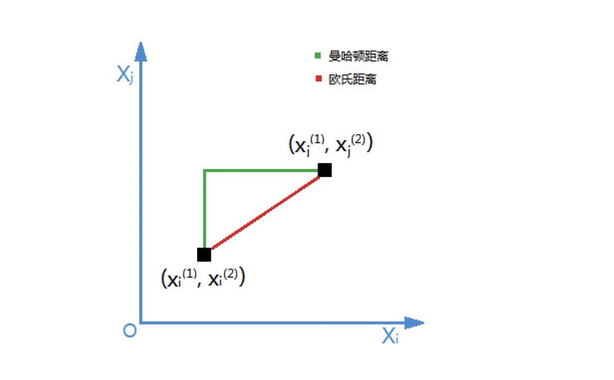

&emsp;&emsp;当我们把多元线性回归损失函数加上 L2 正则的时候，就诞生了 Ridge 岭回归。当我们把多元线性回归损失函数加上 L1 正则的时候，就孕育出来了 Lasso 回归。其实 L1 和 L2 正则项惩罚项可以加到任何算法的损失函数上面去提高计算出来模型的泛化能力的。

#### 2.2、套索回归（Lasso）

先从线性回归开始，其损失函数如下：

<font size = 12 color = 'purple'>$J(\theta) = \frac{1}{2}\sum\limits_{i = 1}^n(h_{\theta}(x^{(i)}) - y^{(i)})^2$</font>


L1正则化的损失函数，令$J_0 = J(\theta)$：

<font size = 12 color = 'green'>$J = J_0 + \alpha * \sum\limits_{i = 1}^n|w_i|$</font>

令  $L_1 = \alpha * \sum\limits_{i = 1}^n|w_i|$ ：

<font size = 12 color = 'green'>$J = J_0 + L_1$</font>


&emsp;&emsp;其中 $J_0$ 是原始的损失函数，加号后面的一项是L1正则化项， $\alpha$ 是正则化系数。注意到 L1正则化是权值的绝对值之和。$J$ 是带有绝对值符号的函数，因此 $J$ 是不完全可微的。机器学习的任务就是要通过一些方法（比如梯度下降）求出损失函数的最小值。当我们在原始损失函数 $J_0$ 后面添加L1正则项时，相当于对 $J_0$ 做了一个约束。令$L_1 = \alpha * \sum\limits_{i = 1}^n|w_i|$ ，则 $J = J_0 + L_1$ ，此时我们的任务变成在 $L_1$ 约束下求出 $J_0$ 取最小值的解。**考虑二维的情况**，即只有两个权值 $w_1、w_2$ ，此时 $L_1 = |w_1| + |w_2|$。 对于梯度下降法，求解 $J_0$ 过程可以画出等值线，同时 L1 正则化的函数 $L_1$ 也可以在 $w_1、w_2$所在的平面上画出来：


&emsp;&emsp;图中等值线是$J_0$的等值线，是椭圆形。黑色方框是 $L_1$ 函数的图形，$L_1 = |w_1| + |w_2|$ 这个函数画出来，就是一个方框。

&emsp;&emsp;在图中，当 $J_0$ 等值线与 $L_1$ 图形首次相交的地方就是最优解。上图中 $J_0$ 与 $L_1$ 在 $L_1$ 的一个顶点处相交，这个顶点就是最优解。注意到这个顶点的值是 $(w_1,w_2) = (0,w)$ 。可以直观想象，因为 $L_1$ 函数有很多『突出的角』（二维情况下四个，多维情况下更多）， $J_0$ 与这些角接触的机率会远大于与 $L_1$ 其它部位接触的机率（这是很直觉的想象，突出的角比直线的边离等值线更近写），而在这些角上，会有很多权值等于0（因为角就在坐标轴上），这就是为什么 L1 正则化可以产生稀疏模型（很多权重等于0了），进而可以用于特征选择。


&emsp;&emsp;而正则化前面的系数 $\alpha$，可以控制 $L_1$ 图形的大小。$\alpha$ 越小，$L_1$ 的图形越大（上图中的黑色方框）；$\alpha$ 越大，$L_1$ 的图形就越小，可以小到黑色方框只超出原点范围一点点，这是最优解的值$(w_1,w_2) = (0,w)$ 中的 w 可以取到很小的值的原因所在。


代码演示 $\alpha$ 取值大小对黑色方框的尺寸影响：

```Python
import matplotlib.pyplot as plt

# α 的值是：1
# 1 = x + y
# y = 1 -x
f = lambda x : 1- x
x = np.linspace(0,1,100)
plt.axis('equal')
plt.plot(x, f(x), color = 'green')

# α 的值是：3
# 1 = 3 * x + 3 * y
# y = 1/3 -x
f2 = lambda x : 1/3 - x 
x2 = np.linspace(0,1/3,100)
plt.plot(x2, f2(x2),color = 'red')

# 一些列设置
plt.xlim(-2,2)
plt.ylim(-2,2)
ax = plt.gca()
ax.spines['right'].set_color('None')  # 将图片的右框隐藏
ax.spines['top'].set_color('None')  # 将图片的上边框隐藏
ax.spines['bottom'].set_position(('data', 0)) # x轴出现在y轴的-1 位置
ax.spines['left'].set_position(('data', 0))
plt.savefig('./图片/13-alpha对方框影响.png',dpi = 200)
```


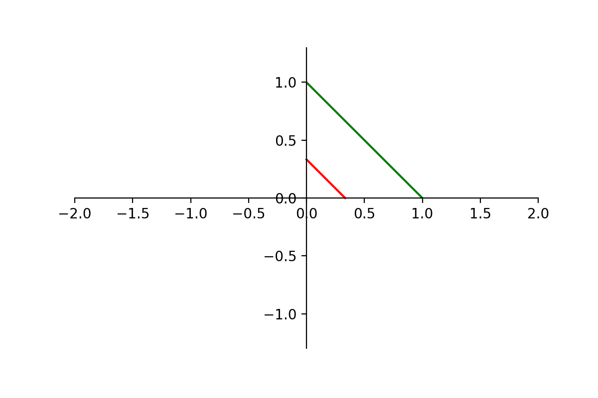

**权重更新规则如下：**

1. 损失函数：

<font size = 12 color = 'purple'>$J(\theta) = \frac{1}{2}\sum\limits_{i = 1}^n(h_{\theta}(x^{(i)}) - y^{(i)})^2$</font>

<font size = 12 color = 'purple'>$L_1  =  \alpha * \sum\limits_{i = 1}^n|w_i|$ </font>

<font size = 12 color = 'purple'>$J = J_0 + L_1$</font>

2. 更新规则：

<font size = 12 color = 'green'>$\theta_j^{n + 1} = \theta_j^{n} - \eta * \frac{\partial}{\partial \theta_j}J$</font>

<font size = 12 color = 'green'>$\theta_j^{n + 1} = \theta_j^{n} - \eta * \frac{\partial}{\partial \theta_j}(J_0 + L_1)$</font>

<font size = 12 color = 'green'>$\frac{\partial}{\partial \theta_j}J_0 =\sum\limits_{i = 1}^{n} (h_{\theta}(x^{(i)}) - y^{(i)} )x_j^{(i)} $</font>

<font size = 12 color = 'green'>$\frac{\partial}{\partial \theta_j}L_1 = \alpha * sgn(w_i) $</font>


其中 $J_0$ 即是线性回归的损失函数，$L_1$ 是添加的正则项。$sgn(w_i)$  表示符号函数、指示函数，值为：1 或 -1。

$sgn(w_i) = \begin{cases}1, &w_i > 0\\-1,&w_i < 0\end{cases}$ 

注意当 $w_i = 0$ 时不可导。

**综上所述**，L1正则化权重更新如下：

<font size = 6 color = 'red'>$\theta_j^{n + 1} = \theta_j^{n} -\eta\sum\limits_{i = 1}^{n} (h_{\theta}(x^{(i)}) - y^{(i)} )x_j^{(i)} - \eta*\alpha * sgn(w_i)$</font>

* Lasso回归和线性回归相比，多了一项：$-\eta * \alpha * sgn(w_i)$
* $\eta $ 大于零，表示梯度下降学习率
* $\alpha$ 大于零，表示L1正则化系数
* 当$w_i$为正时候  $sgn(w_i) = 1$，直接减去 $\eta * \alpha$ （大于0），所以正的 $w_i$ 变小了
* 当$w_i$为负时候  $sgn(w_i) = -1$，相当于直接加上 $\eta * \alpha$ （小于0），所以负的 $w_i$​ 变大了，绝对值变小，向0靠近


有的书本上公式会这样写，其中 $\lambda$ 表示L1正则化系数：

 <font size = 6 color = 'red'>$\theta_j^{n + 1} = \theta_j^{n} -\eta\sum\limits_{i = 1}^{n} (h_{\theta}(x^{(i)}) - y^{(i)} )x_j^{(i)} - \eta*\lambda * sgn(w_i)$</font>

#### 2.3、岭回归（Ridge）

也是先从线性回归开始，其损失函数如下：

<font size = 12 color = 'purple'>$J(\theta) = \frac{1}{2}\sum\limits_{i = 1}^n(h_{\theta}(x^{(i)}) - y^{(i)})^2$</font>


L2正则化的损失函数（对L2范数，进行了平方运算），令$J_0 = J(\theta)$：

<font size = 12 color = 'green'>$J = J_0 + \alpha * \sum\limits_{i = 1}^n(w_i)^2$</font>

令  $L_2 = \alpha * \sum\limits_{i = 1}^n(w_i)^2$ ：

<font size = 12 color = 'green'>$J = J_0 + L_2$</font>


同样可以画出他们在二维平面上的图形，如下：


二维平面下 L2 正则化的函数图形是个圆（绝对值的平方和，是个圆），与方形相比，被磨去了棱角。因此 $J_0$ 与  $L_2$ 相交时使得 $w_1、w_2$ 等于零的机率小了许多（这个也是一个很直观的想象），这就是为什么L2正则化不具有稀疏性的原因，因为不太可能出现多数 w 都为0的情况（这种情况就叫稀疏性）！


**权重更新规则如下：**

1. 损失函数：

<font size = 12 color = 'purple'>$J(\theta) = \frac{1}{2}\sum\limits_{i = 1}^n(h_{\theta}(x^{(i)}) - y^{(i)})^2$</font>

<font size = 12 color = 'purple'>$L_2  =  \alpha * \sum\limits_{i = 1}^n(w_i)^2$ </font>

<font size = 12 color = 'purple'>$J = J_0 + L_2$</font>

2. 更新规则：


<font size = 12 color = 'green'>$\theta_j^{n + 1} = \theta_j^{n} - \eta * \frac{\partial}{\partial \theta_j}J$</font>

<font size = 12 color = 'green'>$\theta_j^{n + 1} = \theta_j^{n} - \eta * \frac{\partial}{\partial \theta_j}(J_0 + L_2)$</font>


<font size = 12 color = 'green'>$\frac{\partial}{\partial \theta_j}J_0 =\sum\limits_{i = 1}^{n} (h_{\theta}(x^{(i)}) - y^{(i)} )x_j^{(i)} $</font>


<font size = 12 color = 'green'>$\frac{\partial}{\partial \theta_j}L_2 = 2\alpha w_i $</font>


其中 $J_0$ 即是线性回归的损失函数，$L_2$ 是添加的正则项。

**综上所述**，L2正则化权重更新如下（$2\alpha$ 也是常数项，可以合并到一起用整体 $\alpha$  替代）：

<font size = 6 color = 'red'>$\theta_j^{n + 1} = \theta_j^{n}(1-\eta * \alpha) -\eta *\sum\limits_{i = 1}^{n} (h_{\theta}(x^{(i)}) - y^{(i)} )x_j^{(i)}$</font>

其中 $\alpha$ 就是正则化参数，$\eta$ 表示学习率。从上式可以看到，与未添加L2正则化的迭代公式相比，每一次迭代， $\theta_j$ 都要先乘以一个小于1的因子（即 $(1-\eta * \alpha)$ ），从而使得 $\theta_j$ 加速减小，因此总的来看，$\theta$ 相比不加L2正则项的线性回归可以获得更小的值。从而，实现了防止过拟合的效果，增加模型的鲁棒性~


有的书本上，公式写法可能**不同**：其中 $\lambda$ 表示正则化参数。

<font size = 6 color = 'red'>$\theta_j^{n + 1} = \theta_j^{n}(1-\eta * \lambda) -\eta *\sum\limits_{i = 1}^{n} (h_{\theta}(x^{(i)}) - y^{(i)} )x_j^{(i)}$</font>


### 3、线性回归衍生算法

&emsp;&emsp;接下来，我们一起学习一下scikit-learn中为我们提供的线性回归衍生算法，根据上面所学的原理，对比线性回归加深理解。

#### 3.1、Ridge算法使用

这是scikit-learn官网给出的岭回归的，损失函数公式，注意，它用的矩阵表示，里面用到范数运算。

<font size = 12>$\underset{w}\min || X w - y||_2^2 + \alpha ||w||_2^2$</font>


L2正则化和普通线性回归系数对比：

```Python
import numpy as np
from sklearn.linear_model import Ridge
from sklearn.linear_model import SGDRegressor

# 1、创建数据集X，y
X = 2*np.random.rand(100, 5)
w = np.random.randint(1,10,size = (5,1))
b = np.random.randint(1,10,size = 1)
y = X.dot(w) + b + np.random.randn(100, 1)

print('原始方程的斜率：',w.ravel())
print('原始方程的截距：',b)

ridge = Ridge(alpha= 1, solver='sag')
ridge.fit(X, y)
print('岭回归求解的斜率：',ridge.coef_)
print('岭回归求解的截距：',ridge.intercept_)

# 线性回归梯度下降方法
sgd = SGDRegressor(penalty='l2',alpha=0,l1_ratio=0)
sgd.fit(X, y.reshape(-1,))
print('随机梯度下降求解的斜率是：',sgd.coef_)
print('随机梯度下降求解的截距是：',sgd.intercept_)
```


**结论：**

* 和没有正则项约束线性回归对比，可知L2正则化，将方程系数进行了缩小
* $\alpha$  增大求解出来的方程斜率变小
* Ridge回归源码解析：
  * alpha：正则项系数 
  * fit_intercept：是否计算 $w_0$ 截距项 
  * normalize：是否做归一化 
  * max_iter：最大迭代次数 
  * tol：结果的精确度
  * solver：优化算法的选择


#### 3.2、Lasso算法使用

这是scikit-learn官网给出的套索回归的，损失函数公式，注意，它用的矩阵表示，里面用到范数运算。

<font size = 12>$\underset{w}\min { \frac{1}{2n_{\text{samples}}} ||X w - y||_2 ^ 2 + \alpha ||w||_1}$</font>


公式中多了一项：<font size = 6>$\frac{1}{2n_{samples}}$</font>这是一个常数项，去掉之后，也不会影响损失函数公式计算。在岭回归中，就没有这项。


L1正则化和普通线性回归系数对比：

```Python
import numpy as np
from sklearn.linear_model import Lasso
from sklearn.linear_model import SGDRegressor

# 1、创建数据集X，y
X = 2*np.random.rand(100, 20)
w = np.random.randn(20,1)
b = np.random.randint(1,10,size = 1)
y = X.dot(w) + b + np.random.randn(100, 1)

print('原始方程的斜率：',w.ravel())
print('原始方程的截距：',b)

lasso = Lasso(alpha= 0.5)
lasso.fit(X, y)
print('套索回归求解的斜率：',lasso.coef_)
print('套索回归求解的截距：',lasso.intercept_)

# 线性回归梯度下降方法
sgd = SGDRegressor(penalty='l2',alpha=0, l1_ratio=0)
sgd.fit(X, y.reshape(-1,))
print('随机梯度下降求解的斜率是：',sgd.coef_)
print('随机梯度下降求解的截距是：',sgd.intercept_)
```


**结论：**

* 和没有正则项约束线性回归对比，可知L1正则化，将方程系数进行了缩减，部分系数为0，产生稀疏模型
* $\alpha$  越大，模型稀疏性越强，越多的参数为0
* Lasso回归源码解析：
  * alpha：正则项系数 
  * fit_intercept：是否计算 $w_0$ 截距项 
  * normalize：是否做归一化 
  * precompute：bool 类型，默认值为False，决定是否提前计算Gram矩阵来加速计算
  * max_iter：最大迭代次数 
  * tol：结果的精确度
  * warm_start：bool类型，默认值为False。如果为True，那么使⽤用前⼀次训练结果继续训练。否则从头开始训练


#### 3.3、Elastic-Net算法使用

这是scikit-learn官网给出的弹性网络回归的，损失函数公式，注意，它用的矩阵表示，里面用到范数运算。

<font size = 6>$\underset{w}\min { \frac{1}{2n_{\text{samples}}} ||X w - y||_2 ^ 2 + \alpha \rho ||w||_1 +
\frac{\alpha(1-\rho)}{2} ||w||_2 ^ 2}$</font>


&emsp;&emsp;Elastic-Net 回归，即岭回归和Lasso技术的混合。弹性网络是一种使用 L1， L2 范数作为先验正则项训练的线性回归模型。 这种组合允许学习到一个只有少量参数是非零稀疏的模型，就像 Lasso 一样，但是它仍然保持一些像 Ridge 的正则性质。我们可利用 l1_ratio 参数控制 L1 和 L2 的凸组合。

&emsp;&emsp;弹性网络在很多特征互相联系（相关性，比如**身高**和**体重**就很有关系）的情况下是非常有用的。Lasso 很可能只随机考虑这些特征中的一个，而弹性网络更倾向于选择两个。

&emsp;&emsp;在实践中，Lasso 和 Ridge 之间权衡的一个优势是它允许在迭代过程中继承 Ridge 的稳定性。


弹性网络回归和普通线性回归系数对比：

```Python
import numpy as np
from sklearn.linear_model import ElasticNet
from sklearn.linear_model import SGDRegressor

# 1、创建数据集X，y
X = 2*np.random.rand(100, 20)
w = np.random.randn(20,1)
b = np.random.randint(1,10,size = 1)
y = X.dot(w) + b + np.random.randn(100, 1)

print('原始方程的斜率：',w.ravel())
print('原始方程的截距：',b)

model = ElasticNet(alpha= 1, l1_ratio = 0.7)
model.fit(X, y)
print('弹性网络回归求解的斜率：',model.coef_)
print('弹性网络回归求解的截距：',model.intercept_)

# 线性回归梯度下降方法
sgd = SGDRegressor(penalty='l2',alpha=0, l1_ratio=0)
sgd.fit(X, y.reshape(-1,))
print('随机梯度下降求解的斜率是：',sgd.coef_)
print('随机梯度下降求解的截距是：',sgd.intercept_)
```


**结论：**

* 和没有正则项约束线性回归对比，可知Elastic-Net网络模型，融合了L1正则化L2正则化
* Elastic-Net 回归源码解析：
  * alpha：混合惩罚项的常数
  * l1_ratio：弹性网混合参数，0 <= l1_ratio <= 1，对于 l1_ratio = 0，惩罚项是L2正则惩罚。对于 l1_ratio = 1是L1正则惩罚。对于 0 
  * fit_intercept：是否计算 $w_0$ 截距项 
  * normalize：是否做归一化 
  * precompute：bool 类型，默认值为False，决定是否提前计算Gram矩阵来加速计算
  * max_iter：最大迭代次数 
  * tol：结果的精确度
  * warm_start：bool类型，默认值为False。如果为True，那么使⽤用前⼀次训练结果继续训练。否则从头开始训练


### 4、多项式回归

#### 4.1、多项式回归基本概念

&emsp;&emsp;升维的目的是为了去解决欠拟合的问题的，也就是为了提高模型的准确率为目的的，因为当维度不够时，说白了就是对于预测结果考虑的因素少的话，肯定不能准确的计算出模型。

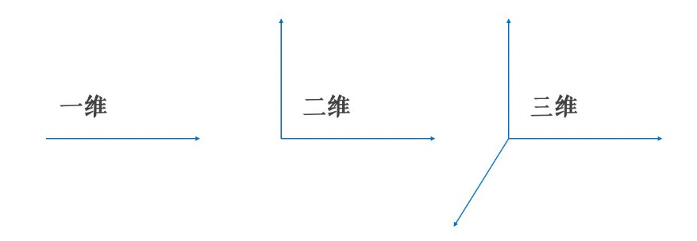

&emsp;&emsp;在做升维的时候，最常见的手段就是将已知维度进行相乘（或者自乘）来构建新的维度，如下图所示。普通线性方程，无法拟合规律，必须是多项式，才可以完美拟合曲线规律，图中是二次多项式。

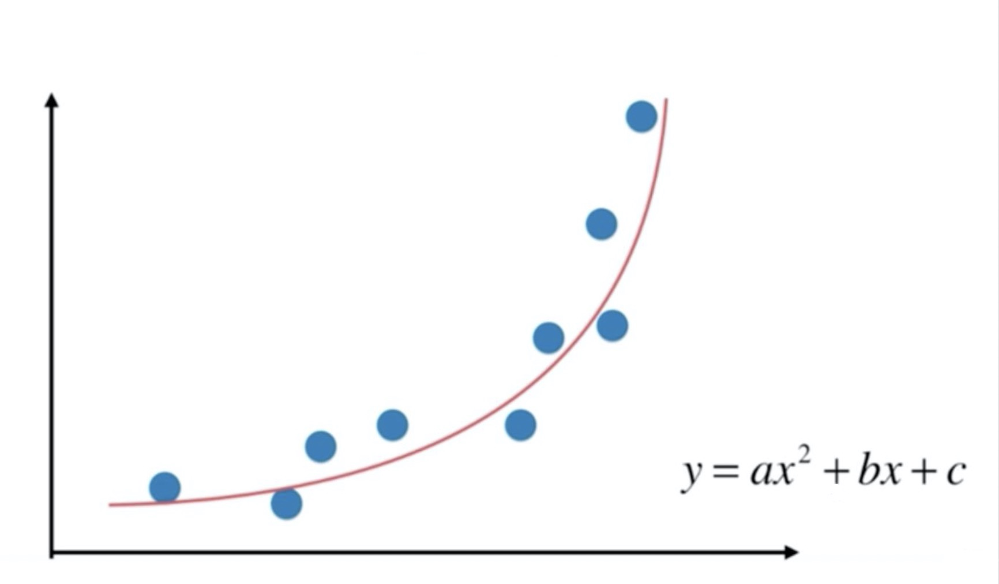

&emsp;&emsp;对于多项式回归来说主要是为了扩展线性回归算法来适应更广泛的数据集，比如我们数据集有两个维度 $x_1、x_2$，那么用多元线性回归公式就是：$\hat{y} = w_0 + w_1x_1 + w_2x_2$，当我们使用二阶多项式升维的时候，数据集就从原来的 $x_1、x_2$扩展成了$x_1、x_2、x_1^2、x_2^2、x_1x_2$ 。因此多元线性回归就得去多计算三个维度所对应的w值：$\hat{y} = w_0 + w_1x_1 + w_2x_2 + w_3x_1^2 + w_4x_2^2 + w_5x_1x_2$ 。

&emsp;&emsp;此时拟合出来的方程就是曲线，可以解决一些线性回归的欠拟合问题！

#### 4.2、多项式回归实战1.0

```Python
import numpy as np
import matplotlib.pyplot as plt
from sklearn.linear_model import LinearRegression

# 1、创建数据，并进行可视化
X = np.linspace(-1,11,num = 100)
y = (X - 5)**2 + 3*X -12 + np.random.randn(100)
X = X.reshape(-1,1)
plt.scatter(X,y)

# 2、创建预测数据
X_test = np.linspace(-2,12,num = 200).reshape(-1,1)

# 3、不进行升维 + 普通线性回归
model_1 = LinearRegression()
model_1.fit(X,y)
y_test_1 = model_1.predict(X_test)
plt.plot(X_test,y_test,color = 'red')

# 4、多项式升维 + 普通线性回归
X = np.concatenate([X,X**2],axis = 1)
model_2 = LinearRegression()
model_2.fit(X,y)
# 5、测试数据处理，并预测
X_test = np.concatenate([X_test,X_test**2],axis = 1)
y_test_2 = model_2.predict(X_test)

# 6、数据可视化，切片操作
plt.plot(X_test[:,0],y_test_2,color = 'green')
```

**结论：**

* 不进行多项式升维，拟合出来的曲线，是线性的直线，和目标曲线无法匹配
* 使用np.concatenate()进行简单的，幂次合并，注意数据合并的方向axis = 1
* 数据可视化时，注意切片，因为数据升维后，多了平方这一维

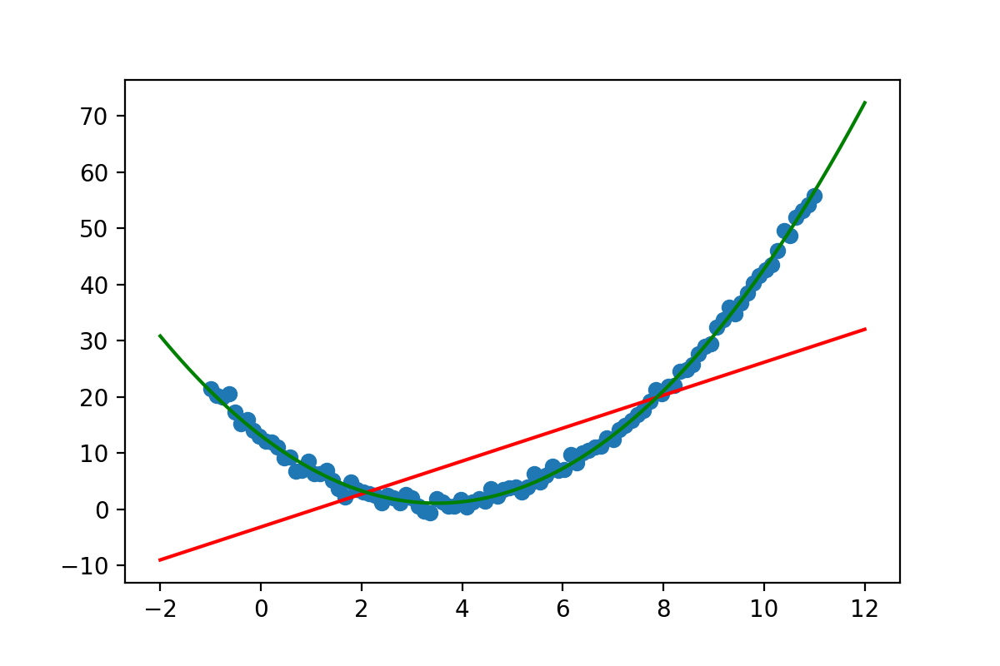


#### 4.3、多项式回归实战2.0

```Python
import numpy as np
import matplotlib.pyplot as plt
from sklearn.preprocessing import PolynomialFeatures,StandardScaler
from sklearn.linear_model import SGDRegressor

# 1、创建数据，并进行可视化
X = np.linspace(-1,11,num = 100)
y = (X - 5)**2 + 3*X -12 + np.random.randn(100)
X = X.reshape(-1,1)
plt.scatter(X,y)

# 2、创建预测数据
X_test = np.linspace(-2,12,num = 200).reshape(-1,1)

# 3、使用PolynomialFeatures进行特征升维
poly = PolynomialFeatures()
poly.fit(X,y)
X = poly.transform(X)
s = StandardScaler()
X = s.fit_transform(X)
# model = SGDRegressor(penalty='l2',eta0 = 0.0001,max_iter = 10000)
model = SGDRegressor(penalty='l2',eta0 = 0.01)
model.fit(X,y)

# 4、预测数据
X_test = poly.transform(X_test)
X_test_norm = s.transform(X_test)
y_test = model.predict(X_test_norm)
plt.plot(X_test[:,1],y_test,color = 'green')
```

**结论：**

* eta0表示学习率，设置合适的学习率，才能拟合成功
* 多项式升维，需要对数据进行Z-score归一化处理，效果更佳出色
* SGD随机梯度下降需要调整参数，以使模型适应数据

<center class = "half">

</center>


### 5、代码实战天猫双十一销量预测

&emsp;&emsp;天猫双十一，从2009年开始举办，第一届成交额仅仅0.5亿，后面呈现了爆发式的增长，那么这些增长是否有规律呢？是怎么样的规律，该如何分析呢？我们使用多项式回归一探究竟！

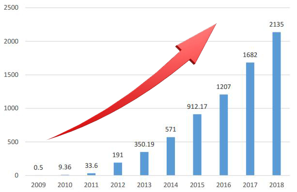

数据可视化，历年天猫双十一销量数据：

```Python
import numpy as np
from sklearn.linear_model import SGDRegressor
import matplotlib.pyplot as plt
plt.rcParams['font.size'] = 18
plt.figure(figsize=(9,6))

# 创建数据，年份数据2009 ~ 2019
X = np.arange(2009,2020)
y = np.array([0.5,9.36,52,191,350,571,912,1207,1682,2135,2684])
plt.bar(X,y,width = 0.5,color = 'green')
plt.plot(X,y,color = 'red')
_ = plt.xticks(ticks = X)
```

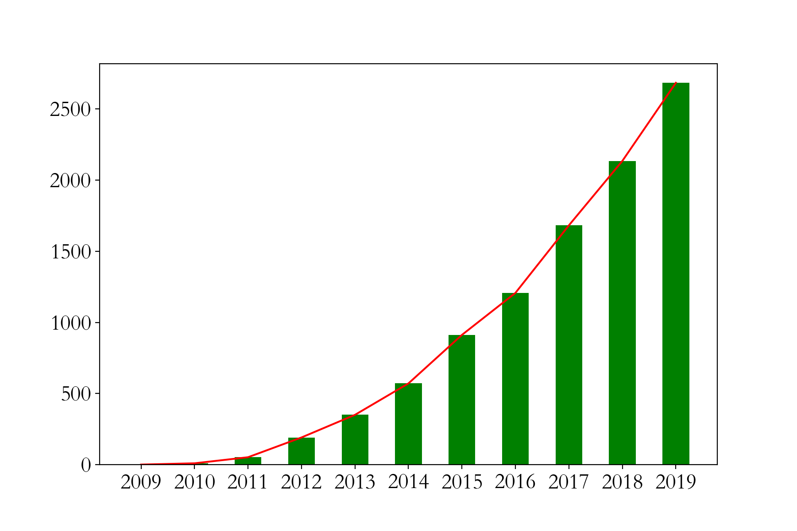

有图可知，在一定时间内，随着经济的发展，天猫双十一销量与年份的关系是多项式关系！假定，销量和年份之间关系是三次幂关系：

<font size = 8>$f(x) = w_1x + w_2x^2 + w_3x^3 + b$</font>


```Python
import numpy as np
from sklearn.linear_model import SGDRegressor
import matplotlib.pyplot as plt
from sklearn.preprocessing import PolynomialFeatures
from sklearn.preprocessing import StandardScaler
plt.figure(figsize=(12,9))

# 1、创建数据，年份数据2009 ~ 2019
X = np.arange(2009,2020)
y = np.array([0.5,9.36,52,191,350,571,912,1207,1682,2135,2684])

# 2、年份数据，均值移除，防止某一个特征列数据天然的数值太大而影响结果
X = X - X.mean()
X = X.reshape(-1,1)

# 3、构建多项式特征，3次幂
poly = PolynomialFeatures(degree=3)
X = poly.fit_transform(X)
s = StandardScaler()
X_norm = s.fit_transform(X)

# 4、创建模型
model = SGDRegressor(penalty='l2',eta0 = 0.5,max_iter = 5000)
model.fit(X_norm,y)

# 5、数据预测
X_test = np.linspace(-5,6,100).reshape(-1,1)
X_test = poly.transform(X_test)
X_test_norm = s.transform(X_test)
y_test = model.predict(X_test_norm)

# 6、数据可视化
plt.plot(X_test[:,1],y_test,color = 'green')
plt.bar(X[:,1],y)
plt.bar(6,y_test[-1],color = 'red')
plt.ylim(0,4096)
plt.text(6,y_test[-1] + 100,round(y_test[-1],1),ha = 'center')
_ = plt.xticks(np.arange(-5,7),np.arange(2009,2021))
```

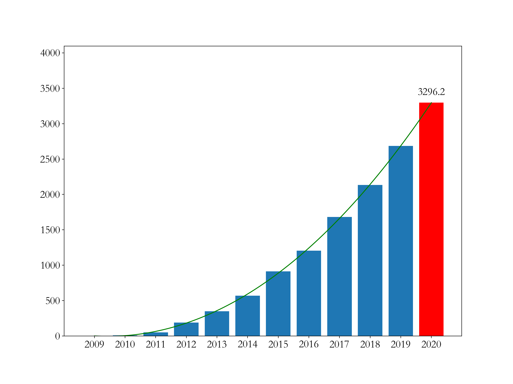

**结论：**

* 数据预处理，均值移除。如果特征**基准值和分散度**不同在某些算法（例如回归算法，KNN等）上可能会大大影响了模型的预测能力。通过均值移除，大大增强数据的**离散化**程度。
* 多项式升维，需要对数据进行Z-score归一化处理，效果更佳出色
* SGD随机梯度下降需要调整参数，以使模型适应多项式数据
* 从2020年开始，天猫双十一统计的成交额改变了规则为11.1日~11.11日的成交数据（之前的数据为双十一当天的数据），2020年成交额为**4980**亿元
* 可以，经济发展有其客观规律，前11年高速发展（曲线基本可以反应销售规律），到2020年是一个转折点


### 6、代码实战中国人寿保费预测

#### 6.1、数据加载与介绍

```Python
import numpy as np
import pandas as pd
data = pd.read_excel('./中国人寿.xlsx')
print(data.shape)
data.head()
```

数据介绍：

* 共计1338条保险数据，每条数据7个属性
* 最后一列charges是保费
* 前面6列是特征，分别为：年龄、性别、体重指数、小孩数量、是否抽烟、所在地区


#### 6.2、EDA数据探索

```Python
import seaborn as sns
# 性别对保费影响
sns.kdeplot(data['charges'],shade = True,hue = data['sex'])

# 地区对保费影响
sns.kdeplot(data['charges'],shade = True,hue = data['region'])

# 吸烟对保费影响
sns.kdeplot(data['charges'],shade = True,hue = data['smoker'])

# 孩子数量对保费影响
sns.kdeplot(data['charges'],shade = True,hue = data['children'],palette='Set1')
```


<center class = "half">

</center>

<center class = "half">

</center>

总结：

* 不同性别对保费影响不大，不同性别的保费的概率分布曲线基本重合，因此这个特征无足轻重，可以删除
* 地区同理
* 吸烟与否对保费的概率分布曲线差别很大，整体来说不吸烟更加健康，那么保费就低，这个特征很重要
* 家庭孩子数量对保费有一定影响


#### 6.3、特征工程

```Python
data = data.drop(['region', 'sex'], axis=1)
data.head() # 删除不重要特征

# 体重指数，离散化转换，体重两种情况：标准、肥胖
def convert(df,bmi):
    df['bmi'] = 'fat' if df['bmi'] >= bmi else 'standard'
    return df
data = data.apply(convert, axis = 1, args=(30,))
data.head()

# 特征提取，离散型数据转换为数值型数据
data = pd.get_dummies(data)
data.head()

# 特征和目标值抽取
X = data.drop('charges', axis=1) # 训练数据
y = data['charges'] # 目标值
X.head()
```


#### 6.4、特征升维

```Python
from sklearn.linear_model import LinearRegression
from sklearn.linear_model import ElasticNet
from sklearn.metrics import mean_squared_error,mean_squared_log_error

# 数据拆分
from sklearn.model_selection import train_test_split
from sklearn.preprocessing import PolynomialFeatures
X_train, X_test, y_train, y_test = train_test_split(X, y, test_size=0.2)

# 特征升维
poly = PolynomialFeatures(degree= 2, include_bias = False)
X_train_poly = poly.fit_transform(X_train)
X_test_poly = poly.fit_transform(X_test)
```


#### 6.5、模型训练与评估

普通线性回归：

```Python
model_1 = LinearRegression()
model_1.fit(X_train_poly, y_train)
print('测试数据得分：',model_1.score(X_train_poly,y_train))
print('预测数据得分：',model_1.score(X_test_poly,y_test))
print('训练数据均方误差：',np.sqrt(mean_squared_error(y_train,model_1.predict(X_train_poly))))
print('测试数据均方误差：',np.sqrt(mean_squared_error(y_test,model_1.predict(X_test_poly))))

print('训练数据对数误差：',np.sqrt(mean_squared_log_error(y_train,model_1.predict(X_train_poly))))
print('测试数据对数误差：',np.sqrt(mean_squared_log_error(y_test,model_1.predict(X_test_poly))))
```

弹性网络回归：

```Python
model_2 = ElasticNet(alpha = 0.3,l1_ratio = 0.5,max_iter = 50000)
model_2.fit(X_train_poly,y_train)
print('测试数据得分：',model_2.score(X_train_poly,y_train))
print('预测数据得分：',model_2.score(X_test_poly,y_test))

print('训练数据均方误差为：',np.sqrt(mean_squared_error(y_train,model_2.predict(X_train_poly))))
print('测试数据均方误差为：',np.sqrt(mean_squared_error(y_test,model_2.predict(X_test_poly))))

print('训练数据对数误差为：',np.sqrt(mean_squared_log_error(y_train,model_2.predict(X_train_poly))))
print('测试数据对数误差为：',np.sqrt(mean_squared_log_error(y_test,model_2.predict(X_test_poly))))
```


**结论：**

* 进行EDA数据探索，可以查看无关紧要特征
* 进行特征工程：删除无用特征、特征离散化、特征提取。这对机器学习都至关重要
* 对于简单的数据（特征比较少）进行线性回归，一般需要进行特征升维
* 选择不同的算法，进行训练和评估，从中筛选优秀算法