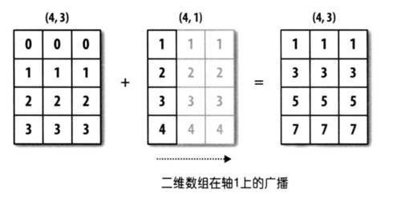

[toc]

# NumPy科学计算库

### 课程介绍

NumPy（Numerical Python）是Python的一种开源的数值计算扩展。提供多维数组对象，各种派生对象（如掩码数组和矩阵），这种工具可用来存储和处理大型矩阵，比Python自身的嵌套列表（nested list structure)结构要高效的多（该结构也可以用来表示矩阵（matrix）），支持大量的维度数组与矩阵运算，此外也针对数组运算提供大量的数学函数库，包括数学、逻辑、形状操作、排序、选择、输入输出、离散傅立叶变换、基本线性代数，基本统计运算和随机模拟等等。

- 几乎所有从事Python工作的数据分析师都利用NumPy的强大功能。
  - 强大的N维数组
  - 成熟的广播功能
  - 用于整合C/C++和Fortran代码的工具包
  - NumPy提供了全面的数学功能、随机数生成器和线性代数功能
  
- 安装Python库

- 第一种方式：

  - pip install jupyter -i https://pypi.tuna.tsinghua.edu.cn/simple
  - pip install numpy -i https://pypi.tuna.tsinghua.edu.cn/simple

- 第二种方式：

  - 直接安装[anaconda下载](https://www.anaconda.com/products/individual#Downloads)

  - 注意：Add Path！！！ 添加一下环境变量~

    

  * 百度网盘链接: https://pan.baidu.com/s/1sQ8LMH6q8ezVUzNjSCtgyQ 提取码: sm7m 

- 启动终端

  * Windows----> 快捷键：**win + R** ----->输入：**cmd**回车------>命令行出来

  - Mac ---->启动终端

- 启动jupyter

  - 进入终端输入指令:**jupyter notebook**
  - 在哪里启动jupyter启动，浏览器上的目录，对应哪里，windows默认路径是：**C:\Users\lufengkun**
  - **C:\Users\xxx**

## 第一部分 基本操作

### 第一节  数组创建

创建数组的最简单的方法就是使用array函数，将Python下的list转换为ndarray。

```python
import numpy as np
l = [1,3,5,7,9] # 列表
arr = np.array(l) # 将列表转换为NumPy数组
arr # 数据一样，NumPy数组的方法，功能更加强大
# 输出为
# array([1, 3, 5, 7, 9])
```

我们可以利用np中的一些内置函数来创建数组，比如我们创建全0的数组，也可以创建全1数组，全是其他数字的数组，或者等差数列数组，正态分布数组，随机数。

```python
import numpy as np
arr1 = np.ones(10) # 输出为：array([1., 1., 1., 1., 1., 1., 1., 1., 1., 1.])
arr2 = np.zeros(10) # 输出为： array([0., 0., 0., 0., 0., 0., 0., 0., 0., 0.])
arr3 = np.full(shape = [2,3],fill_value=2.718) 
# 输出为：
# array([[2.718, 2.718, 2.718],
#       [2.718, 2.718, 2.718]])
arr4 = np.arange(start = 0,stop = 20,step = 2) 
# 等差数列 输出为：array([ 0,  2,  4,  6,  8, 10, 12, 14, 16, 18])
arr5 = np.linspace(start =0,stop = 9,num = 10) 
# 等差数列 输出为：array([0., 1., 2., 3., 4., 5., 6., 7., 8., 9.])
arr6 = np.random.randint(0,100,size = 10) 
# int随机数 输出为：array([ 4,  8, 79, 62, 34, 35,  2, 65, 47, 18])
arr7 = np.random.randn(5) 
# 正态分布 输出为：array([ 0.57807872,  0.37922855,  2.37936837, -0.28688769,  0.2882854 ])
arr8 = np.random.random(size = 5) 
# float 随机数 输出为：array([0.59646412, 0.37960586, 0.38077327, 0.76983539, 0.22689201])
```

### 第二节  查看操作

* jupyter扩展插件（不安装）
  * pip install jupyter_contrib_nbextensions -i https://pypi.tuna.tsinghua.edu.cn/simple
  * pip install jupyter_nbextensions_configurator -i https://pypi.tuna.tsinghua.edu.cn/simple
  * jupyter contrib nbextension install --user
  * jupyter nbextensions_configurator enable --user
  * **退出，重新进入jupyter notebook就可以了**

NumPy的数组类称为ndarray，也被称为别名 array。请注意，numpy.array这与标准Python库类不同array.array，后者仅处理一维数组且功能较少。ndarray对象的重要属性是

#### 1.2.1 数组的轴数、维度

```python
import numpy as np 
arr = np.random.randint(0,100,size = (3,4,5))
arr.ndim # 输出 3
```

#### 1.2.2 数组尺寸形状

```python
import numpy as np 
arr = np.random.randint(0,100,size = (3,4,5))
arr.shape # 输出 (3,4,5)
```

#### 1.2.3 数组元素的总数

```python
import numpy as np 
arr = np.random.randint(0,100,size = (3,4,5))
arr.size # 输出 3*4*5 = 60
```

#### 1.2.4 数据类型

```python
import numpy as np 
arr = np.random.randint(0,100,size = (3,4,5))
arr.dtype # 输出 dtype('int64')
```

#### 1.2.5 数组中每个元素的大小（以字节为单位）

```python
import numpy as np 
arr = np.random.randint(0,100,size = (3,4,5))
arr.itemsize #输出是 8 ，因为数据类型是int64，64位，一个字节是8位，所以64/8 = 8
```

### 第三节 文件IO操作

#### 1.3.1 保存数组

save方法保存ndarray到一个npy文件，也可以使用savez将多个array保存到一个.npz文件中

```python
x = np.random.randn(5)
y = np.arange(0,10,1)
#save方法可以存一个ndarray
np.save("x_arr",x)
#如果要存多个数组，要是用savez方法，保存时以key-value形式保存，key任意（xarr、yarr）
np.savez("some_array.npz",xarr = x,yarr=y)
```

#### 1.3.2 读取

load方法来读取存储的数组，如果是.npz文件的话，读取之后相当于形成了一个key-value类型的变量，通过保存时定义的key来获取相应的array

```python
np.load('x_arr.npy') # 直接加载

# 通过key获取保存的数组数据
np.load('some_array.npz')['yarr']
```

#### 1.3.3 读写csv、txt文件

```python
arr = np.random.randint(0,10,size = (3,4))
#储存数组到txt文件
np.savetxt("arr.csv",arr,delimiter=',') # 文件后缀是txt也是一样的
#读取txt文件，delimiter为分隔符，dtype为数据类型
np.loadtxt("arr.csv",delimiter=',',dtype=np.int32)
```

## 第二部分 数据类型

ndarray的数据类型：

- int: int8、uint8、int16、int32、int64
- float: float16、float32、float64
- str

### array创建时，指定

```python
import numpy as np
np.array([1,2,5,8,2],dtype = 'float32') 
# 输出 ：array([1., 2., 5., 8., 2.], dtype=float32)
```

### asarray转换时指定

```python
import numpy as np
arr = [1,3,5,7,2,9,0]
# asarray 将列表进行变换
np.asarray(arr,dtype = 'float32') 
# 输出：array([1., 3., 5., 7., 2., 9., 0.], dtype=float32)
```

### 数据类型转换astype

```python
import numpy as np
arr = np.random.randint(0,10,size = 5,dtype = 'int16') 
# 输出：array([6, 6, 6, 6, 3], dtype=int16)
# 使用astype进行转换
arr.astype('float32') # 输出：array([1., 4., 0., 6., 6.], dtype=float32)
```

## 第三部分 数组运算

### 加减乘除幂运算

```python
import numpy as np
arr1 = np.array([1,2,3,4,5])
arr2 = np.array([2,3,1,5,9])
arr1 - arr2 # 减法
arr1 * arr2 # 乘法
arr1 / arr2 # 除法
arr1**arr2 # 两个星号表示幂运算
```

### 逻辑运算

```python
import numpy as np
arr1 = np.array([1,2,3,4,5])
arr2 = np.array([1,0,2,3,5])
arr1 < 5
arr1 >= 5
arr1 == 5
arr1 == arr2
arr1 > arr2
```
### 数组与标量计算

数组与标量的算术运算也会将标量值传播到各个元素

```python
import numpy as np
arr = np.arange(1,10)
1/arr
arr+5
arr*5
```
### *=、+=、-=操作 

某些操作（例如+=和*=）只会修改现有数组，而不是创建一个新数组。

```python
import numpy as np
arr1 = np.arange(5)
arr1 +=5
arr1 -=5
arr1 *=5
# arr1 /=5 不支持运算
```

## 第四部分 复制和视图

在操作数组时，有时会将其数据复制到新数组中，有时不复制。

对于初学者来说，这通常会引起混乱。有以下三种情况

### 完全没有复制

```python
import numpy as np
a = np.random.randint(0,100,size = (4,5))
b = a
a is b # 返回True a和b是两个不同名字对应同一个内存对象
b[0,0] = 1024 # 命运共同体
display(a,b)
```

### 查看或浅拷贝

不同的数组对象可以共享相同的数据。该view方法创建一个查看相同数据的新数组对象

```python
import numpy as np
a = np.random.randint(0,100,size = (4,5))
b = a.view() # 使用a中的数据创建一个新数组对象
a is b # 返回False a和b是两个不同名字对应同一个内存对象
b.base is a # 返回True，b视图的根数据和a一样
b.flags.owndata # 返回False b中的数据不是其自己的
a.flags.owndata # 返回True a中的数据是其自己的
b[0,0] = 1024 # a和b的数据都发生改变
display(a,b)
```

### 深拷贝

```python
import numpy as np
a = np.random.randint(0,100,size = (4,5))
b = a.copy()
b is a # 返回False
b.base is a # 返回False
b.flags.owndata # 返回True
a.flags.owndata # 返回True
b[0,0] = 1024 # b改变，a不变，分道扬镳
display(a,b)
```

* copy应该在不再需要原来的数组情况下，切片后调用。例如，假设a是一个巨大的中间结果，而最终结果b仅包含的一小部分a，则在b使用切片进行构造时应制作一个深拷贝：

  ```python
  import numpy as np
  a = np.arange(1e8)
  b = a[::1000000].copy() # 每100万个数据中取一个数据
  del a # 不在需要a，删除占大内存的a
  b.shape # shape(100,)
  ```
## 第五部分 索引、切片和迭代

### 第一节 基本索引和切片

numpy中数组切片是原始数组的视图，这意味着数据不会被复制，视图上任何数据的修改都会反映到原数组上

```python
arr = np.array([0,1,2,3,4,5,6,7,8,9])
arr[5] #索引 输出 5
arr[5:8] #切片输出：array([5, 6, 7])
arr[2::2] # 从索引2开始每两个中取一个 输出 array([2, 4, 6, 8])
arr[::3] # 不写索引默认从0开始，每3个中取一个 输出为 array([0, 3, 6, 9])
arr[1:7:2] # 从索引1开始到索引7结束，左闭右开，每2个数中取一个 输出 array([1, 3, 5])
arr[::-1] # 倒序 输出 array([9, 8, 7, 6, 5, 4, 3, 2, 1, 0])
arr[::-2] # 倒序 每两个取一个 输出  array([9, 7, 5, 3, 1])
arr[5:8]=12 # 切片赋值会赋值到每个元素上，与列表操作不同
temp = arr[5:8]
temp[1] = 1024
arr # 输出：array([   0,    1,    2,    3,    4,   12, 1024,   12,    8,    9])
```

对于二维数组或者高维数组，我们可以按照之前的知识来索引，当然也可以传入一个以逗号隔开的索引列表来选区单个或多个元素

```python
arr2d = np.array([[1,3,5],[2,4,6],[-2,-7,-9],[6,6,6]]) # 二维数组 shape(3,4)
arr2d[0,-1] #索引 等于arr2d[0][-1] 输出 5
arr2d[0,2]  #索引 等于arr2d[0][2] ==  arr2d[0][-1] 输出 5

arr2d[:2,-2:] #切片 第一维和第二维都进行切片 等于arr2d[:2][:,1:] 
arr2d[:2,1:] #切片 1 == -2 一个是正序，另个一是倒序，对应相同的位置
# 输出：
#array([[3, 5],
#       [4, 6]])
```

### 第二节 花式索引和索引技巧

* 整数数组进行索引即花式索引,其和切片不一样，它总是将数据复制到新数组中

```python
import numpy as np
#一维
arr1 = np.array([1,2,3,4,5,6,7,8,9,10])
arr2 = arr1[[1,3,3,5,7,7,7]] # 输出 array([2, 4, 4, 6, 8, 8, 8])
arr2[-1] = 1024 # 修改值，不影响arr1
#二维
arr2d = np.array([[1,3,5,7,9],[2,4,6,8,10],[12,18,22,23,37],[123,55,17,88,103]]) #shape(4,5)
arr2d[[1,3]] # 获取第二行和第四行，索引从0开始的所以1对应第二行 
# 输出 array([[  2,   4,   6,   8,  10],
#            [123,  55,  17,  88, 103]])
arr2d[([1,3],[2,4])] # 相当于arr2d[1,2]获取一个元素,arr2d[3,4]获取另一个元素
# 输出为 array([  6, 103])
# 选择一个区域
arr2d[np.ix_([1,3,3,3],[2,4,4])] # 相当于 arr2d[[1,3,3,3]][:,[2,4,4]]
arr2d[[1,3,3,3]][:,[2,4,4]]
# ix_()函数可用于组合不同的向量
# 第一个列表存的是待提取元素的行标，第二个列表存的是待提取元素的列标
# 输出为
# array([[  6,  10,  10],
#        [ 17, 103, 103],
#        [ 17, 103, 103],
#        [ 17, 103, 103]])
```

* boolean值索引

```python
names = np.array(['softpo','Brandon','Will','Michael','Will','Ella','Daniel','softpo','Will','Brandon'])
cond1 = names == 'Will'
cond1 
# 输出array([False, False,  True, False,  True, False, False, False,  True, False])
names[cond1] # array(['Will', 'Will', 'Will'], dtype='<U7')
arr = np.random.randint(0,100,size = (10,8)) # 0~100随机数
cond2 = arr > 90 
# 找到所有大于90的索引，返回boolean类型的数组 shape(10,8)，大于返回True，否则False
arr[cond2] # 返回数据全部是大于90的
```

## 第六部分 形状操作

### 数组变形

```python
import numpy as np
arr1 = np.random.randint(0,10,size = (3,4,5))
arr2 = arr1.reshape(12,5) # 形状改变，返回新数组
arr3 = arr1.reshape(-1,5) # 自动“整形”，自动计算
```

### 数组转置

```python
import numpy as np
arr1 = np.random.randint(0,10,size = (3,5)) # shape(3,5)
arr1.T # shape(5,3) 转置
arr2 = np.random.randint(0,10,size = (3,6,4)) # shape(3,6,4)
np.transpose(arr2,axes=(2,0,1)) # transpose改变数组维度 shape(4,3,6)
```

### 数组堆叠

```python
import numpy as np
arr1 = np.array([[1,2,3]])
arr2 = np.array([[4,5,6]])
np.concatenate([arr1,arr2],axis = 0) 
# 串联合并shape(2,3) axis = 0表示第一维串联 输出为
# array([[1, 2, 3],
#        [4, 5, 6]])
np.concatenate([arr1,arr2],axis = 1) 
# shape(1,6) axis = 1表示第二维串联 输出为：array([[1, 2, 3, 4, 5, 6]])

np.hstack((arr1,arr2)) # 水平方向堆叠 输出为：array([[1, 2, 3, 4, 5, 6]])
np.vstack((arr1,arr2)) 
# 竖直方向堆叠，输出为：
# array([[1, 2, 3],
#        [4, 5, 6]])
```

### split数组拆分

```python
import numpy as np
arr = np.random.randint(0,10,size = (6,5)) # shape(6,5)
np.split(arr,indices_or_sections=2,axis = 0) # 在第一维（6）平均分成两份 
np.split(arr,indices_or_sections=[2,3],axis = 1) # 在第二维（5）以索引2，3为断点分割成3份

np.vsplit(arr,indices_or_sections=3) # 在竖直方向平均分割成3份
np.hsplit(arr,indices_or_sections=[1,4]) # 在水平方向，以索引1，4为断点分割成3份
```


## 第七部分 广播机制

当两个数组的形状并不相同的时候，我们可以通过扩展数组的方法来实现相加、相减、相乘等操作，这种机制叫做广播（broadcasting）

### 一维数组广播


```python
import numpy as np
arr1 = np.sort(np.array([0,1,2,3]*3)).reshape(4,3) #shape(4,3)
arr2 = np.array([1,2,3]) # shape(3,)
arr3 = arr1 + arr2 # arr2进行广播复制4份 shape(4,3)
arr3
```

### 二维数组的广播



```python
import numpy as np
arr1 = np.sort(np.array([0,1,2,3]*3)).reshape(4,3) # shape(4,3)
arr2 = np.array([[1],[2],[3],[4]]) # shape(4,1)
arr3 = arr1 + arr2 # arr2 进行广播复制3份 shape(4,3)
arr3
```

### 三维数组广播


```python
import numpy as np
arr1 = np.array([0,1,2,3,4,5,6,7]*3).reshape(3,4,2) #shape(3,4,2)
arr2 = np.array([0,1,2,3,4,5,6,7]).reshape(4,2) #shape(4,2)
arr3 = arr1 + arr2 # arr2数组在0维上复制3份 shape(3,4,2)
arr3
```


## 第八部分 通用函数

### 第一节 通用函数：元素级数字函数

abs、sqrt、square、exp、log、sin、cos、tan，maxinmum、minimum、all、any、inner、clip、round、trace、ceil、floor

```python
import numpy as np
arr1 = np.array([1,4,8,9,16,25])
np.sqrt(arr1) # 开平方
np.square(arr1) # 平方
np.clip(arr1,2,16) # 输出 array([ 2,  4,  8,  9, 16, 16])

x = np.array([1,5,2,9,3,6,8])
y = np.array([2,4,3,7,1,9,0])
np.maximum(x,y) # 返回两个数组中的比较大的值
arr2 = np.random.randint(0,10,size = (5,5))
np.inner(arr2[0],arr2) #返回一维数组向量内积
```


### 第二节 where函数

where 函数，三个参数，条件为真时选择值的数组，条件为假时选择值的数组

```python
import numpy as np
arr1 = np.array([1,3,5,7,9])
arr2 = np.array([2,4,6,8,10])
cond = np.array([True,False,True,True,False])
np.where(cond,arr1,arr2) # True选择arr1，False选择arr2的值
# 输出 array([ 1,  4,  5,  7, 10])

arr3 = np.random.randint(0,30,size = 20)
np.where(arr3 < 15,arr3,-15) # 小于15还是自身的值，大于15设置成-15
```

### 第三节 排序方法

np中还提供了排序方法，排序方法是就地排序，即直接改变原数组

arr.sort()、np.sort()、arr.argsort()

```python
import numpy as np
arr = np.array([9,3,11,6,17,5,4,15,1])
arr.sort() # 直接改变原数组
np.sort(arr) # 返回深拷贝排序结果
arr = np.array([9,3,11,6,17,5,4,15,1])
arr.argsort() # 返回从小到大排序索引 array([8, 1, 6, 5, 3, 0, 2, 7, 4])
```

### 第四节 集合运算函数

```python
A = np.array([2,4,6,8])
B = np.array([3,4,5,6])
np.intersect1d(A,B) # 交集 array([4, 6])
np.union1d(A,B) # 并集 array([2, 3, 4, 5, 6, 8])
np.setdiff1d(A,B) #差集，A中有，B中没有 array([2, 8])
```

### 第五节 数学和统计函数

min、max、mean、median、sum、std、var、cumsum、cumprod、argmin、argmax、argwhere、cov、corrcoef

```python
import numpy as np
arr1 = np.array([1,7,2,19,23,0,88,11,6,11])
arr1.min() # 计算最小值 0
arr1.argmax() # 计算最大值的索引 返回 6
np.argwhere(arr1 > 20) # 返回大于20的元素的索引
np.cumsum(arr1) # 计算累加和
arr2 = np.random.randint(0,10,size = (4,5))
arr2.mean(axis = 0) # 计算列的平均值
arr2.mean(axis = 1) # 计算行的平均值
np.cov(arr2,rowvar=True) # 协方差矩阵
np.corrcoef(arr2,rowvar=True) # 相关性系数
```


## 第九部分 线性代数

### 矩阵乘积

```python
#矩阵的乘积
A = np.array([[4,2,3],
              [1,3,1]]) # shape(2,3)
B = np.array([[2,7],
              [-5,-7],
              [9,3]]) # shape(3,2)
np.dot(A,B) # 矩阵运算 A的最后一维和B的第一维必须一致
A @ B # 符号 @ 表示矩阵乘积运算
```

### 矩阵其他计算

下面可以计算矩阵的逆、行列式、特征值和特征向量、qr分解值，svd分解值

```python
#计算矩阵的逆
from numpy.linalg import inv,det,eig,qr,svd
A = np.array([[1,2,3],
              [2,3,4],
              [4,5,8]]) # shape(3,3)
inv(t) # 逆矩阵
det(t)#计算矩阵行列式
```

## 第十部分 <font color = red>实战</font>-用NumPy分析鸢尾花花萼属性各项指标

案列：读取iris数据集中的花萼长度数据（已保存为csv格式）
并对其进行排序、去重，并求出和、累积和、均值、标准差、方差、最小值、最大值。

```python
import numpy as np  # 导入类库 numpy
data = np.loadtxt('./iris.csv',delimiter = ',')  # 读取数据文件，data是二维的数组
data.sort(axis = -1)  # 简单排序
print('简单排序后：', data)
print('数据去重后：', np.unique(data)) # 去除重复数据
print('数据求和：', np.sum(data))  # 数组求和
print('元素求累加和', np.cumsum(data))  # 元素求累加和
print('数据的均值：', np.mean(data))  # 均值
print('数据的标准差：', np.std(data))  # 标准差
print('数据的方差：', np.var(data))  # 方差
print('数据的最小值：', np.min(data))  # 最小值
print('数据的最大值：', np.max(data))  # 最大值
```

