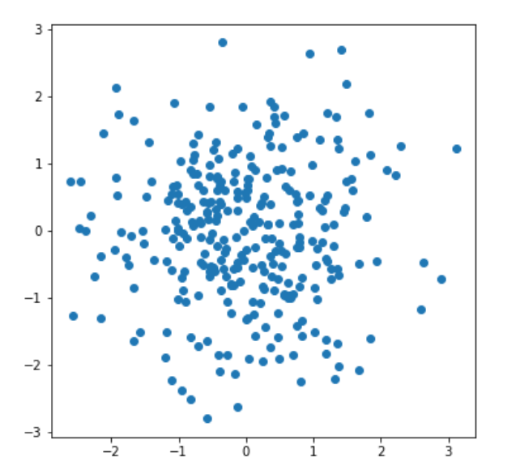
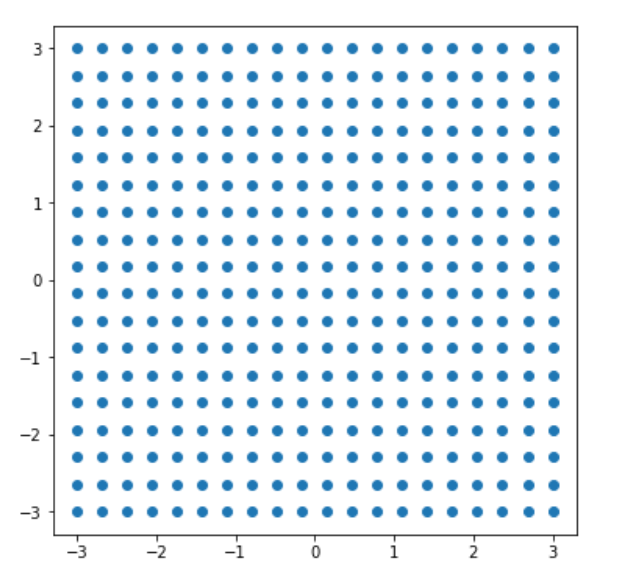
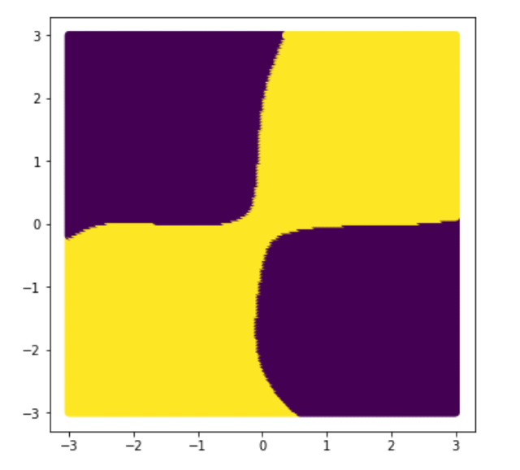
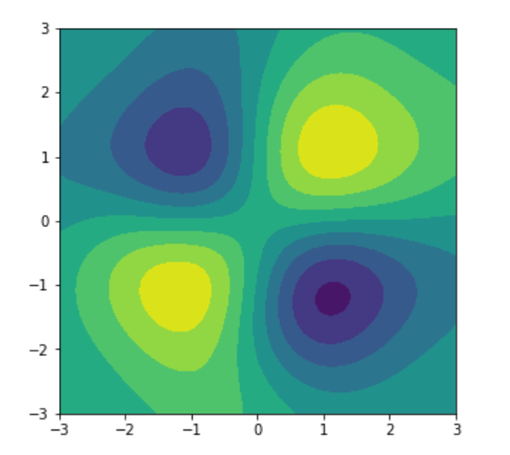
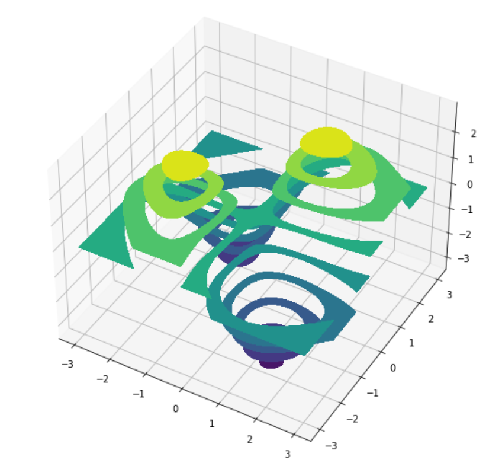

### 1、支持向量机原理可视化

#### 1.1、导包

```Python
import numpy as np
import matplotlib.pyplot as plt
from mpl_toolkits.mplot3d import Axes3D
from sklearn.svm import SVC
```

#### 1.2、创建数据

```Python
rs = np.random.RandomState(256)
X = rs.randn(300,2)
y = X[:,0]*X[:,1] >=0
plt.figure(figsize=(6,6))
plt.scatter(X[:,0],X[:,1])
```



#### 1.3、创建测试数据

```Python
x1 = np.linspace(-3,3,20)
x2 = np.linspace(-3,3,18)
X1,X2 = np.meshgrid(x1,x2)
plt.figure(figsize=(6,6))
plt.scatter(X1,X2)
X_test = np.concatenate([X1.reshape(-1,1),X2.reshape(-1,1)],axis = 1)
X_test.shape
```



#### 1.4、模型训练

```Python
svc = SVC(kernel = 'rbf')
svc.fit(X,y)
y_ = svc.predict(X_test)
plt.figure(figsize=(6,6))
plt.scatter(X_test[:,0],X_test[:,1],c = y_)
```



#### 1.5、原理2D可视化

```Python
# 二维 --------> 三维
# 分离平面，上面一类点，下面也是一类点
# 这些点有的距离近，有的距离远
d = svc.decision_function(X_test)
# 等高面
plt.figure(figsize=(5,5))
plt.contourf(X1,X2,d.reshape(180,200))
```



#### 1.6、原理3D可视化

```Python
plt.figure(figsize=(12,9))
ax = plt.subplot(111,projection = '3d')
ax.contourf(X1,X2,d.reshape(180,200))
ax.view_init(40,-60)
```



### 2、SVC建模人脸识别

#### 2.1、导包

```Python
import numpy as np
from sklearn.svm import SVC
from sklearn.model_selection import train_test_split
import matplotlib.pyplot as plt
from sklearn.decomposition import PCA
from sklearn.model_selection import GridSearchCV
from sklearn import datasets
```

#### 2.2、数据加载

```Python
# 第一次加载，需要联网下载
# 下载路径：C:\Users\likai\scikit_learn_data\lfw_home
faces = datasets.fetch_lfw_people(resize= 1,min_faces_per_person=70)
# 形状是：(125,94)
X  = faces['data']
y = faces['target']
display(X.shape,y.shape)
```

#### 2.3、数据降维与拆分

```Python
pca = PCA(n_components=0.9)
X_pca = pca.fit_transform(X)
display(X_pca.shape)
X_train,X_test,X_train_pca,X_test_pca,y_train,y_test = train_test_split(X,X_pca,y,test_size = 0.1)

display(X_train.shape,X_test.shape)
display(X_train_pca.shape,X_test_pca.shape)
```

#### 2.4、直接使用SVC建模预测

```Python
svc = SVC()
svc.fit(X_train_pca,y_train)
svc.score(X_test_pca,y_test)
# 输出：0.7984496124031008
```

#### 2.5、网格搜索确定最佳参数

```Python
%%time
svc = SVC()
params = {'C':np.logspace(-3,1,20),'kernel':['rbf','poly','sigmoid','linear']}
gc = GridSearchCV(estimator = svc,param_grid = params)
gc.fit(X_train_pca,y_train)
print('网格搜索确定最佳参数：',gc.best_params_)
print('模型得分是：',gc.score(X_test_pca,y_test))
y_pred = gc.predict(X_test_pca)
# 输出
'''
网格搜索确定最佳参数： {'C': 3.792690190732246, 'kernel': 'rbf'}
模型得分是： 0.8837209302325582
Wall time: 36.2 s
'''
```

#### 2.6、数据可视化

```Python
target_names = faces.target_names
print('目标任务名字如下：',target_names)
plt.figure(figsize=(5*2,10*3))
for i in range(50):
    plt.subplot(10,5,i + 1)
    plt.imshow(X_test[i].reshape(125,-1),cmap = 'gray')
    true_name = target_names[y_test[i]].split(' ')[-1]
    pred_name = target_names[y_pred[i]].split(' ')[-1]
    plt.title('True:%s\nPred:%s' % (true_name,pred_name))
    plt.axis('off')
```


