[TOC]

### 相关背景

* 在许多领域的研究与应用中，通常需要对含有多个变量的数据进行观测，收集大量数据后进行分析研究寻找规律。<font color=red>**多变量大数据集**</font>无疑会为研究和应用提供丰富的信息，但是也在一定程度上增加了数据采集的工作量。更重要的是在很多情形下，<font color=#ff0000>**多变量之间可能存在相关性，从而增加了问题分析的复杂性**。</font>如果分别对每个指标进行分析，分析往往是孤立的，不能完全利用数据中的信息，<font color=red>**因此盲目减少指标会损失很多有用的信息，从而产生错误的结论**。</font>
* 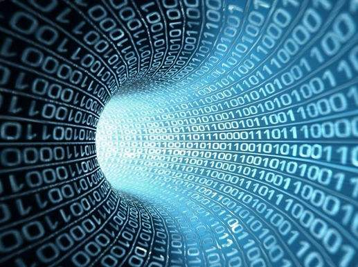
* 因此需要找到一种合理的方法，<font color=red>**在减少需要分析的指标同时，尽量减少原指标包含信息的损失**</font>，以达到对所收集数据进行全面分析的目的。由于各变量之间存在一定的相关关系，因此可以考虑将<font color=red>**关系紧密的变量变成尽可能少的新变量**</font>，使这些新变量是两两不相关的，那么就可以用较少的综合指标分别代表存在于各个变量中的各类信息。
* 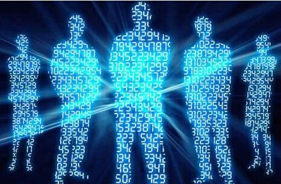
* 数据的形式是多种多样的，维度也是各不相同的，当实际问题中遇到很高的维度时，如何给他降到较低的维度上？进行<font color=green>**属性选择**</font>，当然这是一种很好的方法，这里另外提供一种<font color = green>**从高维特征空间向低纬特征空间映射**</font>的思路。


### 数据降维

* 降维就是一种对高维度特征数据预处理方法。降维是将高维度的数据保留下最重要的一些特征，去除噪声和不重要的特征，从而实现提升数据处理速度的目的。在实际的生产和应用中，降维在一定的信息损失范围内，可以为我们节省大量的时间和成本。降维也成为应用非常广泛的数据预处理方法。
* 数据降维，直观地好处是维度降低了，便于计算和可视化，其更深层次的意义在于有效信息的提取综合及无用信息的摈弃。
* 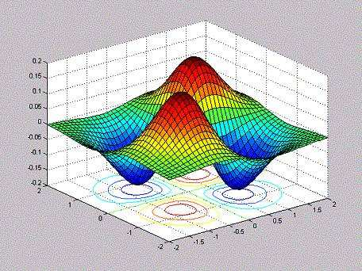
* 跟射人先射马，擒贼先擒王一样的道理。抓住主要的，忽略次要的。
* 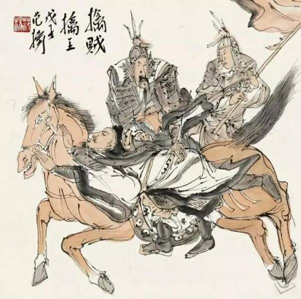
* 人的消化系统就是**数据（食物）降维过程**，变成基本的葡萄糖和氨基酸以及维生素。
* 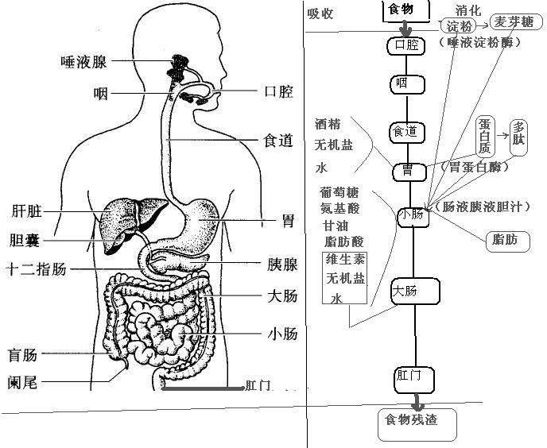
* 降维具有如下一些优点：
  - 1) 减少所需的存储空间
  - 2) 加快计算速度(例如在机器学习算法中)，更少的维数意味着更少的计算，并且更少的维数可以允许使用不适合大量维数的算法。
  - 3)去除冗余特征，例如在以平方米和平方公里在存储地形尺寸方面，两者一起用没有意义(数据收集有缺陷)。
  - 4) 将数据的维数降低到2D或3D可以允许我们绘制和可视化它，可能观察模式，给我们提供直观感受。
  - 5) 太多的特征或太复杂的模型可以导致过拟合。
  - 6) 较简单的模型在小数据集上有更强的鲁棒性

### 数据降维的方法

* 主要的方法是线性映射和非线性映射方法两大类。
* 线性映射方法的代表方法有：PCA（Principal Component Analysis），LDA（Discriminant Analysis）
* 非线性映射方法的代表方法有：核方法（KernelPCA）、流形学习（ISOMap，LLE）
* 非负矩阵分解（NMF）是在矩阵中所有元素均为非负数的约束条件之下的矩阵分解方法

### PCA降维

1. PCA（Principal Components Analysis）即主成分分析，是图像处理中经常用到的降维方法。它不仅仅是对高维数据进行降维，更重要的是经过降维去除了噪声，发现了数据中的模式。PCA把原先的n个特征用数目更少的m个特征取代，新特征是旧特征的线性组合，这些线性组合最大化样本方差，尽量使新的m个特征互不相关。

2. PCA方法通过消除数据的相关性，找到一个空间，使得各个类别的数据在该空间上能够很好地分离。在下图中，有一些离散的二维分布点，其中棕色表示一类集合，黄色表示另一类集合，假设这两个类别可以用特征X和特征Y进行描述，由图可知，在X轴和Y轴上这两个类别的投影是重叠的，表明这些点的两个特征X和Y没有表现出突出的识别性。但是两个类的投影在Z轴上区分度较大，显示出很好的识别性。PCA就是这样的一个工具，它可以产生非常好的降维效果。
   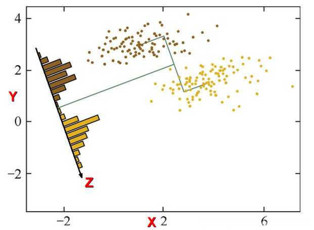
   
3. PCA(Principal Component Analysis)，即主成分分析方法，是一种使用最广泛的数据降维算法。PCA的主要思想是将n维特征映射到k维上，这k维是全新的正交特征也被称为主成分，是在原有n维特征的基础上重新构造出来的k维特征。PCA的工作就是从原始的空间中顺序地找一组相互正交的坐标轴，新的坐标轴的选择与数据本身是密切相关的。其中，第一个新坐标轴选择是原始数据中方差最大的方向，第二个新坐标轴选取是与第一个坐标轴正交的平面中使得方差最大的，第三个轴是与第1,2个轴正交的平面中方差最大的。依次类推，可以得到n个这样的坐标轴。通过这种方式获得的新的坐标轴，我们发现，大部分方差都包含在前面k个坐标轴中，后面的坐标轴所含的方差几乎为0。于是，我们可以忽略余下的坐标轴，只保留前面k个含有绝大部分方差的坐标轴。事实上，这相当于只保留包含绝大部分方差的维度特征，而忽略包含方差几乎为0的特征维度，实现对数据特征的降维处理。
   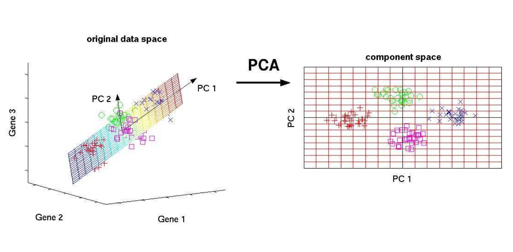

   **思考：我们如何得到这些包含最大差异性的主成分方向呢？**

   <font color=green>通过计算数据矩阵的协方差矩阵，然后得到协方差矩阵的特征值特征向量，选择特征值最大(即方差最大)的k个特征所对应的特征向量组成的矩阵。这样就可以将数据矩阵转换到新的空间当中，实现数据特征的降维。</font>

   <font color=green>由于得到协方差矩阵的特征值特征向量有两种方法：特征值分解协方差矩阵、奇异值分解协方差矩阵，所以PCA算法有两种实现方法：基于特征值分解协方差矩阵实现PCA算法、基于SVD分解协方差矩阵实现PCA算法。</font>

4. pca降维原理
   4.1. 协方差和散度矩阵

   样本均值

   $$\bar x = \frac{1}{n}\sum_{i=1}^nx_i$$

   样本方差

   $$S^2 = \frac{1}{n-1}\sum_{i=1}^{n}(x_i - \bar x)^2$$

   样本X和样本Y的协方差

   $$Conv(X,Y) = E[(X - E(X))(Y - E(Y))]$$

   ​						$$=\frac{1}{n-1}\sum_{i=1}^n(x_i - \bar x)(y_i - \bar y)$$

   由上面的公式，我们可以得到以下结论：

   *  方差的计算公式是针对一维特征，即针对同一特征不同样本的取值来进行计算得到；而协方差则必须要求至少满足二维特征；方差是协方差的特殊情况。

   * 方差和协方差的除数是n-1,这是为了得到方差和协方差的无偏估计。

   * 协方差为正时，说明X和Y是正相关关系；协方差为负时，说明X和Y是负相关关系；协方差为0时，说明X和Y是相互独立。Cov(X,X)就是X的方差。
   * 当样本是n维数据时，它们的协方差实际上是协方差矩阵(对称方阵)。例如，对于3维数据(x,y,z)，计算它的协方差就是：

   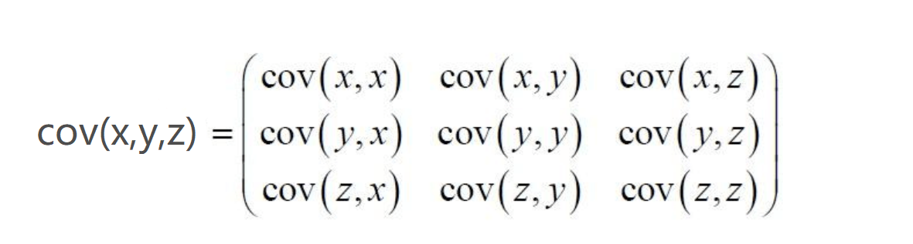

   对于数据X的散度矩阵为Scatter matrix。其实协方差矩阵和散度矩阵关系密切，散度矩阵就是协方差矩阵乘以（总数据量n-1）。因此它们的特征值和特征向量是一样的。这里值得注意的是，散度矩阵是SVD奇异值分解的一步，因此PCA和SVD是有很大联系。

   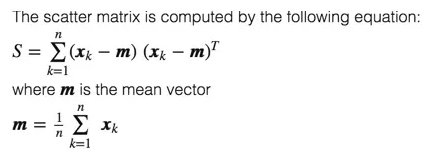

   ```
   A = np.random.randint(0,10,size = (3,3))
   # 协方差
   cov = np.cov(A,rowvar=True)
   # 散度矩阵
   B = (A - A.mean(axis = 1).reshape(-1,1))
   scatter = B.dot(B.T)
   display(A,cov,scatter)
   ```

   4.2.特征值分解矩阵原理

   * 特征值与特征向量

     $$Av = \lambda v$$

     其中，λ是特征向量v对应的特征值，一个矩阵的一组特征向量是一组正交向量
     
   * 特征值分解矩阵
     
     对于矩阵A，有一组特征向量v，将这组向量进行正交化单位化，就能得到一组正交单位向量。特征值分解，就是将矩阵A分解为如下式：
     
     $$A = P \wedge P^{-1}$$
     
     [矩阵相似对角化](https://blog.csdn.net/Candle_light/article/details/84842337)
     
     其中，P是矩阵A的特征向量组成的矩阵，$$\wedge$$则是一个对角阵，对角线上的元素就是特征值。

   4.3.SVD分解矩阵原理

   * 是一种因子分解运算，将一个矩阵分解为3个矩阵的乘积
   * 3个矩阵: U, Σ 和 V，其中U和V是正交矩阵，分别称为左奇异值、右奇异值，Σ 为奇异值

   * 奇异值分解是一个能适用于任意矩阵的一种分解的方法，对于任意矩阵A总是存在一个奇异值分解：

   * ​	$$A \approx UΣV^T$$

   * **full_matrices=True时**，表示U和V是全矩阵

     ​	$$A_{m \times n} \approx U_{m \times m}Σ_{n \times n}V_{n \times n}^T$$

     ​	假设A是一个$$m*n$$的矩阵，那么得到的U是一个$$m*m$$的方阵，U里面的正交向量被称为左奇异向量。Σ是一个$$m*n$$的矩阵，Σ除了对角线其它元素都为0，对角线上的元素称为奇异值。v的转置矩阵，是一个$$n*n$$的矩阵，它里面的正交向量被称为右奇异值向量。而且一般来讲，我们会将Σ上的值按从大到小的顺序排列。

   * **full_matrices=False时**，表示U和V不是全矩阵

     $$A_{m \times n} \approx U_{m \times k}Σ_{k \times k}V_{k \times n}^T$$

     ​	假设A是一个$$m*n$$的矩阵，那么得到的U是一个$$m*k$$的方阵，U里面的正交向量被称为左奇异向量。Σ是一个$$k*k$$的矩阵，Σ除了对角线其它元素都为0，对角线上的元素称为奇异值。v的转置矩阵，是一个$$ k*n$$的矩阵，它里面的正交向量被称为右奇异值向量。而且一般来讲，我们会将Σ上的值按从大到小的顺序排列。

5. PCA算法两种实现方式：

   5.1.基于特征值分解协方差矩阵实现PCA算法:

   * 去平均值(即去中心化)，即每一位特征减去各自的平均值
   * 计算协方差矩阵
   * 用特征值分解方法求协方差矩阵的特征值与特征向量
   * 对特征值从大到小排序，选择其中最大的k个。然后将其对应的k个特征向量分别作为行向量组成特征向量矩阵ev
   * 将数据转换到k个特征向量构建的新空间中，即X_pca= $X \cdot ev$

   ```Python
   # 1、去中心化
   B = X - X.mean(axis = 0)
   B[:5]
   
   # 2、协方差
   # 方差是协方差特殊形式
   # 协方差矩阵
   V = np.cov(B,rowvar=False,bias = True)
   
   # 3、协方差矩阵的特征值和特征向量
   # 特征值和特征向量矩阵的概念
   eigen,ev = np.linalg.eig(V)
   display(eigen,ev)
   
   # 4、降维标准，2个特征，选取两个最大的特征值所对应的特征的特征向量
   #  百分比，计算各特征值，占权重，累加可以
   cond = (eigen/eigen.sum()).cumsum() >= 0.98
   index = cond.argmax()
   ev = ev[:,:index + 1]
   
   # 5、进行矩阵运算
   pca_result = B.dot(ev)
   
   # 6、标准化
   pca_result = (pca_result -pca_result.mean(axis = 0))/pca_result.std(axis = 0)
   pca_result[:5]
   ```

   5.2.基于SVD分解协方差矩阵实现PCA算法

   - 去平均值(即去中心化)，即每一位特征减去各自的平均值
   - 通过SVD对第一步结果进行奇异值分解
   - 特征值默认从大到小排列，选择k个作为降维特征，对左奇异值矩阵进行切片即可（U[:,:k]）
   - 归一化处理（无偏差、偏差）
   - [无偏估计](https://zhuanlan.zhihu.com/p/115184696)
   - $S = \sqrt{\frac{1}{n}\sum\limits_{i = 1}^n(x_i - \mu)^2}$  总体标准差
   - $S = \sqrt{\frac{1}{n-1}\sum\limits_{i = 1}^n(x_i - \overline{X})^2}$ 样本标准差

   ```Python
   from scipy import linalg
   n_components_ = 3
   X,y = datasets.load_iris(return_X_y = True)
   
   # 1、去中心化
   mean_ = np.mean(X, axis=0)
   X -= mean_
   
   # 2、奇异值分解
   U, S, Vt = linalg.svd(X, full_matrices=False)
   
   # 3、符号翻转（如果为负数，那么变成正直）
   max_abs_cols = np.argmax(np.abs(U), axis=0)
   signs = np.sign(U[max_abs_cols, range(U.shape[1])])
   U *= signs
   
   # 4、降维特征筛选
   U = U[:, :n_components_]
   
   # 5、归一化
   # U = (U - U.mean(axis = 0))/U.std(axis = 0)
   U *= np.sqrt(X.shape[0] - 1)
   U[:5]
   ```

6. PCA降维手写数字，支持向量机SVC进行训练和预测

   7.1.PCA降维手写数字数据，保留95%的重要特征

   7.2.使用降维数据和原始数据分别进行训练和预测

   7.3.对比算法学习降维数据和原始数据准确率与运行时间

### LDA线性判别

1. LDA线性判别分析也是一种经典的降维方法，LDA是一种监督学习的降维技术，也就是说它的数据集的每个样本是有类别输出的。这点和PCA不同。PCA是不考虑样本类别输出的无监督降维技术。LDA的思想可以用一句话概括，就是“*投影后类内方差最小，类间方差最大*”。什么意思呢？ 我们要将数据在低维度上进行投影，投影后希望每一种类别数据的投影点尽可能的接近，而不同类别的数据的类别中心之间的距离尽可能的大。
   可能还是有点抽象，我们先看看最简单的情况。假设我们有两类数据分别为红色和蓝色，如下图所示，这些数据特征是二维的，我们希望将这些数据投影到一维的一条直线，让每一种类别数据的投影点尽可能的接近，而红色和蓝色数据中心之间的距离尽可能的大。

   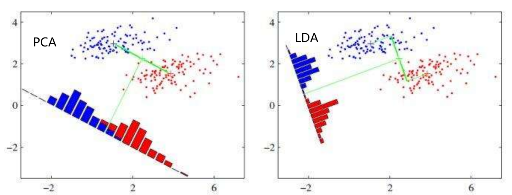
   
2. 给定训练集样例，设法将样例投影到一条直线上，使得同**类样例的投影尽可能接近**，**异类样例的投影点尽可能原理**；在对新的样本进行分类时，将其投影到同样的这条直线上，再根据投影点的位置来确定新样本的类别

   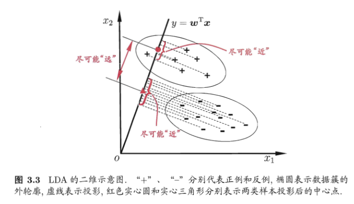

3. LDA算法实现方式

   * 计算数据总的散度矩阵$$S_t$$
   * 计算数据类内散度矩阵$$S_w$$
   * 计算类间散度矩阵$$S_b$$
   * 特征值和特征向量计算
   * 筛选特征向量，进行矩阵运算返回输出结果
   
   ```Python
   import numpy as np
   from sklearn.discriminant_analysis import LinearDiscriminantAnalysis
   from sklearn import datasets
   # scipy这个模块下的线性代数子模块
   from scipy import linalg
   
   # 加载数据
   X,y = datasets.load_iris(return_X_y=True)
   X[:5]
   
   # 1、总的散度矩阵
   # 协方差
   St = np.cov(X.T,bias = 1)
   St
   
   # 2、类内的散度矩阵
   # Scatter散点图，within（内）
   Sw = np.full(shape = (4,4),fill_value=0,dtype=np.float64)
   for i in range(3):
       Sw += np.cov(X[y == i],rowvar = False,bias = 1)
   Sw/=3
   Sw
   
   # 3、计算类间的散度矩阵
   # Scatter  between 
   Sb = St - Sw
   Sb
   
   # 4、特征值，和特征向量
   eigen,ev = linalg.eigh(Sb,Sw)
   ev = ev[:, np.argsort(eigen)[::-1]][:,:2]
   ev
   
   # 5、删选特征向量，进行矩阵运算
   X.dot(ev)[:5]
   ```
   
   


### NMF非负矩阵分解

1. NMF的基本思想可以简单描述为：对于任意给定的一个非负矩阵A，NMF算法能够寻找到一个非负矩阵U和一个非负矩阵V，使得满足 ，从而将一个非负的矩阵分解为左右两个非负矩阵的乘积。

   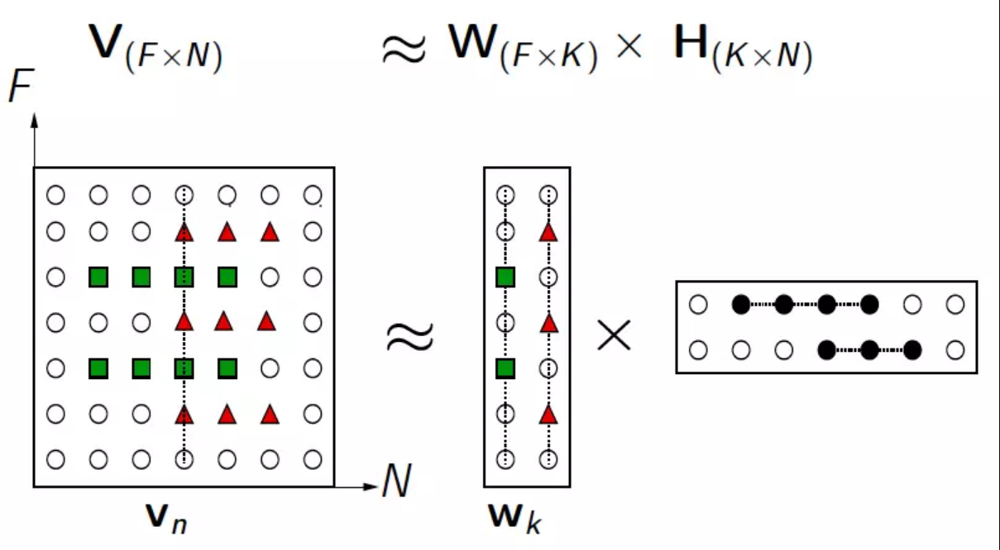

2. 解前后可理解为：原始矩阵V的列向量是对左矩阵W中所有列向量的加权和，而权重系数就是右矩阵对应列向量的元素，故称W为基矩阵，H为系数矩阵。一般情况下$$k$$(W矩阵的列数）的选择要比N小，满足$$(F+N)k < FN$$，这时用系数矩阵W代替原始矩阵，就可以实现对原始矩阵进行降维，得到数据特征的降维矩阵，从而减少存储空间，减少计算机资源。

3. 原矩阵V中的一列向量可以解释为对左矩阵W中所有列向量(称为基向量)的加权和，而权重系数为右矩阵H中对应列向量中的元素。这种基于基向量组合的表示形式具有很直观的语义解释，它反映了人类思维中“局部构成整体”的概念。

4. 虽然NMF是一个很厉害的算法，但其实质是加权和，我们可以在原理上等效为基本的线性方程：

   $$y = a_1x_1 + a_2x_2 +……+ a_nx_n$$

   $$y$$构成了原矩阵中的元素，$$a$$是权重，$$x$$是特征。矩阵乘法中特征用列向量表示，权重系数用行向量表示，所以成了图中所看到的样子。

5. NMF降维算法示例

   ```Python 
   import numpy as np
   from sklearn import datasets
   from sklearn.decomposition import NMF
   
   # 加载数据
   X,y = datasets.load_iris(return_X_y=True)
   
   # 声明算法
   nmf = NMF(n_components=2,init = 'nndsvda',max_iter=1000)
   
   # 降维之后的数据
   W = nmf.fit_transform(X)
   display(W[:5])
   
   # NMF另一半矩阵H
   H = nmf.components_
   
   # X ≈ W • H
   ```
   
   

### LLE局部线性嵌入降维算法

1. 所谓LLE（局部线性嵌入）即”Locally Linear Embedding”的降维算法，在处理所谓流形降维的时候，效果比PCA要好很多。首先，所谓流形，我们脑海里最直观的印象就是Swiss roll,在吃它的时候喜欢把它整个摊开成一张饼再吃，其实这个过程就实现了对瑞士卷的降维操作，即从三维降到了两维。降维前，我们看到相邻的卷层之间看着距离很近，但其实摊开成饼状后才发现其实距离很远，所以如果不进行降维操作，而是直接根据近邻原则去判断相似性其实是不准确的。

   

2. 和传统的PCA，LDA等**关注样本方差**的降维方法相比，LLE关注于降维时**保持样本局部的线性特征（保持原有拓扑结构）**，由于LLE在降维时保持了样本的局部特征，它广泛的用于图像识别，高维数据可视化等领域。**LLE是非线性降维技术**，可以说是流形学习方法最经典的算法之一。很多后续的流形学习、降维方法都与LLE有密切联系。

  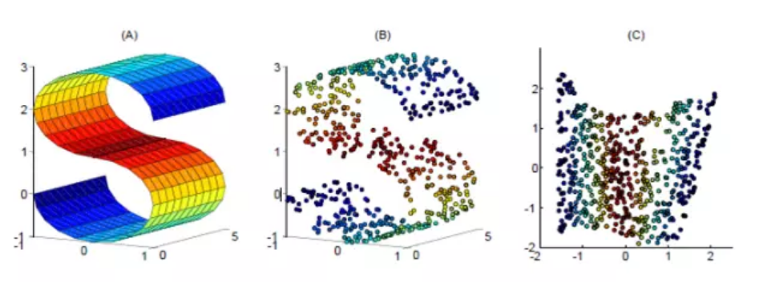

  3.传统的机器学习方法中，数据点和数据点之间的距离和映射函数都是定义在欧式空间中的，然而在实际情况中，这些数据点可能不是分布在欧式空间中的（比如黎曼空间），因此传统欧式空间的度量难以用于真实世界的非线性数据，从而需要对数据的分布引入新的假设。黎曼空间就是弯曲的空间

  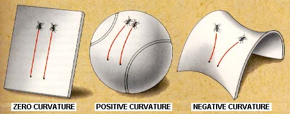

  4.LLE的降维实现过程，直观的可视化效果如下图所示

  

  5.LLE算法认为每一个数据点都可以由其近邻点的线性加权组合构造得到，LLE算法主要步骤：

  * 寻找每个样本点的k个近邻点；
  * 由每个样本点的近邻点计算出该样本点的局部重建权值矩阵；
  * 由该样本点的局部重建权值矩阵和其近邻点计算出该样本点的输出值。

  6.LLE算法示例：

  ```
  # 降维，高维数据降成低维的数据
  # manifold 流形
  from sklearn.manifold import LocallyLinearEmbedding
  from sklearn.decomposition import PCA
  from sklearn import datasets
  import matplotlib.pyplot as plt
  %matplotlib inline
  from mpl_toolkits.mplot3d.axes3d import Axes3D
  X,t = datasets.make_swiss_roll(n_samples=1500,noise=0.05,random_state= 1024)
  fig = plt.figure(figsize=(12,9))
  # axes3D = Axes3D(fig)
  axes3D = fig.add_subplot(projection = '3d')
  axes3D.view_init(7,-80)
  axes3D.scatter(X[:,0],X[:,1],X[:,2],c = t)
  ```

  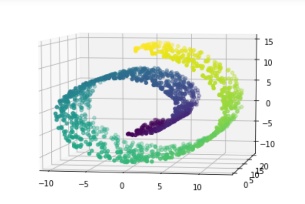

  ```
  pca = PCA(n_components= 2)
  X_pca = pca.fit_transform(X)
  plt.scatter(X_pca[:,0],X_pca[:,1],c = t)
  ```

  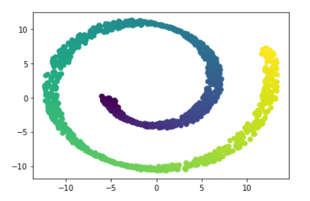

  ```
  lle = LocallyLinearEmbedding(n_neighbors=10,n_components=2)
  lle.fit(X)
  X_lle = lle.transform(X)
  plt.scatter(X_lle[:,0],X_lle[:,1],c = t)
  ```

  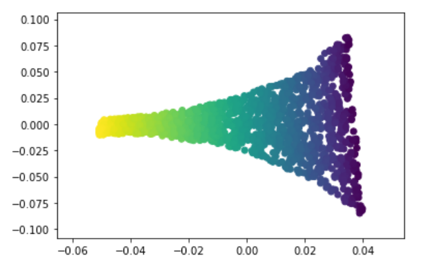

  
