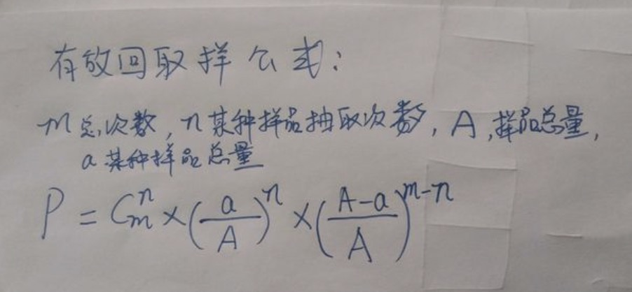
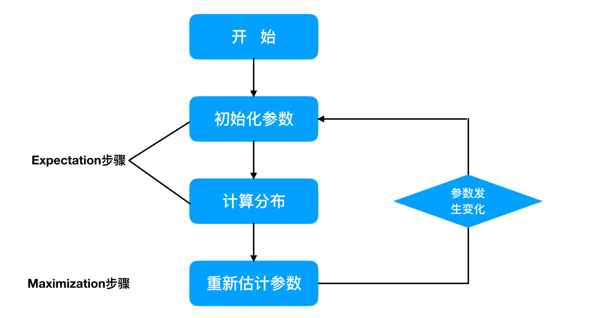
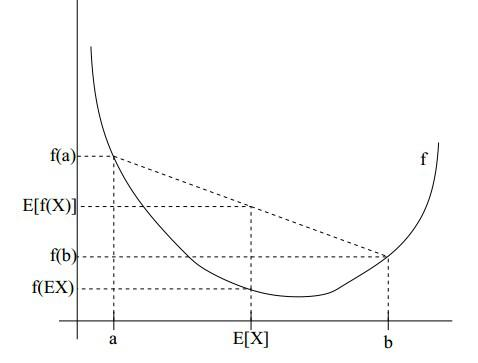
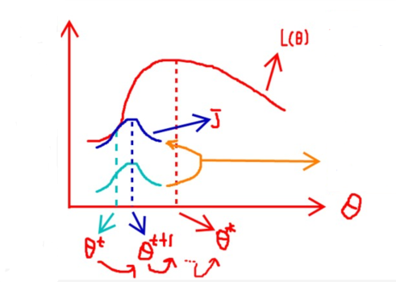
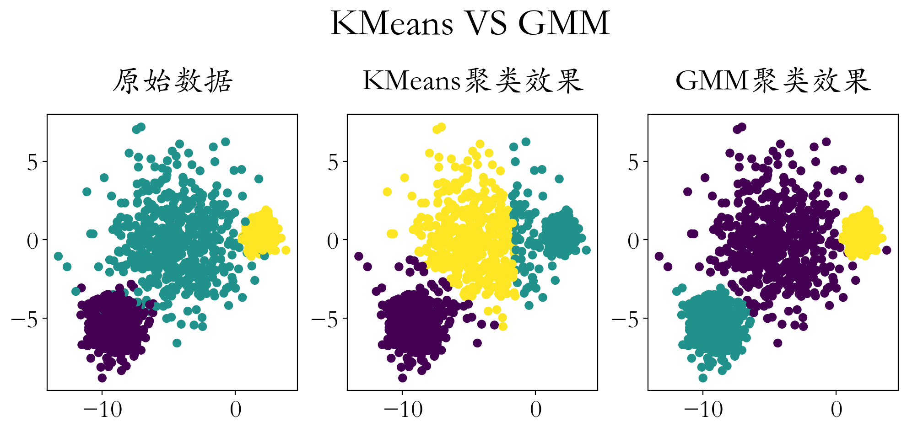

## EM算法与GMM高斯混合模型


### 1、EM算法简介

#### 1.1、EM算法概述

最大期望算法（Expectation-maximization algorithm，又译为期望最大化算法），曾入选“数据挖掘十大算法”中，可见EM算法在机器学习、数据挖掘中的影响力。EM算法是最常见的隐变量估计方法，在机器学习中有极为广泛的用途，例如常被用来学习高斯混合模型（Gaussian mixture model，简称GMM）的参数。

EM算法是在概率模型中寻找参数最大似然估计或者最大后验估计的算法，其中概率模型依赖于无法观测的隐性变量。

#### 1.2、EM算法流程

EM算法是一种迭代优化策略，由于它的计算方法中每一次迭代都分两步，其中一个为期望步（E步），另一个为极大步（M步），所以算法被称为EM算法（Expectation-Maximization Algorithm）。

> 最大期望算法经过两个步骤交替进行计算：
>
> * 第一步是计算期望（E），利用对隐藏变量的现有估计值，计算其最大似然估计值；
> * 第二步是最大化（M），最大化在E步上求得的最大似然值来计算参数的值。M步上找到的参数估计值被用于下一个E步计算中，这个过程不断交替进行。


### 2、极大似然

#### 2.1、似然函数

什么是极大似然，首先来看一下似然函数

> 在数理统计学中，似然函数是一种关于统计模型中的参数的函数，表示模型参数中的似然性。“似然性”与“或然性”或“概率”意思相近，都是指某种事件发生的可能性。

#### 2.2、极大似然

极大似然，也叫最大似然，就是似然函数的最大值！

> 而极大似然就相当于最大可能的意思。
>
> 比如一位同学和一位猎人一起外出打猎，一只野兔从前方窜过。只听一声枪响，野兔应声到下，如果要你推测，这一发命中的子弹是谁打的？你就会想，只发一枪便打中，由于猎人命中的概率一般大于那位同学命中的概率，从而推断出这一枪应该是猎人射中的。
>
> 这个例子所作的推断就体现了最大似然法的基本思想。


#### 2.3、最大似然示例计算

&emsp;&emsp;最大似然估计(maximum likelihood estimation, MLE)一种重要而普遍的求估计量的方法。**最大似然估计**明确地使用概率模型，其目标是寻找能够以较高概率产生观察数据的系统发生树。最大似然估计是一类完全基于**统计**的系统发生树重建方法的代表。

&emsp;&emsp;是不是，有点看不懂，**太学术**了，我们举例说明~

&emsp;&emsp;假如有一个罐子，里面有**黑白**两种颜色的球，数目多少不知，两种颜色的**比例**也不知。我们想知道罐中白球和黑球的比例，但我们**不能**把罐中的球全部拿出来数。现在我们可以每次任意从已经**摇匀**的罐中拿一个球出来，**记录**球的颜色，然后把拿出来的球再**放回**罐中。这个过程可以**重复**，我们可以用记录的球的颜色来估计罐中黑白球的比例。假如在前面的一百次重复记录中，有七十次是白球，请问罐中白球所占的比例**最有可能**是多少？


请告诉我答案！


很多小伙伴，甚至不用算，凭感觉，就能给出答案：**70%**！


 **下面是详细推导过程：**

* 最大似然估计，计算

* 白球概率是p，黑球是1-p（罐子中非黑即白）

* 罐子中取一个请问是白球的概率是多少？

  * $$p$$

* 罐子中取两个球，两个球都是白色，概率是多少？

  * $$p^2$$

* 罐子中取5个球都是白色，概率是多少？

  * $$p^5$$

* 罐子中取10个球，9个是白色，一个是黑色，概率是多少呢？

  

  * $C_{10}^1 = C_{10}^1$ 这个两个排列组合公式是**相等的**~
  * $$C_{10}^9p^9(1-p) = C_{10}^1p^9(1-p)$$

* 罐子取100个球，70次是白球，30次是黑球，概率是多少？

  * $$P = C_{100}^{30}p^{70}(1-p)^{30}$$

* 最大似然估计，什么时候P最大呢？

  $C_{100}^{30}$是常量，可以**去掉**！

  p > 0，1- p > 0，所以上面概率想要求最大值，那么求**导数**即可！

* $$P' = 70*p^{69}*(1-p)^{30} + p^{70}*30*(1-p)^{29}*(-1)$$

  **令导数为0：**

* $$0 = 70*p^{69}*(1-p)^{30} +p^{70}*30*(1-p)^{29}*(-1)$$

  **公式化简：**

* $$0 = 70*(1-p) - p*30$$

* $$0 = 70 - 100*p$$

* **p = 70%**


#### 2.4、极大似然步骤

1. 写出似然函数；
2. 对似然函数取对数，并整理；
3. 求导数，令导数为0，得到似然方程；
4. 解似然方程，得到的参数即为所求；

### 3、EM算法入门

#### 3.1、问题描述

我们需要调查学校的男生和女生的身高分布 ，我们抽取100个男生和100个女生，将他们按照性别划分为两组。

然后，统计抽样得到100个男生的身高数据和100个女生的身高数据。

我们知道他们的身高服从正态分布（自然属性一般服从正态分布），但**分布的均值$\mu$ 和方差$\sigma^2$ 是未知的，就是要估计的参数**。

问题：我们知道样本所服从的概率分布模型和一些样本，我们需要求解该模型的参数。


- 我们已知的条件有两个：
  - 样本服从的分布模型（正态分布）
  - 随机抽取的样本。
- 我们需要求解模型的参数。

根据已知条件，通过极大似然估计，求出未知参数。

**总的来说：极大似然估计就是用来估计模型参数的统计学方法。**

#### 3.2、数学知识解决问题

问题数学化：

* 样本集 <font size = 5>$X = {x_1,x_2…,x_N},N = 100$</font>

* 概率密度是：$p(x_i;\theta)$抽到第i个男生身高的概率。
* 正太分布概率密度是：<font size = 6>$p(x_i|\mu,\sigma^2) = \frac{1}{\sqrt{2\pi}\sigma}e^{-\frac{(x_i - \mu)^2}{2\sigma^2}}$</font>

* 由于100个样本之间独立同分布，所以同时抽到这100个男生的概率是它们各自概率的乘积，也就是样本集X中各个样本的联合概率，用下式表示：

  ​	<font size = 5>$L(\theta) = L(x_1,x_2,…,x_N;\theta) = \prod\limits_{i = 1}^Np(x_i;\theta)$</font>

* 这个概率反映了在概率密度函数的参数是θ时，得到X这组样本的概率。

* 我们需要找到一个参数θ，使得抽到X这组样本的概率最大，也就是说需要其对应的似然函数L(θ)最大。

* 满足条件的θ叫做θ的最大似然估计值，记为：

  * <font size =5>$\hat{\theta} = \rm{argmax}L(\theta)$</font>

#### 3.3、最大似然估计求解步骤

* 首先，写出似然函数：
  * <font size = 5>$L(\theta) = L(x_1,x_2,…,x_N;\theta) = \prod\limits_{i = 1}^Np(x_i;\theta)$</font>
* 其次，对似然函数取对数：
  * <font size = 5>$l(\theta) = ln(L(\theta)) = ln(\prod\limits_{i = 1}^Np(x_i;\theta)) = \sum\limits_{i = 1}^Nlnp(x_i;\theta)$</font>
* 然后，对上式求导，令导数为0，得到似然方程。
* 最后，解似然方程，得到的参数值即为所求。

多数情况下，我们是根据已知条件来推算结果，而极大似然估计是已知结果，寻求使该结果出现的可能性最大的条件，以此作为估计值。

### 4、EM算法进阶

#### 4.1、聚类问题

我们目前有100个男生和100个女生的身高，但是我们不知道这200个数据中哪个是男生的身高，哪个是女生的身高，即抽取得到的每个样本都不知道是从哪个分布中抽取的。

这个时候，对于每个样本，就有两个未知量需要估计：

1. 这个身高数据是来自于男生数据集合还是来自于女生？（聚类问题）

2. 男生、女生身高数据集的正态分布的参数分别是多少？


#### 4.2、解决方案

对具体的男女生身高问题使用EM算法求解流程如下：



1. 初始化参数：先初始化男生身高的正态分布的参数：如均值=1.64，方差=6.0；

2. 计算分布：计算每一个人更可能属于男生分布或者女生分布；

3. 重新估计参数：通过分为男生的n个人来重新估计男生身高分布的参数（最大似然估计），女生分布也按照相同的方式估计出来，更新分布。

4. 这时候两个分布的概率也变了，然后重复步骤2~3，直到参数不发生变化为止。

### 5、Jensen不等式

#### 5.1、定义

设f是定义域为实数的函数，如果对所有的实数x，f(x)的二阶导数都大于0，那么f是凸函数。

Jensen不等式定义如下：

如果f是凸函数，X是随机变量，那么：$E[f(X)] \ge f(E(X))$。当且仅当X是常量时，该式取等号。其中，E(X)表示X的数学期望。

注：Jensen不等式应用于凹函数时，不等号方向反向。当且仅当x是<font color = 'green'>**常量**</font>时，该不等式取<font color = 'green'>**等号**</font>。

#### 5.2、举例



上图表示凸函数（$\nabla_x^2f(x) \ge 0$），X是随机变量，有0.5的概率是a，有0.5的概率是b。X的期望值就是a和b的中值，从图中可以看到 $E[f(X)] \ge f(E(X))$成立。

如果是凹函数（$\nabla_x^2f(x) \le 0$），那么$E[f(X)] \le f(E(X))$。在机器学习中通过二阶导数来判定凹凸函数！

总结如下：

> 如果f是凸函数，X是随机变量，那么：E[f(X)]>=f(E[X])，通俗的说法是函数的期望大于等于期望的函数。
>
> 特别地，如果f是严格凸函数，当且仅当P(X = EX) = 1，即X是常量时，上式取等号，即E[f(X)] = f(EX)。

### 6、EM算法公式推导

#### 6.1、极大似然函数

对于N个样本观察数据 $X = (x_1,x_2,…,x_N)$ ，找出样本的模型参数θ, 极大化模型分布的对数似然函数如下：

<font size = 5>$L(\theta) = L(x_1,x_2,…,x_N;\theta) = \prod\limits_{i = 1}^Np(x_i;\theta)$</font>

<font size = 5>$l(\theta) = ln(L(\theta)) = ln(\prod\limits_{i = 1}^Np(x_i;\theta)) = \sum\limits_{i = 1}^Nlnp(x_i;\theta)$</font>

<font size = 5>$\hat{\theta} = {\rm{argmax}}\sum\limits_{i = 1}^Nlnp(x_i;\theta)$</font>

#### 6.2、联合概率分布

如果我们得到的观察数据有未观察到的隐含数据 $z = (z_1,z_2,…,z_N)$ 即上文中每个样本属于哪个分布是未知的。在隐含数据情况下概率为：

​	<font size = 5>$p(x,z;\theta)$</font>	这个就叫做联合概率分布


此时我们极大化模型分布的对数似然函数如下：

<font size = 5>$\hat{\theta} = {\rm{argmax}}\sum\limits_{i = 1}^Nlnp(x_i;\theta) = {\rm{argmax}}\sum\limits_{i = 1}^Nln\sum\limits_{z_i}p(x_i,z_i;\theta)$</font>

上面公式之所以可以这样写：$\sum\limits_{z_i}p(x_i,z_i;\theta)$请参看文章[联合分布&边缘分布](https://blog.csdn.net/Soft_Po/article/details/118576371)。

#### 6.3、Jesen不等式转化(难)

<font size = 5>$\begin{aligned}\sum\limits_{i = 1}^Nln\sum\limits_{z_i}p(x_i,z_i;\theta) &= \sum\limits_{i = 1}^Nln\sum\limits_{z_i}Q_i(z_i)\frac{p(x_i,z_i;\theta)}{Q_i(z_i)} (1)\\ &\ge \sum\limits_{i = 1}^N\sum\limits_{z_i}Q_i(z_i)ln\frac{p(x_i,z_i;\theta)}{Q_i(z_i)} (2)\end{aligned}$</font>


(1)式是引入了一个未知的新的分布 $Q_i(z_i)$  （即隐变量Z的概率分布，其概率之和等于1，即$\sum\limits_{z_i}Q_i(z_i) = 1$），分子分母同时乘以它得到的。

(2)式是由(1)式根据Jensen不等式得到的

回到公式(2)，因为f(x)=lnx为凹函数（其二次导数为-1/x2 < 0），所以$E[f(X)] \le f(E(X))$

令：

* <font size = 5>$f(x) = ln(x)$</font>

* <font size = 5>$X = \frac{p(x_i,z_i;\theta)}{Q_i(z_i)}$</font>

* <font size = 5>$E(X) = \sum\limits_{z_i}Q_i(z_i)\frac{p(x_i,z_i;\theta)}{Q_i(z_i)}$</font>

* <font size = 5>$f(E(X)) = ln\sum\limits_{z_i}Q_i(z_i)\frac{p(x_i,z_i;\theta)}{Q_i(z_i)}$</font>

* <font size = 5>$E(f(X)) = \sum\limits_{z_i}Q_i(z_i)ln\frac{p(x_i,z_i;\theta)}{Q_i(z_i)}$</font>

* $f(x) = lnx$ 是凹函数，所以：

  <font size = 5>$E[f(X)] \le f(E(X))$</font>


#### 6.4、EM公式推导(难)

<font size = 5>$\begin{aligned}l(\theta) &= \sum\limits_{i = 1}^Nln\sum\limits_{z_i}Q_i(z_i)\frac{p(x_i,z_i;\theta)}{Q_i(z_i)} (1)\\ J(z,Q) &= \sum\limits_{i = 1}^N\sum\limits_{z_i}Q_i(z_i)ln\frac{p(x_i,z_i;\theta)}{Q_i(z_i)} (2)\end{aligned}$</font>

<font size = 5>$l(\theta) \ge J(z,Q)$</font>


此时， (2) 式就容易地求导了，但是 (2) 式和 (1) 式是不等号关系！ (1) 式的最大值不是 (2) 式的最大值啊，而我们想得到式 (1) 的最大值，那怎么办呢？

上面的 (1) 式和 (2) 式不等式可以写成：似然函数$ l(\theta) \ge J(z,Q)$。

当我们在求 (1) 式的极大值时，(1)式不太好计算，我们便想 (1) 式大于某个方便计算的下界 (2) 式，而我们尽可能让下界 (2) 式最大化，直到 (2) 式的计算结果等于 (1) 式，便也就间接求得了 (1) 式的极大值！

即我们可以通过不断的最大化这个下界$J(z,Q)$，来使得$l(\theta)$不断提高，最终达到$l(\theta)$的最大值。



见上图，我们固定$\theta$，调整$Q(z)$使下界$J(z,Q)$上升至与$l(\theta)$在此点$\theta$处相等（绿色曲线到蓝色曲线），然后固定$Q(z)$，调整$\theta$使下界$J(z,Q)$达到最大值（$\theta_t$到$\theta_{t+1}$），然后再固定$\theta$，调整Q(z)……直到收敛到似然函数$l(\theta)$的最大值处的$\theta^{*}$。

这里有两个问题：

1. 什么时候下界$J(z,Q)$与$l(\theta)$在此点$\theta^*$处相等？
2. 为什么一定会收敛？

 首先第一个问题，在Jensen不等式中说到，当自变量X是常数的时候，等式成立。换言之，为了让 (2) 式取等号，我们需要令：

<font size = 5>$\frac{p(x_i,z_i;\theta)}{Q_i(z_i)} = C$</font>


其中，C为常数，不依赖于$z$。对该式做个变换，并对所有的 $z$ 求和，得到

<font size = 5>$\sum\limits_{z}p(x_i,z_i;\theta) = \sum\limits_zQ_i(z_i)C$</font>

因为前面提到过$\sum\limits_zQ_i(z_i) = 1$ （即隐变量Z的概率分布，其概率之和等于1），所以可以推导出：

<font size = 5>$\sum\limits_{z}p(x_i,z_i;\theta) = C$</font>

所以通过<font size = 5>$\frac{p(x_i,z_i;\theta)}{Q_i(z_i)} = C$</font> ，可以求得 $Q_i(z_i)$ 的值为：

<font size = 5>$Q_i(z_i) = \frac{p(x_i,z_i;\theta)}{C}$</font>

<font size = 5>$\because$ </font>

 <font size = 5>$\sum\limits_{z}p(x_i,z_i;\theta) = C$</font>

<font size = 5>$\therefore$</font>

<font size = 5 color = 'green'>$\begin{align}Q_i(z_i) &= \frac{p(x_i,z_i;\theta)}{\sum\limits_{z}p(x_i,z_i;\theta)}\\\\&=\frac{p(x_i,z_i;\theta)}{p(x_i;\theta)}\\\\&=p(z_i|x_i;\theta)\end{align}$</font>


瞬间豁然开朗！至此，我们推出了在固定参数 $\theta$ 后，使下界拉升的 $Q(z)$ 的计算公式就是<font color = 'red'>条件概率</font>，解决了 $Q(z)$ 如何选择的问题。这一步就是 **E** 步，建立 $l(\theta)$ 的下界。

[了解条件概率](https://blog.csdn.net/Soft_Po/article/details/118702294)

接下来的 **M** 步，就是在固定 $Q(z)$ 后，调整 $\theta$ ，去极大化 $l(\theta)$ 的下界 $J(z,Q)$ ，毕竟在固定$Q(z)$后，下界还可以调整的更大。

这就是EM算法的步骤。

### 7、GMM高斯混合模型

#### 7.1、GMM介绍

高斯混合模型是一个用于聚类的概率模型，其使用了EM算法进行迭代计算，高斯混合模型假设每个簇的数据都是符合高斯分布（又叫正态分布）的，当前**数据呈现的分布就是各个簇的高斯分布叠加在一起的结果。**

高斯分布的概率密度函数为：

<font size = 6>$p(x_i|\mu,\sigma^2) = \frac{1}{\sqrt{2\pi}\sigma}e^{-\frac{(x_i - \mu)^2}{2\sigma^2}}$</font>


GMM模型其实就是使用高斯分布的概率密度函数带入到EM算法公式中，进行求解。

GMM算法，是EM算法的一种落地实现方式。

#### 7.2、GMM算法示例

```Python
import numpy as np
from sklearn import datasets
import matplotlib.pyplot as plt
from sklearn.mixture import GaussianMixture
from sklearn.cluster import KMeans
# 创建数据，并可视化
X,y = datasets.make_blobs(n_samples=1500,
                             cluster_std=[1.0, 2.5, 0.5],
                             random_state=170)
plt.figure(figsize=(12,4))
plt.rcParams['font.family'] = 'STKaiti'
plt.rcParams['font.size'] = 20
plt.subplot(1,3,1)
plt.scatter(X[:,0],X[:,1],c = y)
plt.title('原始数据',pad = 20)

# Kmeans聚类
kmeans = KMeans(3)
kmeans.fit(X)
y_ = kmeans.predict(X)
plt.subplot(1,3,2)
plt.scatter(X[:,0],X[:,1],c = y_)
plt.title('KMeans聚类效果',pad = 20)

# GMM高斯混合模型聚类
gmm = GaussianMixture(n_components=3)
y_ = gmm.fit_predict(X)
plt.subplot(1,3,3)
plt.scatter(X[:,0],X[:,1],c = y_)
plt.title('GMM聚类效果',pad = 20)

plt.figtext(x = 0.51,y = 1.1,s = 'KMeans VS GMM',ha = 'center',fontsize = 30)
plt.savefig('./GMM高斯混合模型.png',dpi = 200)
```



结论：

GMM高斯混合模型比KMeans算法更适合划分，高斯分布的数据（特别是数据距离间隔比较小时，优势更加明显）！