### 1、决策回归树原理概述

* 与分类树一样

* 裂分指标，使用的是MSE、MAE

  <font size = 5>$\text{MSE}(y, \hat{y}) = \frac{1}{n_\text{samples}} \sum\limits_{i=0}^{n_\text{samples} - 1} (y_i - \hat{y}_i)^2$​</font>

  <font size = 5>$\text{MAE}(y, \hat{y}) = \frac{1}{n_{\text{samples}}} \sum\limits_{i=0}^{n_{\text{samples}}-1} \left| y_i - \hat{y}_i \right|$</font>

  

* 决策回归树，认为它是<font color = red>分类问题</font>，只是，分的类别多一些！！！

* 只要树，分类回归，其实就是分类多和少的问题

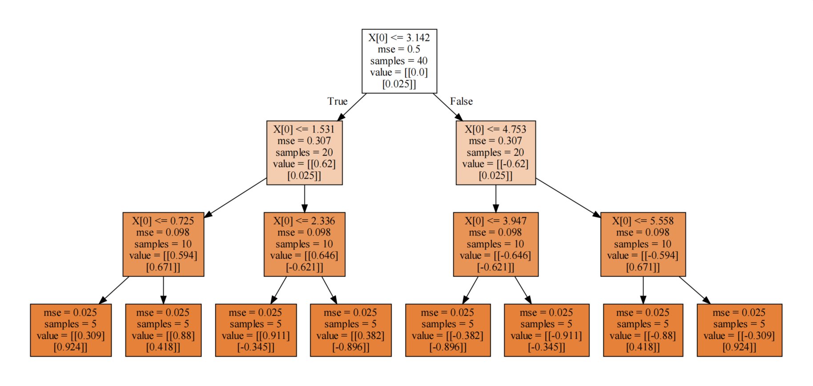

### 2、决策回归树算例

#### 2.1、决策树预测圆的轨迹

导包并创建数据与可视化

```Python
import numpy as np
from sklearn.tree import DecisionTreeRegressor
from sklearn import tree
from sklearn.model_selection import train_test_split
from sklearn.linear_model import LinearRegression
import matplotlib.pyplot as plt
import graphviz
X = np.linspace(0,2*np.pi,40).reshape(-1,1)
X_test = np.linspace(0,2*np.pi,187).reshape(-1,1)
# y 一个正弦波，余弦波，圆
y = np.c_[np.sin(X),np.cos(X)]
plt.figure(figsize=(3,3))
plt.scatter(y[:,0],y[:,1])
```

使用线性回归预测，看效果

```Python
linear = LinearRegression()
linear.fit(X,y) #将数据交给算法，学习，希望算法，找到规律
# X ----> y 是一个圆；预测X_test返回值y_ 如果预测好，也是圆
y_ = linear.predict(X_test)
plt.figure(figsize=(3,3))
plt.scatter(y_[:,0],y_[:,1])
```

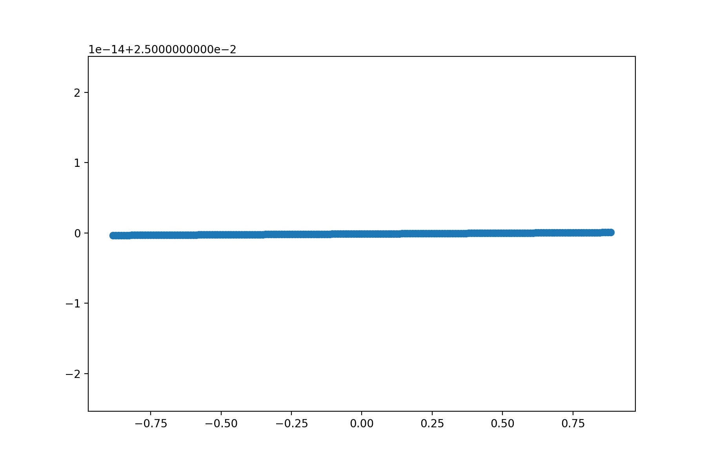

使用决策树回归，看效果

```Python
model = DecisionTreeRegressor(criterion='mse',max_depth=3)
model.fit(X,y)#X 是40个点 y是一个圆
y_ = model.predict(X_test) #X_test是187点，预测y_应该是一个圆
# 请问y_中有多少数据？？？
print(y_.shape)
plt.figure(figsize=(6,6))
plt.scatter(y_[:,0],y_[:,1],color = 'green')
plt.savefig('./3-决策树回归效果.png',dpi = 200)
```

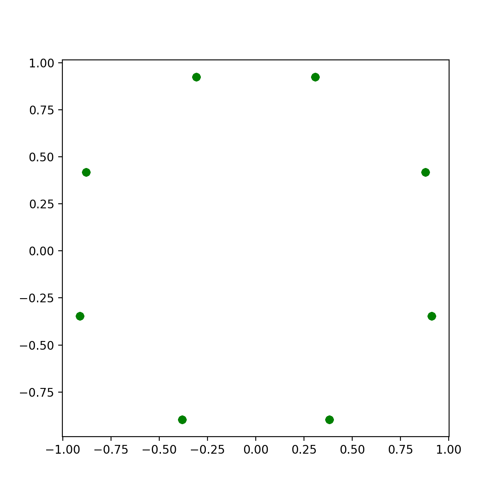

思考一下为什么画出来的图形是八个点？

决策回归树可视化

```Python
# 决策树形状
dot_data = tree.export_graphviz(model,filled=True)
graph = graphviz.Source(dot_data)
graph.render('./1-决策回归树')
```


因为决策树**深度是3**，所以最终得到**8个叶节点**，所以分成8类！

#### 2.2、增加决策树深度

```Python
model = DecisionTreeRegressor(criterion='mse',max_depth=4)
model.fit(X,y)#X 是40个点 y是一个圆
y_ = model.predict(X_test) #X_test是187点，预测y_应该是一个圆
# 请问y_中有多少数据？？？
print(y_.shape)
plt.figure(figsize=(6,6))
plt.scatter(y_[:,0],y_[:,1],color = 'green')
plt.savefig('./4-增加深度决策树回归效果.png',dpi = 200)
# 决策树形状
dot_data = tree.export_graphviz(model,filled=True)
graph = graphviz.Source(dot_data)
graph.render('./5-增加深度决策回归树')
```

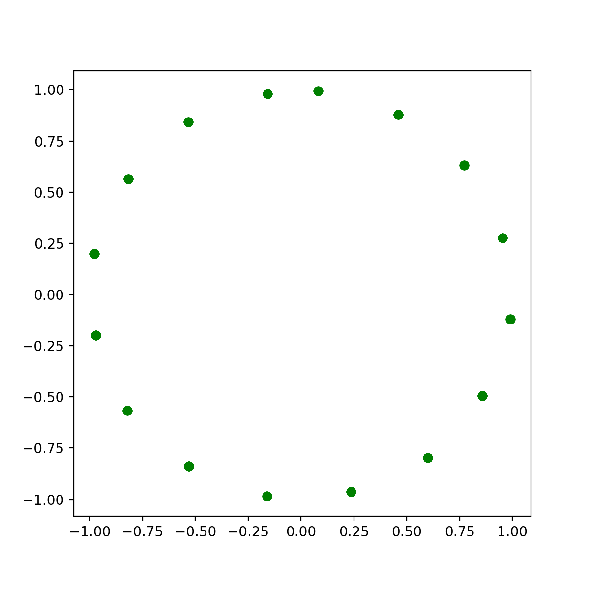

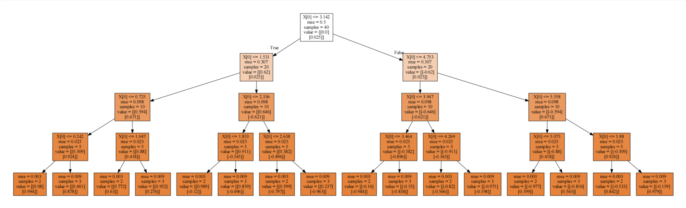

#### 2.3、决策回归树分裂原理剖析

以上面深度为3的决策树为例


1、计算未分裂时，整体MSE:

<font size = 5>$\text{MSE}(y, \hat{y}) = \frac{1}{n_\text{samples}} \sum\limits_{i=0}^{n_\text{samples} - 1} (y_i - \hat{y}_i)^2$</font>

```Python
mse = ((y - y.mean(axis = 0))**2).mean()
print('未分裂时，整体MSE:',mse)
```

2、根据分裂标准X[0] <= 3.142，计算分裂后的MSE：

```Python
cond = X <= 3.142
part1 = y[cond.reshape(-1)]
part2 = y[(~cond).reshape(-1)]
mse1 = ((part1 - part1.mean(axis = 0))**2).mean()
mse2 = ((part2 - part2.mean(axis = 0))**2).mean()
print(mse1,mse2)
```

3、寻找最佳分裂条件：

```Python
split_result = {}
mse_lower = 0.5
for i in range(len(X) - 1):
    split = round(X[i:i + 2].mean(),3)
    cond = X <= split
    part1 = y[cond.reshape(-1)]
    part2 = y[(~cond).reshape(-1)]
    mse1 = ((part1 - part1.mean(axis = 0))**2).mean()
    mse2 = ((part2 - part2.mean(axis = 0))**2).mean()
    mse = mse1 * len(part1)/cond.size + mse2 * len(part2)/cond.size
    mse_result.append(mse)
    if mse < mse_lower:
        split_result.clear()
        split_result[split] = [i,mse]
        mse_lower = mse
print('最佳分裂条件：',split_result)
```

根据打印输出，我们知道最佳裂分，索引是：19。分裂条件是：3.142。

结论：和直接使用决策回归树绘图显示的结果一模一样~


### 3、决策回归树 VS 线性回归

1、加载数据

```Python
import numpy as np
from sklearn.tree import DecisionTreeRegressor
from sklearn import tree
from sklearn import datasets
from sklearn.model_selection import train_test_split
from sklearn.linear_model import LinearRegression
diabetes = datasets.load_diabetes()#糖尿病
X = diabetes['data']
y = diabetes['target']
X_train,X_test,y_train,y_test = train_test_split(X,y,random_state = 911)
```

2、线性回归表现

```Python
linear = LinearRegression()
linear.fit(X_train,y_train)
linear.score(X_test,y_test)
```

3、决策树回归表现

```Python
import matplotlib.pyplot as plt
plt.rcParams['font.family'] = 'STKaiti'
max_depth = np.arange(1,16)
score = []
for d in max_depth:
    model = DecisionTreeRegressor(max_depth = d)
    model.fit(X_train,y_train)
    score.append(model.score(X_test,y_test))
plt.plot(max_depth,score,'ro-')
plt.xlabel('max_depth',fontsize = 18)
plt.ylabel('Score',fontsize = 18)
plt.title('决策树准确率随着深度变化',pad = 20,fontsize = 20)
plt.savefig('./6-决策树回归糖尿病.png',dpi = 200)
```

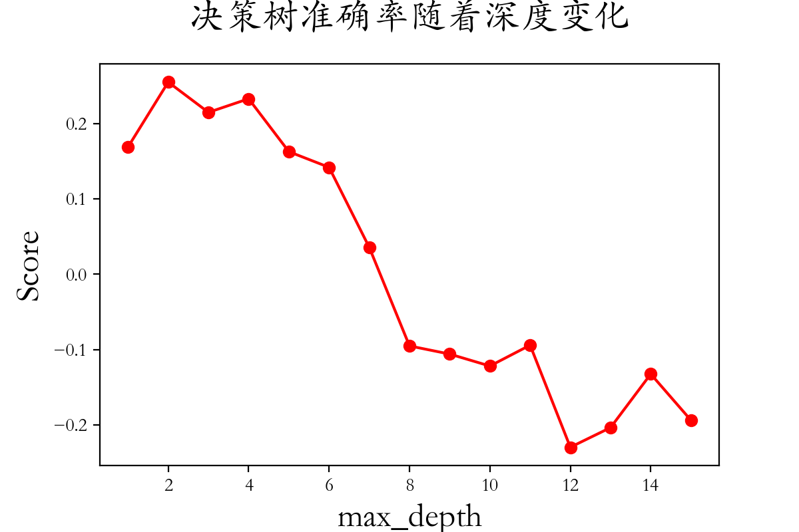

4、结论：

* 对于这个案例，线性回归效果更好一些
* 糖尿病这个数据，更适合使用方程对规律进行拟合
* 在很多方面，决策树回归表现也优秀~


### 4、集成算法

#### 4.1、集成算法概述

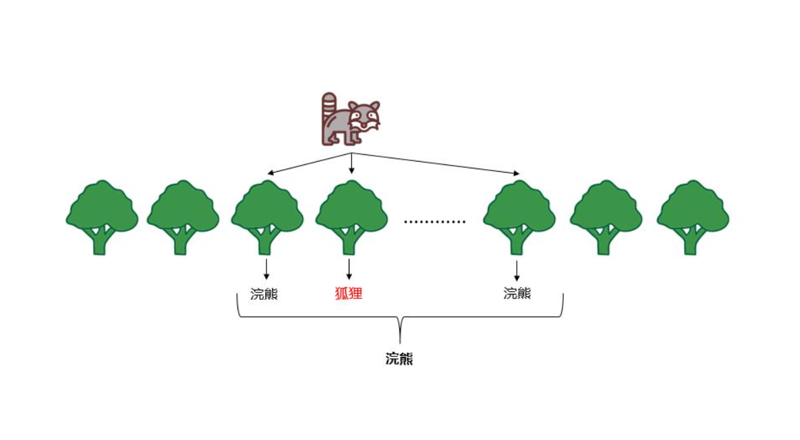

集成算法核心：

少数服从多数，人多力量大，三个臭皮匠顶个诸葛亮。


假设你有 100 个朋友给你出主意投资股票，你怎么做最终的决定？ 

1. 选择最牛 x 的一个朋友的意见当作自己的意见（找到最好的单颗决策树） 

2. 所有朋友的意见投票，少数服从多数（随机森林） 

3. 还是牛一点的朋友多给几票，弱鸡一点的少给几票（Adaboost）

聚合模型：

所有朋友的意见投票, 少数服从多数（随机森林对应原理公式）

* <font size = 5>$G(x) = \frac{1}{n}\sum\limits_{i =1}^n1 \times g_i(x) $ </font>

牛一点的朋友多给几票，弱鸡一点的少给几票（Adaboost对应原理公式）

* <font size = 5>$G(x) = \frac{1}{n}\sum\limits_{i =1}^n \alpha_i \times g_i(x) ;\alpha_i \ge 0$​​​ </font>

#### 4.2、构造不同模型（朋友）

同样的数据，行列都相同，**不同的超参数**，可以得到不同的模型。 

同样的超参数，行相同，**列不同**，可以得到不同的模型。 

同样的超参数，**行不同**，列相同，可以得到不同的模型。 

同样的超参数，同样的数据，但是**数据权重不同**，可以得到不同的模型。


#### 4.3、集成算法不同方式

* 方式一Bagging（套袋法）
  * 对训练集进行**抽样**， 将抽样的结果用于训练 g(x)。
  * 并行，独立训练。
  * 随机森林random forest便是这一类别的代表。

* 方式二Boosting（提升法）
  * 利用训练集训练出模型，根据本次模型的预测结果，调整训练集。
  * 然后利用调整后的训练集训练下一个模型。
  * 串行，需要第一个模型。
  * Adaboost，GBDT，Xgboost都是提升树算法典型代表。

#### 4.4、Bagging集成算法步骤

1. Bootstrap（独立自主） : 有放回地对原始数据集进行均匀抽样

2. 利用每次抽样生成的数据集训练模型 

3. 最终的模型为每次生成的模型进行投票 

4. 其实 boosting 和 bagging 都不仅局限于对决策树这种基模型适应 

5. 如果不是同一种 base model，也可以做集成算法 


### 5、随机森林

#### 5.1、随机森林介绍

Bagging 思想 + 决策树就诞生了**随机森林**。

随机森林，都有哪些随机？

* bagging生成一颗决策树时，随机抽样
* 抽样后，分裂时，每一个结点都随机选择特征，从部分特征中筛选最优分裂条件

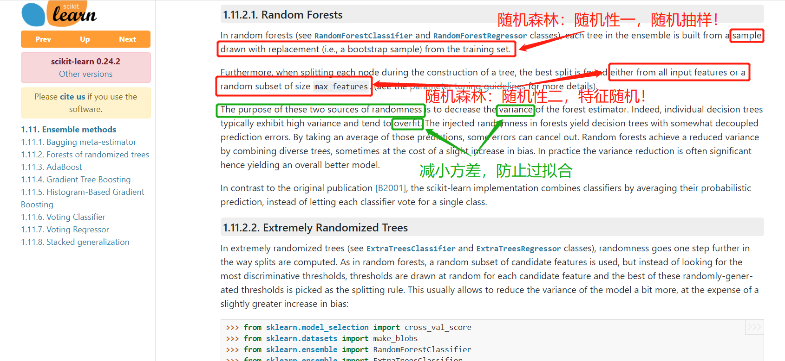

#### 5.2、随机森林实战

1、导包加载数据

```Python
import numpy as np
from sklearn import tree
from sklearn import datasets
from sklearn.model_selection import train_test_split
import graphviz
# ensemble 集成
# 随机森林
from sklearn.ensemble import RandomForestClassifier
# 作为对照
from sklearn.linear_model import LogisticRegression
from sklearn.tree import DecisionTreeClassifier
# 加载数据
X,y = datasets.load_iris(return_X_y=True)
X_train,X_test,y_train,y_test = train_test_split(X,y,random_state = 112)
```

2、普通决策树

```Python
score = 0
for i in range(100):
    X_train,X_test,y_train,y_test = train_test_split(X,y)
    model = DecisionTreeClassifier()
    model.fit(X_train,y_train)
    score += model.score(X_test,y_test)/100
print('随机森林平均准确率是：',score)
```

3、随机森林（运行时间稍长，10s）

```Python
score = 0
for i in range(100):
    X_train,X_test,y_train,y_test = train_test_split(X,y)
    model = RandomForestClassifier()
    model.fit(X_train,y_train)
    score += model.score(X_test,y_test)/100
print('随机森林平均准确率是：',score)
```

结论：

* 和决策树对比发现，随机森林分数稍高，结果稳定
* 即降低了结果方差，减少错误率

4、逻辑斯蒂回归

```Python
import warnings
warnings.filterwarnings('ignore')
score = 0
for i in range(100):
    X_train,X_test,y_train,y_test = train_test_split(X,y)
    lr = LogisticRegression()
    lr.fit(X_train,y_train)
    score += lr.score(X_test,y_test)/100
print('逻辑斯蒂回归平均准确率是：',score)
```

结论：

* 逻辑斯蒂回归这个算法更加适合鸢尾花这个数据的分类
* 随机森林也非常优秀

#### 5.3、随机森林可视化

1、创建随机森林进行预测

```Python
X_train,X_test,y_train,y_test = train_test_split(X,y,random_state = 9)
forest = RandomForestClassifier(n_estimators=100,criterion='gini')
forest.fit(X_train,y_train)
score1 = round(forest.score(X_test,y_test),4)
print('随机森林准确率：',score1)
print(forest.predict_proba(X_test))
```

2、对比决策树

```Python
X_train,X_test,y_train,y_test = train_test_split(X,y,random_state = 112)
model = DecisionTreeClassifier()
model.fit(X_train,y_train)
print('决策树准确率：',model.score(X_test,y_test))
proba_ = model.predict_proba(X_test)
print(proba_)
```

总结：

* 一般情况下，随机森林比决策树更加优秀
* 随机森林，是多棵树投票的概率，所以predict_proba()概率值，出现0.97
* 单一决策树，不是，通过投票，而是通过决策树叶节点分类，所以概率要么是0，要么是1

3、绘制决策树

```Python
# 第一颗树类别
dot_data = tree.export_graphviz(forest[0],filled=True)
graph = graphviz.Source(dot_data)
graph
```

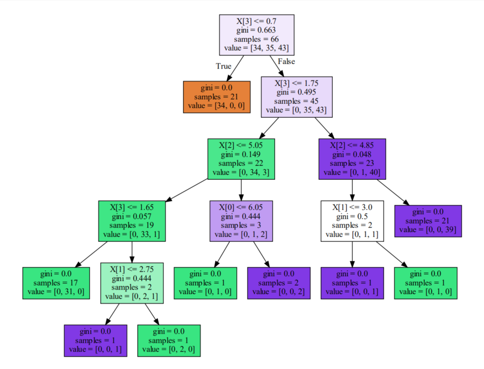

```Python
# 第五十颗树类别
dot_data = tree.export_graphviz(forest[49],filled=True)
graph = graphviz.Source(dot_data)
graph
```

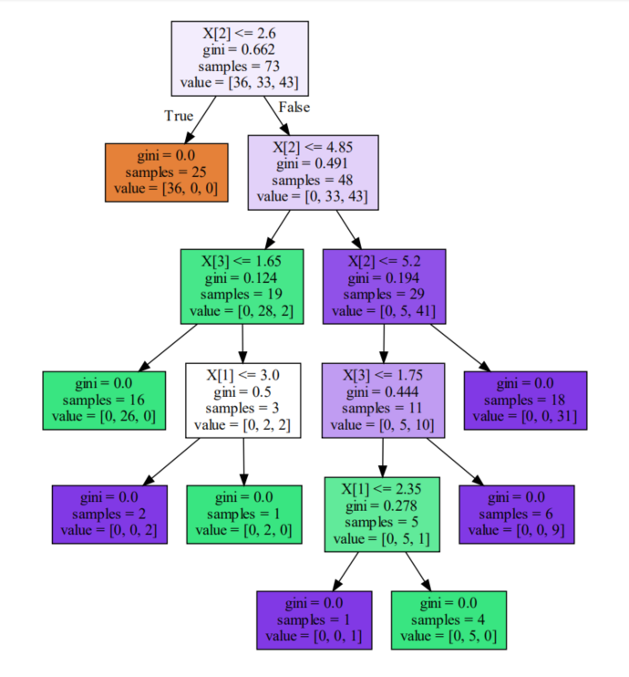

```Python
# 第100颗树类别
dot_data = tree.export_graphviz(forest[-1],filled=True)
graph = graphviz.Source(dot_data)
graph
```

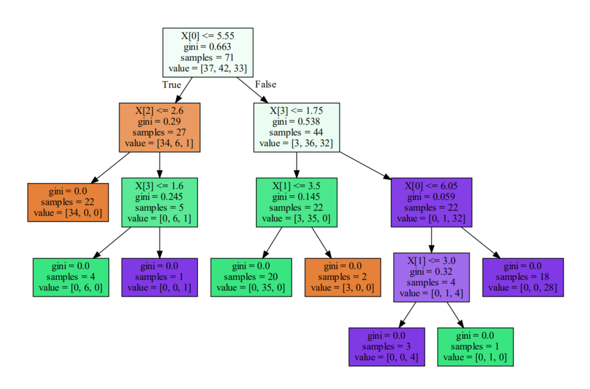

#### 5.4、随机森林总结

随机森林主要步骤：

* 随机选择样本（放回抽样）； 

* 随机选择特征； 

* 构建决策树； 

* 随机森林投票（平均） 

优点: 

* 表现良好

* 可以处理高维度数据(维度随机选择)

* 辅助进行特征选择

* 得益于 Bagging 可以进行并行训练

缺点： 

* 对于噪声过大的数据容易过拟合

### 6、极限森林

#### 6.1、极限森林介绍

极限森林，都有哪些随机？

* 极限森林中每一个决策树都采用**原始训练集**
* 抽样后，分裂时，每一个结点分裂时，都进行特征随机抽样（一部分特征作为分裂属性）
* 从分裂随机中筛选最优分裂条件

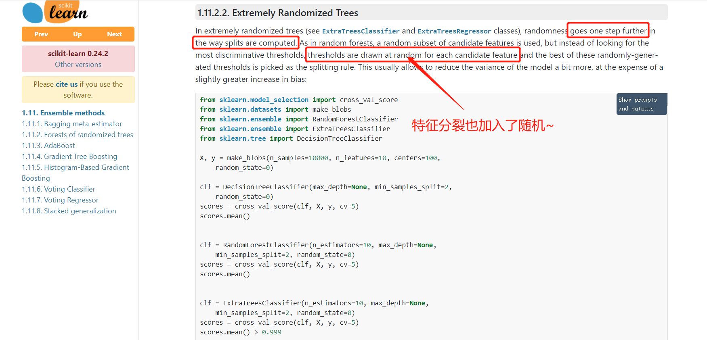

#### 6.2、极限森林实战

1、加载数据

```Python
import warnings
warnings.filterwarnings('ignore')
import numpy as np
from sklearn.ensemble import RandomForestClassifier,ExtraTreesClassifier
from sklearn.tree import DecisionTreeClassifier
from sklearn import datasets
from sklearn.model_selection import train_test_split
import graphviz
from sklearn import tree

# 加载数据
X,y = datasets.load_wine(True)
X_train,X_test,y_train,y_test = train_test_split(X,y,random_state = 119)
```

2、单棵决策树

```Python
clf = DecisionTreeClassifier()
clf.fit(X_train,y_train)
print('单棵决策树得分：',clf.score(X_test,y_test))
print('数据特征：',clf.n_features_)
print('节点分裂选择最大特征数量：',clf.max_features_)
```

3、随机森林

```Python
clf2 = RandomForestClassifier()
clf2.fit(X_train,y_train)
print('随机森林得分：',clf2.score(X_test,y_test))
print('数据特征：',clf2.n_features_)
for t in clf2:
    print('节点分裂选择最大特征数量：',t.max_features_)
```

4、极限森林

```Python
clf3 = ExtraTreesClassifier(max_depth = 3)
clf3.fit(X_train,y_train)
print('极限森林得分：',clf3.score(X_test,y_test))
print('数据特征：',clf3.n_features_)
for t in clf3:
    print('节点分裂选择最大特征数量：',t.max_features_)
```

5、可视化

```Python
dot_data = tree.export_graphviz(clf3[0],filled=True)
graph = graphviz.Source(dot_data)
graph
```

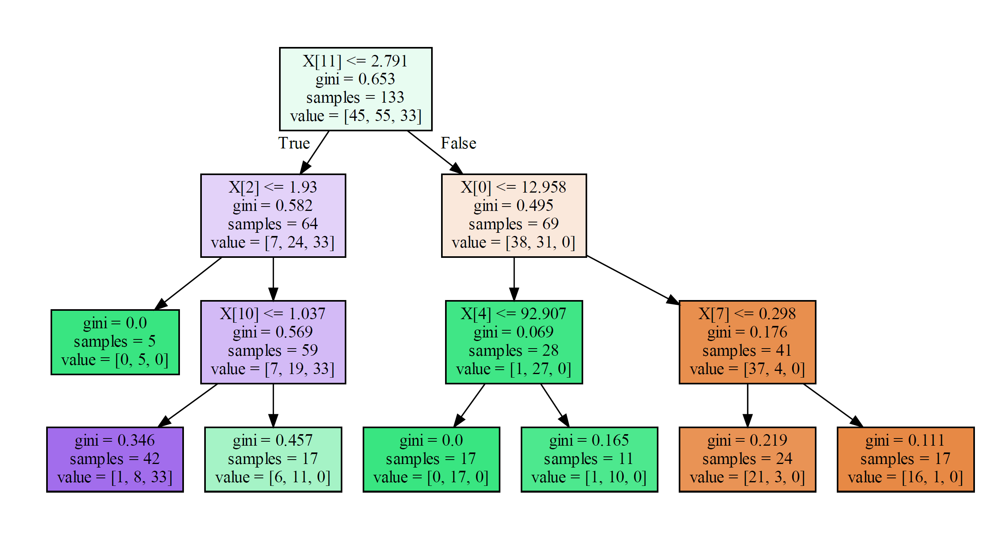

```Python
dot_data = tree.export_graphviz(clf3[49],filled=True)
graph = graphviz.Source(dot_data)
graph
```

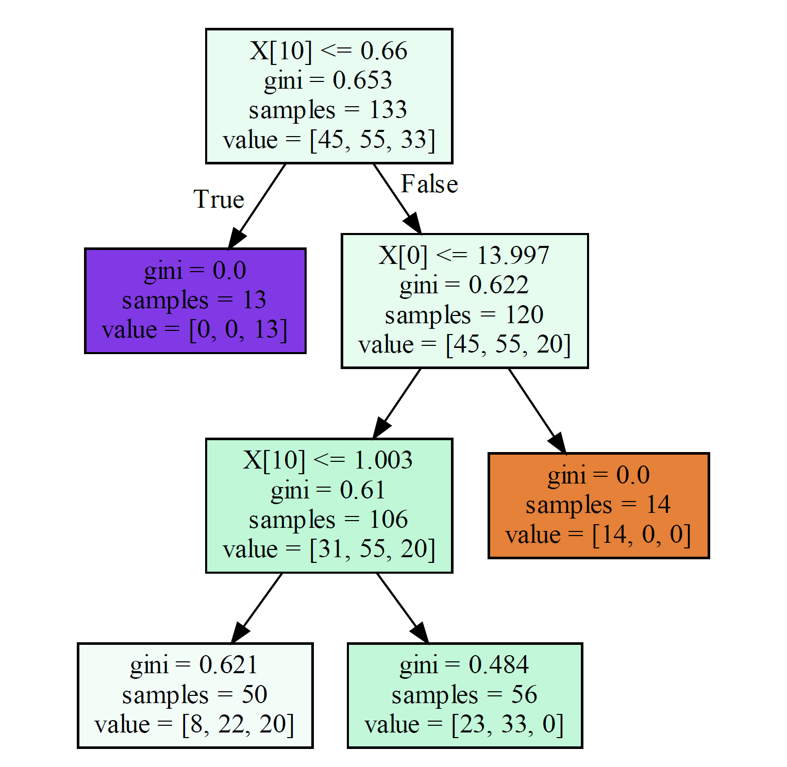

6、分裂标准代码演练

6.1、计算未分裂gini系数

```Python
count = []
for i in range(3):
    count.append((y_train == i).sum())
count = np.array(count)
p = count / count.sum()
gini = (p * (1 - p)).sum()
print('未分裂，gini系数是：',round(gini,3))
```

6.2、根据属性寻找最佳分裂条件

```Python
f = np.sort(X_train[:,11])
gini_lower = 1
best_split = {}
for i in range(len(f) - 1):
    split = round(f[i:i + 2].mean(),3)
    cond = X_train[:,11] <= split
    part1 = y_train[cond]
    part2 = y_train[~cond]
    # 计算每一部分的gini系数
    count1 = []
    count2 = []
    for j in range(3):
        count1.append((part1 == j).sum())
        count2.append((part2 == j).sum())
    count1,count2 = np.array(count1),np.array(count2)
    p1 = count1 / count1.sum()
    p2 = count2 / count2.sum()
    gini1 = round((p1 * (1 - p1)).sum(),3)
    gini2 = round((p2 * (1 - p2)).sum(),3)
    # 计算整体的gini系数
    gini = round(gini1 * count1.sum()/(y_train.size) + gini2 * count2.sum()/(y_train.size),3)
    if gini < gini_lower:
        gini_lower = gini
        best_split.clear()
        best_split[j] = split
    print(split,gini1,gini2,gini,count1,count2)
print(best_split,gini_lower)
```

**结论：**

* 通过打印输出可知，极限森林分裂条件，并不是最优的
* 并没有使用gini系数最小的分裂点
* 分裂值，具有随机性，这正是极限森林的随机所在！
