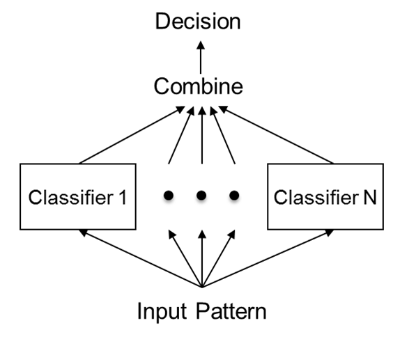
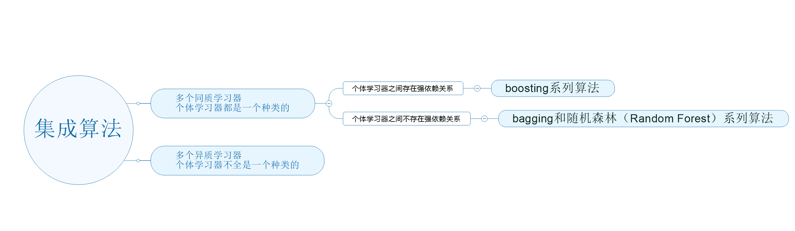
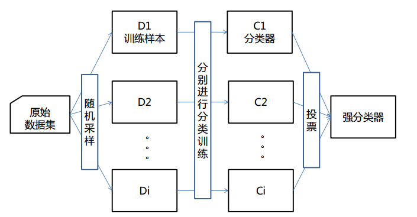
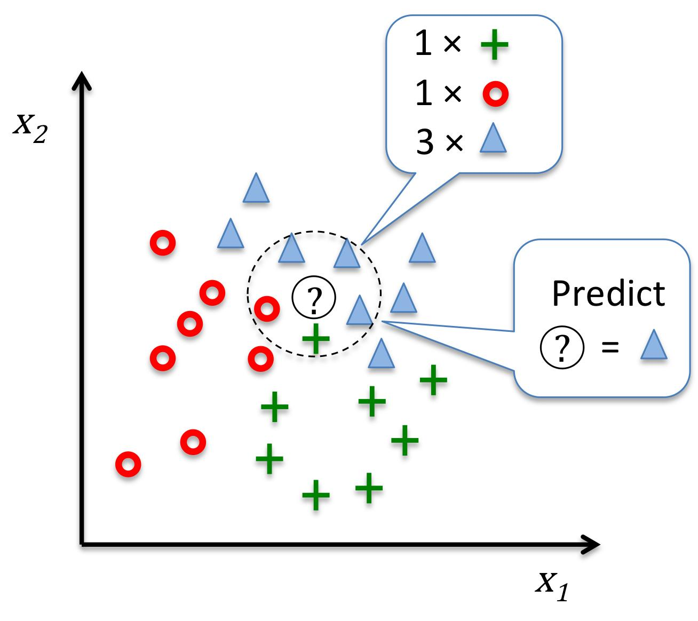
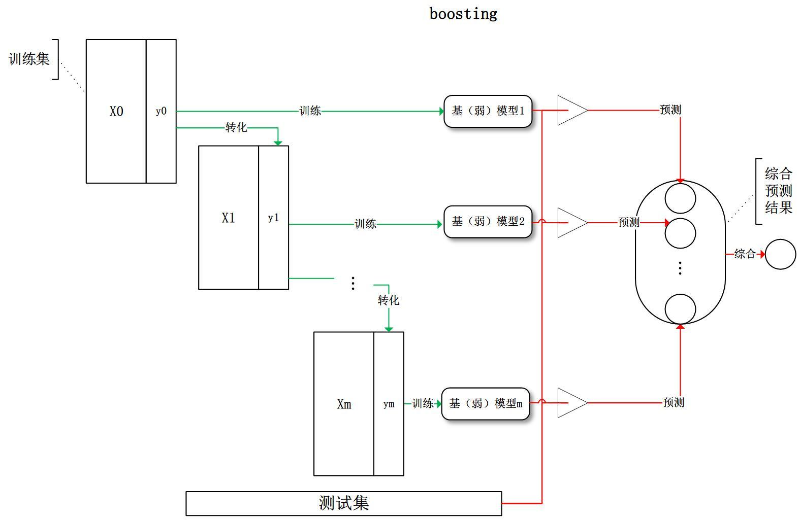
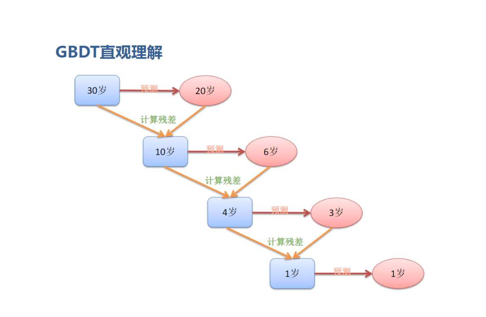
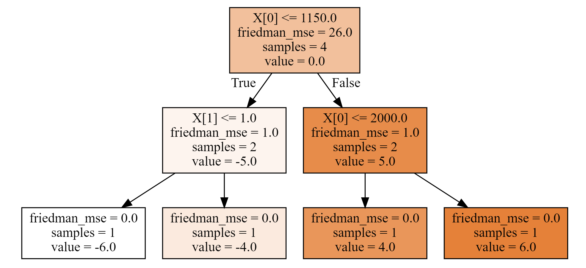
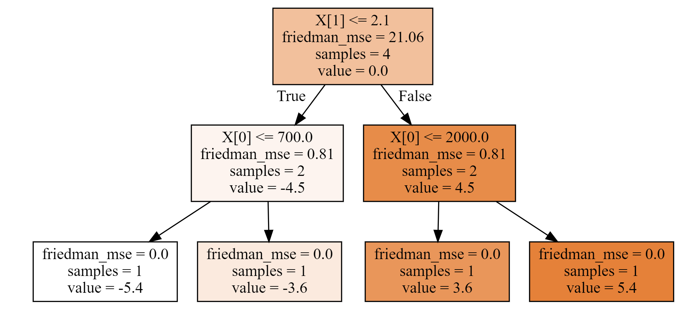
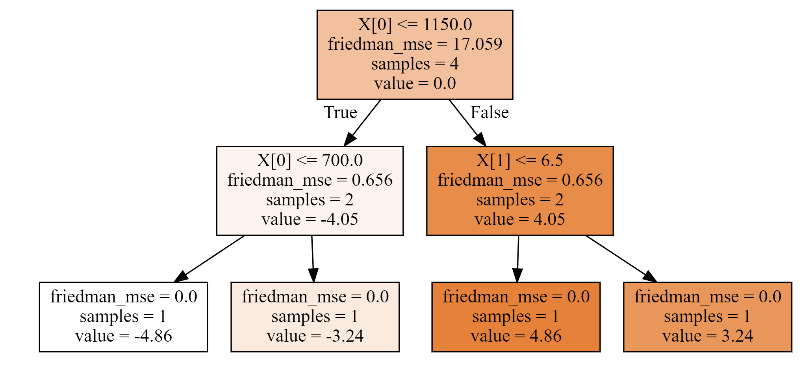

### 1、集成算法

#### 1.1、不同集成算法

集成算法流程概述




不同集成算法对比



同质学习器（也叫算法，model，模型）

* 随机森林，同质学习器，内部的100个模型，都是决策树
* bagging：套袋法
  * 随机森林
  * 极端森林
* boosting：提升法
  * GBDT
  * AdaBoost

#### 1.2、bagging




#### 1.3、自建集成算法（同质）

1、导包数据创建

```Python
import numpy as np
from sklearn.neighbors import KNeighborsClassifier
from sklearn.ensemble import BaggingClassifier
from sklearn import datasets
from sklearn.model_selection import train_test_split
from sklearn.linear_model import LogisticRegression
from sklearn.tree import DecisionTreeClassifier
X,y = datasets.load_wine(return_X_y = True)
X_train,X_test,y_train,y_test = train_test_split(X,y,random_state = 1024)
```

2、KNN集成算法

算法原理：



```Python
# 一个算法，准确率 62%
knn = KNeighborsClassifier()
knn.fit(X_train,y_train)
print('单一KNN算法，得分是：',knn.score(X_test,y_test))

# 100个算法，集成算法，准确提升到了73.3%
knn = KNeighborsClassifier()
# bag中100个knn算法
bag_knn = BaggingClassifier(base_estimator=knn,n_estimators=100,max_samples=0.8,max_features=0.7)
bag_knn.fit(X_train,y_train)
print('KNN集成算法，得分是：',bag_knn.score(X_test,y_test))
```


3、逻辑斯蒂回归集成算法

```Python
import warnings
warnings.filterwarnings('ignore')
lr = LogisticRegression()
lr.fit(X_train,y_train)
print('单一逻辑斯蒂算法，得分是：',lr.score(X_test,y_test))

# 偶尔效果会好
bag = BaggingClassifier(base_estimator=LogisticRegression(),n_estimators=500,
                        max_samples=0.8, max_features=0.5)
bag.fit(X_train,y_train)
print('逻辑斯蒂集成算法，得分是：', bag.score(X_test,y_test))
```

4、决策树自建集成算法

```Python
clf = DecisionTreeClassifier()
clf.fit(X_train,y_train)
print('单棵决策树，得分是：',clf.score(X_test,y_test))

bag = BaggingClassifier(base_estimator=DecisionTreeClassifier(),n_estimators=100,
                        max_samples=1.0,max_features=0.5)
bag.fit(X_train,y_train)
print('决策树集成算法，得分是：',bag.score(X_test,y_test))
```


#### 1.4、boosting



### 2、GBDT

#### 2.1、梯度提升树概述

* gradient Boosting DecisionTree ----> GBDT

* Boosting :提升的，一点点靠近最优答案



* 残差
  * **残差的意思就是： A的预测值 + A的残差 = A的实际值**
  * **残差 = 实际值 - 预测值**
  * **预测值 = 实际值 - 残差**

#### 2.2、梯度提升树应用

1、使用全量数据构建梯度提升树（0.1434）

```Python
from sklearn.ensemble import GradientBoostingRegressor
import numpy as np
import pandas as pd 

# 加载数据
data_train = pd.read_csv('zhengqi_train.txt', sep='\t')
data_test = pd.read_csv('zhengqi_test.txt', sep='\t')
X_train = data_train.iloc[:,:-1]
y_train = data_train['target']
X_test = data_test

# GBDT模型训练预测
gbdt = GradientBoostingRegressor()
gbdt.fit(X_train,y_train)
y_pred = gbdt.predict(X_test)
np.savetxt('GBDT_full_feature_result.txt', y_pred)
```


2、使用部分数据构建梯度提升树（0.1486）

```Python
from sklearn.linear_model import ElasticNet
from sklearn.ensemble import GradientBoostingRegressor
import numpy as np
import pandas as pd 

# 加载数据
data_train = pd.read_csv('zhengqi_train.txt', sep='\t')
data_test = pd.read_csv('zhengqi_test.txt', sep='\t')
X_train = data_train.iloc[:,:-1]
y_train = data_train['target']
X_test = data_test

# 先使用ElaticNet模型进行数据筛选
model = ElasticNet(alpha = 0.1, l1_ratio=0.05)
model.fit(X_train, y_train)
cond = model.coef_ != 0
X_train = X_train.iloc[:,cond]
X_test = X_test.iloc[:,cond]
print('删除数据后，形状是：',X_train.shape)

# GBDT模型训练预测
gbdt = GradientBoostingRegressor()
gbdt.fit(X_train,y_train)
y_pred = gbdt.predict(X_test)
np.savetxt('GBDT_drop_feature_result.txt', y_pred)
```


#### 2.3、梯度提升树原理

1、创建数据并使用梯度提升回归树进行预测

```Python
import numpy as np
from sklearn.ensemble import GradientBoostingRegressor
import matplotlib.pyplot as plt
from sklearn import tree
import graphviz

### 实际问题，年龄预测，回归问题
# 简单的数据，算法原理，无论简单数据，还是复杂数据，都一样
# 属性一表示花销，属性二表示上网时间
X = np.array([[600,0.8],[800,1.2],[1500,10],[2500,3]])
y = np.array([14,16,24,26]) # 高一、高三，大四，工作两年
# loss  = ls 最小二乘法
learning_rate = 0.1
gbdt = GradientBoostingRegressor(n_estimators=3,loss = 'ls',# 最小二乘法
                                 learning_rate=0.1)#learning_rate 学习率
gbdt.fit(X,y)#训练
y_ = gbdt.predict(X)#预测
y_
```

2、计算残差

```Python
# 目标值，真实值，算法，希望，预测，越接近真实，模型越好！！！
print(y)
# 求平均，这个平均值就是算法第一次预测的基准，初始值
print(y.mean())
# 残差：真实值，和预测值之间的差
residual = y - y.mean()
residual
# 残差，越小越好
# 如果残差是0，算法完全准确的把数值预测出来！
```

3、绘制三棵树

* 第一棵树

  ```Python
  # 第一颗树，分叉时，friedman-mse (就是均方误差)= 26
  print('均方误差：',((y - y.mean())**2).mean())
  dot_data = tree.export_graphviz(gbdt[0,0],filled=True)
  graph = graphviz.Source(dot_data)
  graph
  ```

  

  ```Python
  # 梯度下降，降低残差
  residual = residual - learning_rate*residual
  residual
  # 输出：array([-5.4, -3.6,  3.6,  5.4])
  ```

* 第二棵树

  ```Python
  # 第二颗树
  dot_data = tree.export_graphviz(gbdt[1,0],filled=True)
  graph = graphviz.Source(dot_data)
  graph
  ```

  

  ```Python
  # 梯度下降，降低残差
  residual = residual - learning_rate*residual
  residual
  # 输出：array([-4.86, -3.24,  3.24,  4.86])
  ```

* 第三棵树

  ```Python
  # 第三颗树
  dot_data = tree.export_graphviz(gbdt[2,0],filled=True)
  graph = graphviz.Source(dot_data)
  graph
  ```

  

  ```Python
  # 梯度下降，降低残差
  residual = residual - learning_rate*residual
  residual
  # 输出：array([-4.374, -2.916,  2.916,  4.374])
  ```

  4、使用残差计算最终结果

  ```Python
  # 使用残差一步步，计算的结果
  y_ = y - residual
  print('使用残差一步步计算，最终结果是：\n',y_)
  # 使用算法，预测
  gbdt.predict(X)
  # 两者输出结果一样
  ```

  结论：

  使用残差计算的结果和算法预测一模一样！
  
  
  
#### 2.4、梯度提升回归树的最佳裂分条件计算

1、第一棵树，分裂情况如下：


```Python
# 计算未分裂均方误差
lower_mse = ((y - y.mean())**2).mean()
print('未分裂均方误差是：',lower_mse)
best_split = {}
for index in range(2):
    for i in range(3):
        t = X[:,index].copy()
        t.sort()
        split = t[i:i + 2].mean()
        cond = X[:,index] <= split
        mse1 = round(((y[cond] - y[cond].mean())**2).mean(),3)
        mse2 = round(((y[~cond] - y[~cond].mean())**2).mean(),3)
        p1 = cond.sum()/cond.size
        mse = round(mse1 * p1 + mse2 * (1- p1),3)
        print('第%d列' % (index),'裂分条件是：',split,'均方误差是：',mse1,mse2,mse)
        if mse < lower_mse:
            best_split.clear()
            lower_mse = mse
            best_split['第%d列'%(index)] = split
        elif mse == lower_mse:
            best_split['第%d列'%(index)] = split
print('最佳分裂条件是：',best_split)
# 输出：
'''
未分裂均方误差是： 26.0
第0列 裂分条件是： 700.0 均方误差是： 0.0 18.667 14.0
第0列 裂分条件是： 1150.0 均方误差是： 1.0 1.0 1.0
第0列 裂分条件是： 2000.0 均方误差是： 18.667 0.0 14.0
第1列 裂分条件是： 1.0 均方误差是： 0.0 18.667 14.0
第1列 裂分条件是： 2.1 均方误差是： 1.0 1.0 1.0
第1列 裂分条件是： 6.5 均方误差是： 27.556 0.0 20.667
最佳分裂条件是： {'第0列': 1150.0, '第1列': 2.1}
'''
```

2、第二棵树，分裂情况如下：


```Python
# 梯度下降，降低残差
residual = residual - learning_rate*residual
# 计算未分裂均方误差
lower_mse = round(((residual - residual.mean())**2).mean(),3)
print('未分裂均方误差是：',lower_mse)
best_split = {}
for index in range(2):
    for i in range(3):
        t = X[:,index].copy()
        t.sort()
        split = t[i:i + 2].mean()
        cond = X[:,index] <= split
        mse1 = round(((residual[cond] - residual[cond].mean())**2).mean(),3)
        mse2 = round(((residual[~cond] - residual[~cond].mean())**2).mean(),3)
        p1 = cond.sum()/cond.size
        mse = round(mse1 * p1 + mse2 * (1- p1),3)
        print('第%d列' % (index),'裂分条件是：',split,'均方误差是：',mse1,mse2,mse)
        if mse < lower_mse:
            best_split.clear()
            lower_mse = mse
            best_split['第%d列'%(index)] = split
        elif mse == lower_mse:
            best_split['第%d列'%(index)] = split
print('最佳分裂条件是：',best_split)
# 输出
'''
未分裂均方误差是： 21.06
第0列 裂分条件是： 700.0 均方误差是： 0.0 15.12 11.34
第0列 裂分条件是： 1150.0 均方误差是： 0.81 0.81 0.81
第0列 裂分条件是： 2000.0 均方误差是： 15.12 0.0 11.34
第1列 裂分条件是： 1.0 均方误差是： 0.0 15.12 11.34
第1列 裂分条件是： 2.1 均方误差是： 0.81 0.81 0.81
第1列 裂分条件是： 6.5 均方误差是： 22.32 0.0 16.74
最佳分裂条件是： {'第0列': 1150.0, '第1列': 2.1}
'''
```

3、第三棵树，分裂情况如下：


```Python
# 梯度下降，降低残差
residual = residual - learning_rate*residual
# 计算未分裂均方误差
lower_mse = round(((residual - residual.mean())**2).mean(),3)
print('未分裂均方误差是：',lower_mse)
best_split = {}
for index in range(2):
    for i in range(3):
        t = X[:,index].copy()
        t.sort()
        split = t[i:i + 2].mean()
        cond = X[:,index] <= split
        mse1 = round(((residual[cond] - residual[cond].mean())**2).mean(),3)
        mse2 = round(((residual[~cond] - residual[~cond].mean())**2).mean(),3)
        p1 = cond.sum()/cond.size
        mse = round(mse1 * p1 + mse2 * (1- p1),3)
        print('第%d列' % (index),'裂分条件是：',split,'均方误差是：',mse1,mse2,mse)
        if mse < lower_mse:
            best_split.clear()
            lower_mse = mse
            best_split['第%d列'%(index)] = split
        elif mse == lower_mse:
            best_split['第%d列'%(index)] = split
print('最佳分裂条件是：',best_split)
# 输出
'''
未分裂均方误差是： 17.059
第0列 裂分条件是： 700.0 均方误差是： 0.0 12.247 9.185
第0列 裂分条件是： 1150.0 均方误差是： 0.656 0.656 0.656
第0列 裂分条件是： 2000.0 均方误差是： 12.247 0.0 9.185
第1列 裂分条件是： 1.0 均方误差是： 0.0 12.247 9.185
第1列 裂分条件是： 2.1 均方误差是： 0.656 0.656 0.656
第1列 裂分条件是： 6.5 均方误差是： 18.079 0.0 13.559
最佳分裂条件是： {'第0列': 1150.0, '第1列': 2.1}
'''
```

