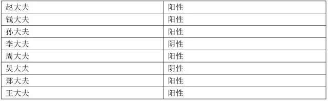

### 1、Adaboost算法介绍

#### 1.1、算法引出

AI 39年（公元1995年），扁鹊成立了一家专治某疑难杂症的医院，经过半年的精心筹备，硬件设施已全部到位，只缺经验丰富的医生前来坐诊。找几个猎头打听了一下，乖乖，请一个资深专家（总监头衔的），一年的工资就得256万。这恐怕还不够去知名搜索引擎投放广告！

穷则思变，扁鹊院长想来想去，找到了两个天才的顾问，名叫Freund（弗雷德）和Schapire（夏皮雷），想请他们出出主意，怎样用较低的成本解决医生的问题。这两位老兄想到了同一个点子：

三个臭皮匠，赛过诸葛亮

我们玩人海战术！不如去医学院招一批应届生，给他们训练一段时间然后上岗，组成一个会诊小组，一起来给病人看病，集体决策。扁鹊很快招来了8个年轻的新手：

赵大夫，钱大夫，孙大夫，李大夫，周大夫，吴大夫，郑大夫，王大夫

#### 1.2、算法策略

怎么训练这些新人呢？两个顾问设计出了一套培训方案：

1. 用大量的病例让这些新手依次学习，每个大夫自己琢磨怎样诊断，学习结束后统计一下每个人在这些病例上的诊断准确率
2. 训练时，前面的大夫误诊的病例，后面的大夫要重点学习研究，所谓查缺补漏
3. 训练结束之后，给每个大夫打分，如果一个大夫对病例学习的越好，也就是说在这些学习的病例集上诊断的准确率越高，他在后面诊断病人时的话语权就越大

扁鹊院长跑到其他医院买回了1万个病例，这些病例是这样的：


#### 1.3、训练流程

接下来培训过程开始了。首先接受培训的是赵大夫，经过学习总结，他摸索出了一套诊断规则，这套规则表现很不错，至少在学习用的病例集上，达到了70%的诊断准确率。学习完成之后，他给每一条病例调整了权重，被他误诊的病例，权重增大，诊断正确的病例，权重调小，以便于后面的医生有重点的学习。

接下来让钱大夫学习，他同样学习这些病例，但重点要关注被赵大夫误诊的那些病例，经过一番训练，钱大夫达到了75%的准确率。学习完之后，他也调整了这些病例的权重，被他误诊的病例，加大权重，否则减小权重。

后面的过程和前面类似，依次训练孙大夫，李大夫，周大夫，吴大夫，郑大夫，王大夫，每个大夫在学习的时候重点关注被前面的大夫误诊的病例，学习完之后调整每条病例的权重。这样到最后，王大夫对前面这些大夫都误诊的病例特别擅长，专攻这些情况的疑难杂症！

学习期结束之后，扁鹊院长汇总出了这8个大夫的诊断准确率：


#### 1.4、大夫话语权

当所有大夫都培训完成之后，就可以让他们一起坐堂问诊了。Freund和Schapire设计出了这样一套诊断规则：来一个病人之后，8个大夫一起诊断，然后投票。如果一个大夫之前在学习时的诊断准确率为p，他在投票时的话语权是：

<font size = 6>$\alpha = \frac{1}{2}ln\frac{p}{1-p}$​​​</font>

按照这个计算规则，8个大夫的话语权为：


#### 1.5、诊断结果

这样诊断结果的计算方法为，先汇总整合8个大夫的诊断结果：


在这里对病人的诊断结果有两种可能，阳性和阴性，我们量化表示，+1表示阳性，-1表示阴性。

最后的诊断结果是：如果上面计算出来的s值大于0，则认为是阳性，否则为阴性。

#### 1.6、病人诊断

第一个病人来了，8个大夫一番诊断之后，各自给出了结果：



现在是投票集体决策的时候了。投票值为：


按照规则，这个病人被判定为阳性。

#### 1.7、算法总结

医院运营了3个月，效果出奇的好，扁鹊院长统计了一下，诊断准确率居然高达95%，不比一个资深老专家差！每个医生一年的工资10万，8个医生总共才80万，这比请一个资深专家要便宜170万，太划算了！

这次成功之后，Freund和Schapire决定把这种方法推广到其他行业，用于解决一些实际问题。这些行业要解决的问题都有一个特点：要做出一个决策，这个决策有两种可能，例如银行要根据客户的收入、负债情况、信用记录等信息决定给客户贷款还是不贷款；人脸识别公司要判断一张图像是人脸还是不是人脸。这就是机器学习中的二分类问题，给定一个样本数据，判断这个样本的类别。对于上面的疾病诊断来说，样本数据就是病人的各项检查数据，类别是阴性和阳性。

两位天才给这种方法取了一个名字：**AdaBoost算法**。

Adaboosting中的Ada是adaptive的意思，所以AdaBoosting表示**自适应增强算法**！

### 2、Adaboost算法使用

#### 2.1、乳腺癌案例

1、导包

```Python
import numpy as np
from sklearn.tree import DecisionTreeClassifier
from sklearn.ensemble import AdaBoostClassifier,RandomForestClassifier
from sklearn.model_selection import train_test_split
from sklearn.metrics import accuracy_score
from sklearn import datasets
```

2、加载拆分数据

```Python
X,y = datasets.load_breast_cancer(return_X_y=True)
display(X.shape,y.shape,np.unique(y))
X_train,X_test,y_train,y_test = train_test_split(X,y,test_size=0.2)
```

3、使用决策树建模

```Python
model = DecisionTreeClassifier()
# 训练
model.fit(X_train,y_train)
# 预测值
y_pred = model.predict(X_test)
display(y_pred[:20],y_test[:20])
# 准确率
accuracy_score(y_test,y_pred)
# 准确率大约是：0.8947368421052632
```

4、使用随机森林建模

```Python
%%time
model = RandomForestClassifier(n_estimators=500)
# 训练
model.fit(X_train,y_train)
# 预测
y_pred = model.predict(X_test)
display(y_pred[:20],y_test[:20])
# 准确率
accuracy_score(y_test,y_pred)
# 准确率大约是：0.956140350877193
```

5、使用Adaboost算法建模

```Python
%%time
model = AdaBoostClassifier(n_estimators=500)
# 训练
model.fit(X_train,y_train)
# 预测
y_pred = model.predict(X_test)
display(y_pred[:20],y_test[:20])
# 准确率
accuracy_score(y_test,y_pred)
# 准确率大约是：0.9649122807017544
```

结论：

* 课件，Adaboost对数据拟合更加深入，准确率高，效果好
* 果然是：三个臭皮匠，顶个诸葛亮！


#### 2.2、手写数字案例

1、导包

```Python
import numpy as np
import pandas as pd
from sklearn import tree
import graphviz
from sklearn.tree import DecisionTreeClassifier
from sklearn.ensemble import AdaBoostClassifier,RandomForestClassifier
from sklearn.linear_model import LogisticRegression
import matplotlib.pyplot as plt
from sklearn.model_selection import train_test_split
from sklearn.metrics import accuracy_score
```

2、加载拆分数据

```Python
data = pd.read_csv('./digits.csv')
# 随机抽样
data = data.take(np.random.randint(0,42000,5000))
X = data.iloc[:,1:]
y = data['label']
X_train,X_test,y_train,y_test = train_test_split(X,y,test_size=0.2,random_state=1024)

display(X_train.shape,X_test.shape,y_train.shape,y_test.shape)
```

3、决策树

```Python
model = DecisionTreeClassifier()
# 训练
model.fit(X_train,y_train)
# 预测值
y_pred = model.predict(X_test)
display(y_pred[:20],y_test[:20].values)
# 准确率
accuracy_score(y_test,y_pred)
# 准确率：0.779
```

4、随机森林

```Python
%%time
model = RandomForestClassifier(n_estimators=100)
# 训练
model.fit(X_train,y_train)
# 预测
y_pred = model.predict(X_test)
display(y_pred[:20],y_test[:20].values)
# 准确率
accuracy_score(y_test,y_pred)
# 准确率：0.934
```

5、Adaboost提升算法

```Python
%%time
model = AdaBoostClassifier(n_estimators=100)
# 训练
model.fit(X_train,y_train)
# 预测
y_pred = model.predict(X_test)
display(y_pred[:20],y_test[:20].values)
# 准确率
accuracy_score(y_test,y_pred)
# 准确率：0.521
```

6、逻辑回归算法

```Python
%%time
model = LogisticRegression(max_iter=10000)
# 训练
model.fit(X_train,y_train)
# 预测
y_pred = model.predict(X_test)
display(y_pred[:20],y_test[:20].values)
# 准确率
accuracy_score(y_test,y_pred)
# 准确率：0.891
```

7、可视化

```Python
plt.figure(figsize=(5*2,10*2))
plt.rcParams['font.family'] = 'STKaiti'
for i in range(50):
    plt.subplot(10,5,i + 1)
    plt.imshow(X_test.iloc[i].values.reshape(28,28))
    plt.axis('off')
    plt.title('预测值是：%d' %(y_pred[i]))
```


结论：

* 手写数字的特征是像素值，特征值多大784个
* 而且像素中很多值都是0，没有特征区分度
* Adaboost对这个效果就不好
* 逻辑回归，比决策树算法效果要好一些


### 3、Adaboost二分类算法原理

#### 3.1、算法流程

算法流程图：


算法流程详解：

* $$w^0 = \frac{1}{m},1,2,3,……,m$$ 相当于上图中$D_1(i) = \frac{1}{m}$​
* 训练弱学习器，计算误差率e，可以计算准确率p ，p + e = 1
* 弱学习器的权重$$\alpha_t = \frac{1}{2}ln\frac{1-e_t}{e_t} = \frac{1}{2}ln\frac{p_t}{1-p_t}$$
* $$w^{t+1} = [w^{t}*exp(-yh_t(x)\alpha_t)]$$ 没有进行归一化，相当于$D_{t+1}(i) = [D_t(i)*exp(-\alpha_ty_ih_t(x_i))]$
* $$Z_t是归一化因子$$
* $$Z_t = \sum\limits_{i=1}^mw_i^t$$
* $$w^t = w^t/Z_t$$ 归一化

* 聚合多次训练的弱分类器--->强分类器$H(x) = sign\left(\sum\limits_{t = 1}^T\alpha_th_t(x)\right)$

* sign(F(x))也可以用（sgn(F(x))表示，意思一样）表示F(x) 大于0结果正的，如果F(x)小于0,结果就是负的
* $$sign(F(x)) = \left\{\begin{aligned}&+1,x>0\\&-1,x<=0\end{aligned}\right.$$​​


#### 3.2、手撕算法

##### 3.2.1、创建模拟数据

```Python
from sklearn.ensemble import AdaBoostClassifier
import numpy as np
from sklearn import tree
import graphviz
X = np.arange(10).reshape(-1,1)
y = np.array([1,1,1,-1,-1,-1,1,1,1,-1])
display(X,y)
```


##### 3.2.2、Adaboost建模

```Python
# 使用SAMME表示在构建树时，每棵树都采用相同的分裂方式
ada = AdaBoostClassifier(algorithm='SAMME',n_estimators=3)
ada.fit(X,y)
y_ = ada.predict(X)
display(y,y_)
```

##### 3.2.3、查看每一棵树结构

第一棵树：

```Python
dot_data = tree.export_graphviz(ada[0],filled=True)
graph = graphviz.Source(dot_data)
y1_ = ada[0].predict(X)#第一棵树的预测值，怎么预测呢？
print(y1_)
graph
```


第二棵树：

```Python
dot_data = tree.export_graphviz(ada[1],filled=True)
print(ada[1].predict(X))
graphviz.Source(dot_data)#样本权重，发生变化了
```


第三棵树：

```Python
dot_data = tree.export_graphviz(ada[2],filled=True)
print(ada[2].predict(X))
graphviz.Source(dot_data)
```


##### 3.2.4、第一棵树代码构建


1、gini系数计算

```Python
w1 = np.full(shape = 10,fill_value=1/10)
cond = y == -1
p1 = w1[cond].sum()
cond = y == 1
p2 = w1[cond].sum()
# 计算方式一
gini = p1 * (1 - p1) + p2 * (1 - p2)
print('计算方式二：',gini)
# 计算方式二
gini = 1 - p1**2 - p2**2
print('计算方式二：',gini)
# 输出：0.48
```

2、拆分条件

```Python
gini_result = []
best_split = {}
lower_gini = 1
# 如何划分呢，分成两部分
for i in range(len(X) - 1):
    split = X[i:i+2].mean()
    cond = (X <= split).ravel()
    part1 = y[cond]
    part2 = y[~cond]
    gini1 = 0
    gini2 = 0
    for i in np.unique(y):
        p1 = (part1 == i).sum()/part1.size
        gini1 += p1 * (1 - p1)
        p2 = (part2 == i).sum()/part2.size
        gini2 += p2 * (1 - p2)
    part1_p = cond.sum()/cond.size
    part2_p = 1 - part1_p
    gini  = part1_p * gini1 + part2_p* gini2
    gini_result.append(gini)
    if gini < lower_gini:
        lower_gini = gini
        best_split.clear()
        best_split['X[0]'] = split
print(gini_result)
print(best_split)
# 输出
'''
[0.4444444444444444, 0.4, 0.3428571428571428, 0.45, 0.48, 0.45, 0.47619047619047616, 0.475, 0.4]
{'X[0]': 2.5}
'''
```

3、计算误差率

```Python
# 计算误差率
print(y)
y1_ = ada[0].predict(X) #预测结果
print(y1_)
y1_ = np.array([1 if X[i] < 2.5 else -1 for i in range(10)])
print(y1_)
e1 = ((y != y1_)).mean()#误差
print('第一棵树误差率是：',e1)
# 输出：
'''
[ 1  1  1 -1 -1 -1  1  1  1 -1]
[ 1  1  1 -1 -1 -1 -1 -1 -1 -1]
[ 1  1  1 -1 -1 -1 -1 -1 -1 -1]
第一棵树误差率是： 0.3
'''
```

4、计算第一个分类器权重

```Python
# 计算第一个弱学习器的权重，相当于大夫的话语权
alpha_1 = 1/2*np.log((1 -e1)/e1 )
print('计算第一个弱学习器的权重:',alpha_1)
# 输出：计算第一个弱学习器的权重: 0.42364893019360184
```

5、更新样本权重

```Python
# 在w1的基础上，进行更新 w1 = [0.1,0.1,0.1……]
w2 = w1 * np.exp(-alpha_1 * y * y1_)
w2 = w2/w2.sum() # 归一化
print('第一棵树学习结束更新权重：\n',w2)
# 输出
'''
第一棵树学习结束更新权重：
 [0.07142857 0.07142857 0.07142857 0.07142857 0.07142857 0.07142857
 0.16666667 0.16666667 0.16666667 0.07142857]
'''
```

##### 3.2.5、第二棵树代码构建


1、gini系数计算

```Python
cond = y == -1
p1 = w2[cond].sum()
cond = y == 1
p2 = w2[cond].sum()
# 计算方式一
gini = p1 * (1 - p1) + p2 * (1 - p2)
print('计算方式二：',gini)
# 计算方式二
gini = 1 - p1**2 - p2**2
print('计算方式二：',gini)
# 输出：
'''
计算方式二： 0.40816326530612246
计算方式二： 0.40816326530612257
'''
```

2、拆分条件

```Python
gini_result = []
best_split = {}
lower_gini = 1
# 如何划分呢，分成两部分
for i in range(len(X) - 1):
    split = X[i:i+2].mean()
    cond = (X <= split).ravel()
    part1 = y[cond]
    part1_w2 = w2[cond]/w2[cond].sum()
    part2 = y[~cond]
    part2_w2 = w2[~cond]/w2[~cond].sum()
    gini1 = 1
    gini2 = 1
    for i in [-1,1]:
        cond1 = part1 == i
        p1 = part1_w2[cond1].sum()
        gini1 -= p1**2
        cond2 = part2 == i
        p2 = part2_w2[cond2].sum()
        gini2 -= p2**2
    part1_p = cond.sum()/cond.size
    part2_p = 1 - part1_p
    gini  = part1_p * gini1 + part2_p * gini2
    if gini < lower_gini:
        lower_gini = gini
        best_split.clear()
        best_split['X[0]'] = split
    gini_result.append(gini)
print(gini_result,len(gini_result))
print('最佳裂分条件是：',best_split)
# 输出：
'''
[0.38343195266272184, 0.35555555555555546, 0.3239669421487602, 0.40199999999999997, 0.41283950617283954, 0.3875, 0.40975723183391005, 0.40743750000000006, 0.31952662721893493] 9
最佳裂分条件是： {'X[0]': 8.5}
'''
```

3、计算误差率

```python
print(y)
y2_ = ada[1].predict(X)
print(y2_)
y2_ = np.array([1 if X[i] < 8.5 else -1 for i in range(10)])
print(y2_)
print('样本的权重是：',w2.round(4))
e2 = ((y != y2_) * w2).sum()
print('第二棵树的误差率：',e2)
# 输出
'''
[ 1  1  1 -1 -1 -1  1  1  1 -1]
[ 1  1  1  1  1  1  1  1  1 -1]
[ 1  1  1  1  1  1  1  1  1 -1]
样本的权重是： [0.0714 0.0714 0.0714 0.0714 0.0714 0.0714 0.1667 0.1667 0.1667 0.0714]
第二棵树的误差率： 0.21428571428571425
'''
```

4、计算第二个分类器权重

```python
#计算第二棵树的权重
alpha_2 =1/2*np.log((1 - e2)/e2)
print('第二棵树，权重是：',alpha_2)
# 输出
'''
第二棵树，权重是： 0.6496414920651306
'''
```

5、更新样本权重

```Python
w3 = w2 * np.exp(-alpha_2 * y * y2_)
w3 = w3/w3.sum()
print('第二棵树，更新样本权重，更新样本分布：\n',w3)
# 输出
'''
第二棵树，更新样本权重，更新样本分布：
 [0.04545455 0.04545455 0.04545455 0.16666667 0.16666667 0.16666667
 0.10606061 0.10606061 0.10606061 0.04545455]
'''
```

##### 3.2.6、第三棵树代码构建


1、gini系数计算

```python
cond = y == -1
p1 = w3[cond].sum()
cond = y == 1
p2 = w3[cond].sum()
# 计算方式一
gini = p1 * (1 - p1) + p2 * (1 - p2)
print('计算方式二：',gini)
# 计算方式二
gini = 1 - p1**2 - p2**2
print('计算方式二：',gini)
# 输出
'''
计算方式二： 0.49586776859504134
计算方式二： 0.4958677685950414
'''
```

2、拆分条件

```Python
gini_result = []
best_split = {}
lower_gini = 1
# 如何划分呢，分成两部分
for i in range(len(X) - 1):
    split = X[i:i+2].mean()
    cond = (X <= split).ravel()
    part1 = y[cond]
    part1_w3 = w3[cond]/w3[cond].sum()
    part2 = y[~cond]
    part2_w3 = w3[~cond]/w3[~cond].sum()
    gini1 = 1
    gini2 = 1
    for i in [-1,1]:
        cond1 = part1 == i
        p1 = part1_w3[cond1].sum()
        gini1 -= p1**2
        cond2 = part2 == i
        p2 = part2_w3[cond2].sum()
        gini2 -= p2**2
    part1_p = cond.sum()/cond.size
    part2_p = 1 - part1_p
    gini  = part1_p * gini1 + part2_p * gini2
    if gini < lower_gini:
        lower_gini = gini
        best_split.clear()
        best_split['X[0]'] = split
    gini_result.append(gini)
print(gini_result,len(gini_result))
print('最佳裂分条件是：',best_split)
# 输出
'''
[0.44081632653061237, 0.384, 0.3257617728531856, 0.49573156899810966, 0.44603537981269503, 0.2895408163265305, 0.395068951950528, 0.4712448979591837, 0.44897959183673486] 9
最佳裂分条件是： {'X[0]': 5.5}
'''
```

3、计算误差率

```Python
print(y)
y3_ =ada[2].predict(X)
print(y3_)
y3_ = np.array([-1 if X[i] < 5.5 else 1 for i in range(10)])
print(y3_)
e3 = ((y != y3_)* w3).sum()
print('第三棵树的误差率：',e3)
# 输出
'''
[ 1  1  1 -1 -1 -1  1  1  1 -1]
[-1 -1 -1 -1 -1 -1  1  1  1  1]
[-1 -1 -1 -1 -1 -1  1  1  1  1]
第三棵树的误差率： 0.1818181818181818
'''
```

4、计算第三个分类器权重

```Python
alpha_3 = 1/2*np.log((1 - e3)/e3)
print('第三棵树的权重是：',alpha_3)
# 输出
'''
第三棵树的权重是： 0.7520386983881371
'''
```

5、更新样本权重（为下一棵树拟合做准备）

```Python
# 更新第三棵树的，样本权值分布，权重
w4 = w3 * np.exp(-alpah_3 * y * y_)
w4 = w4/w4.sum()
print('第三棵树，更新样本权重：',w4.round(3))
# 输出
'''
第三棵树，更新样本权重： [0.045 0.045 0.045 0.167 0.167 0.167 0.106 0.106 0.106 0.045]
'''
```


##### 3.2.7、聚合弱分类器--->强分类器

```Python
print('每一个弱分类器的预测结果：')
display(y1_,y2_,y3_)
F =  alpha_1* y1_ + alpha_2*y2_ + alpha_3*y3_
# 将多个弱分类器，整合，变成了强分类器F(X)
print('强分类器合并结果：\n',F)
print('强分类器最终结果如下：\n',np.array([1 if i > 0 else -1 for i in F]))

print('算法预测结果：\n',ada.predict(X))

# 输出：
'''
每一个弱分类器的预测结果：
array([ 1,  1,  1, -1, -1, -1, -1, -1, -1, -1])
array([ 1,  1,  1,  1,  1,  1,  1,  1,  1, -1])
array([-1, -1, -1, -1, -1, -1,  1,  1,  1,  1])
强分类器合并结果：
 [ 0.32125172  0.32125172  0.32125172 -0.52604614 -0.52604614 -0.52604614
  0.97803126  0.97803126  0.97803126 -0.32125172]
强分类器最终结果如下：
 [ 1  1  1 -1 -1 -1  1  1  1 -1]
算法预测结果：
 [ 1  1  1 -1 -1 -1  1  1  1 -1]
'''
```


##### 3.2.7、算法 VS 自己代码对比

```Python
print('算法中每个分类器的误差：',ada.estimator_errors_)
print('手动计算每个分类器的误差：',e1,e2,e3)

print('---------------------')

print('算法中每个分类器的权重：',ada.estimator_weights_)
print('手动计算每个分类器的权重：',alpha_1,alpha_2,alpha_3)

# 输出
'''
算法中每个分类器的误差： [0.3        0.21428571 0.18181818]
手动计算每个分类器的误差： 0.3 0.21428571428571425 0.1818181818181818
---------------------
算法中每个分类器的权重： [0.84729786 1.29928298 1.5040774 ]
手动计算每个分类器的权重： 0.42364893019360184 0.6496414920651306 0.7520386983881371
'''
```

结论：

* 自己计算的误差和算法提供的误差一样
* 自己计算的权重和算法返回的权重，是2倍关系


##### 3.2.8、概率计算

先使用算法预测概率：

```Python
# 使用算法预测概率
ada.predict_proba(X)
# 输出
'''
array([[0.45611407, 0.54388593],
       [0.45611407, 0.54388593],
       [0.45611407, 0.54388593],
       [0.57155357, 0.42844643],
       [0.57155357, 0.42844643],
       [0.57155357, 0.42844643],
       [0.36916261, 0.63083739],
       [0.36916261, 0.63083739],
       [0.36916261, 0.63083739],
       [0.54388593, 0.45611407]])
'''
```

手写代码计算概率

计算每棵树的预测值

```Python
# 计算每棵树的预测值
y1_ = (ada[0].predict(X) == np.array([[-1],[1]])).T.astype(np.int8)
y2_ = (ada[1].predict(X) == np.array([[-1],[1]])).T.astype(np.int8)
y3_ = (ada[2].predict(X) == np.array([[-1],[1]])).T.astype(np.int8)
display(y1_,y2_,y3_)
```


 根据权重计算概率

```Python
# 根据权重，计算综合输出
pred = y1_*alpha_1 * 2+ y2_*alpha_2 * 2 + y3_*alpha_3 * 2

# 进行归一化处理
pred/=(alpha_1 + alpha_2 + alpha_3)*2

# 第一列正负反转
pred[:,0] *= -1

# 求和
pred = pred.sum(axis = 1)

# 水平堆叠
pred = np.vstack([-pred, pred]).T / 2

# 根据softmax求解概率
np.exp(pred)/(np.exp(pred).sum(axis = 1).reshape(-1,1))
```

