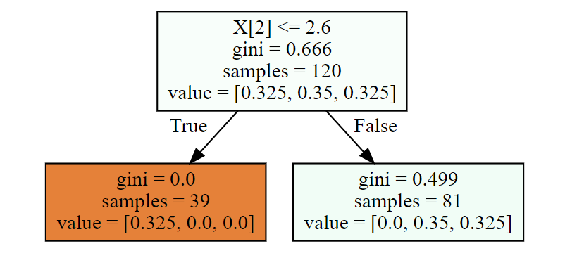
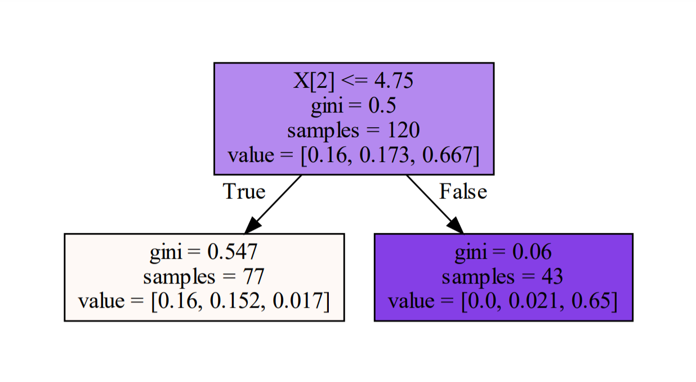
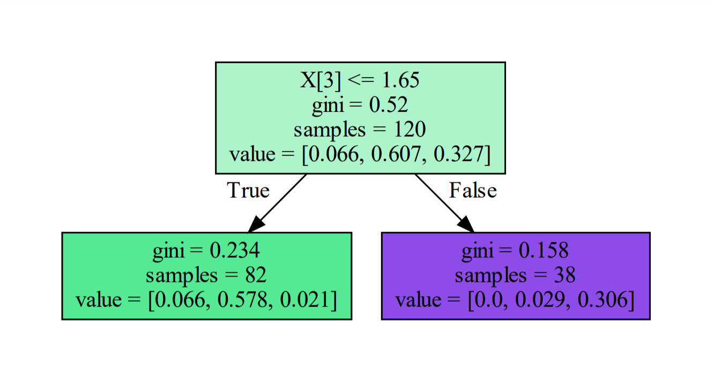
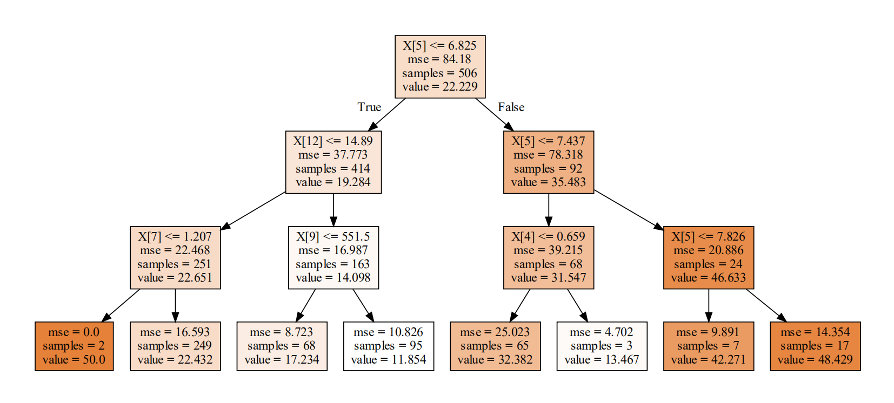

### 1、Adaboost多分类算例

#### 1.1、导包

```Python
import numpy as np
from sklearn.ensemble import AdaBoostClassifier
from sklearn import datasets
from sklearn.model_selection import train_test_split
from sklearn import tree
import graphviz
```


#### 1.2、加载数据

```Python
X,y = datasets.load_iris(return_X_y = True)
X_train,X_test,y_train,y_test = train_test_split(X,y,test_size = 0.2,random_state = 1024)
```


#### 1.3、建模

```python
# 多分类问题，不是+1、-1
# 类别0,1,2
ada = AdaBoostClassifier(n_estimators=3,algorithm='SAMME',learning_rate=1.0)
ada.fit(X_train,y_train) #算法，工作：从X_train---y_train寻找规律
y_ = ada.predict(X_test)
proba_ = ada.predict_proba(X_test)
accuracy = ada.score(X_test,y_test)
print('--------------------算法准确率：',accuracy)
display(y_,proba_)
```


#### 1.4、第一棵树构建

```Python
# 这棵树，简单的树，树的深度：1
# Adaboosting里面都是简单的树
dot_data = tree.export_graphviz(ada[0],filled=True)
graphviz.Source(dot_data)
```




##### 1.4.1、gini系数计算

```Python
w1 = np.full(shape = 120,fill_value=1/120)
gini = 1
for i in range(3):
    cond = y_train == i
    p = w1[cond].sum()
    gini -= p**2
print('-------------gini系数：',gini)
# 输出
'''
-------------gini系数： 0.6662499999999998
'''
```

##### 1.4.2、拆分条件

```Python
best_split = {}
lower_gini = 1
# 如何划分呢，分成两部分
for col in range(X_train.shape[1]):
    for i in range(len(X_train) - 1):
        X = X_train[:,col].copy()
        X.sort()
        split = X[i:i+2].mean()
        cond = (X_train[:,col] <= split).ravel()
        part1 = y_train[cond]
        part2 = y_train[~cond]
        gini1 = 0
        gini2 = 0
        for target in np.unique(y_train):
            if part1.size != 0:
                p1 = (part1 == target).sum()/part1.size
                gini1 += p1 * (1 - p1)
            if part2.size != 0:
                p2 = (part2 == target).sum()/part2.size
                gini2 += p2 * (1 - p2)
        part1_p = w1[cond].sum()
        part2_p = 1 - part1_p
        gini  = part1_p * gini1 + part2_p* gini2
        if gini < lower_gini:
            lower_gini = gini
            best_split.clear()
            best_split['X[%d]'%(col)] = split
        elif gini == lower_gini:
            best_split['X[%d]'%(col)] = split
print(best_split)
# 输出
'''
{'X[2]': 2.5999999999999996, 'X[3]': 0.75}
'''
```

##### 1.4.3、计算误差率

```Python
# 计算误差率
y1_ = ada[0].predict(X_train) #预测结果
print(y1_)
e1 = ((y_train != y1_)).mean()#误差
print('第一棵树误差率是：',e1)
print('算法的误差是：',ada.estimator_errors_)
# 输出
'''
[1 1 1 1 1 1 1 1 0 1 1 1 0 1 0 1 1 0 1 1 1 1 0 0 1 1 1 1 1 1 1 1 1 1 1 0 0
 1 0 1 0 1 0 1 1 1 0 1 0 1 0 1 1 1 1 1 0 1 0 1 1 0 1 1 1 1 1 1 0 1 0 0 1 1
 1 1 0 0 1 0 1 1 0 0 1 0 1 1 1 0 1 1 0 1 0 1 1 1 0 0 0 0 0 1 0 1 1 0 1 0 0
 1 1 0 1 1 1 1 1 1]
第一棵树误差率是： 0.325
算法的误差是： [0.325      0.18993352 0.1160323 ]
'''
```

##### 1.4.4、计算第一个分类器权重

```Python
learning_rate = 1.0
num = 3 # 三分类
a1 = learning_rate * (np.log((1-e1)/e1) + np.log(num - 1))
print('手动计算算法权重是：',a1)

print('算法返回的分类器权重是：',ada.estimator_weights_)
# 输出
'''
手动计算算法权重是： 1.4240346891027378
算法返回的分类器权重是： [1.42403469 2.14358936 2.72369906]
'''
```

##### 1.4.5、更新样本权重

```Python
# 更新样本的权重
w2 = w1 * np.exp(a1 * (y_train != y1_))
w2 /= w2.sum()
w2
```

#### 1.5、第二棵树构建

```Python
# 这棵树，简单的树，树的深度：1
# Adaboosting里面都是简单的树
dot_data = tree.export_graphviz(ada[1],filled=True)
graphviz.Source(dot_data)
```



##### 1.5.1、gini系数计算

```Python
gini = 1
for i in range(3):
    cond = y_train == i
    p = w1[cond].sum()
    gini -= p**2
print('-------------gini系数：',gini)
# 输出
'''
-------------gini系数： 0.4999237921048617
'''
```

##### 1.5.2、拆分条件

```Python
best_split = {}
lower_gini = 1
# 如何划分呢，分成两部分
for col in range(X_train.shape[1]):
    for i in range(len(X_train) - 1):
        X = X_train[:,col].copy()
        X.sort()
        split = X[i:i+2].mean()
        cond = (X_train[:,col] < split).ravel()
        part1 = y_train[cond]
        part1_w2 = w2[cond]/w2[cond].sum()
        part2 = y_train[~cond]
        part2_w2 = w2[~cond]/w2[~cond].sum()
        gini1 = 1
        gini2 = 1
        for target in np.unique(y_train):
            cond1 = part1 == target
            p1 = part1_w2[cond1].sum()
            gini1 -= p1**2
            cond2 = part2 == target
            p2 = part2_w2[cond2].sum()
            gini2 -= p2**2
        part1_p = w2[cond].sum()
        part2_p = 1 - part1_p

        gini  = part1_p * gini1 + part2_p * gini2
        
        if gini < lower_gini:
            lower_gini = gini
            best_split.clear()
            best_split['X[%d]'%(col)] = split
print(best_split)
'''
{'X[2]': 4.75}
'''
```


##### 1.5.3、计算误差率

```Python
# 误差
y2_ = ada[1].predict(X_train)#y2_第二个弱学习器预测值，y_train真实
e2 = ((y2_ != y_train) * w2).sum()
print('---------------第二棵树误差是：',e2)
print('算法返回每棵树的误差值是：',ada.estimator_errors_)
# 输出
'''
---------------第二棵树误差是： 0.18993352326685659
算法返回每棵树的误差值是： [0.325      0.18993352 0.1160323 ]
'''
```

##### 1.5.4、计算第二个弱分类器权重

```Python
# 第二个弱学习器的权重，扁鹊医院大夫的话语权
a2 = learning_rate * (np.log((1-e2)/e2) + np.log(num - 1))
print('第二个弱分类器权重：',a2)
print('算法返回每棵树的权重是：',ada.estimator_weights_)
# 输出
'''
第二个弱分类器权重： 2.1435893615035875
算法返回每棵树的权重是： [1.42403469 2.14358936 2.72369906]
'''
```

##### 1.5.5、更新样本权重

```Python
# 更新样本的权重
w3 = w2 * np.exp(a2 * (y_train != y2_))
w3 /= w3.sum()#归一化 Normalization
```


#### 1.6、第三棵树构建

```Python
# 这棵树，简单的树，树的深度：1
# Adaboosting里面都是简单的树
dot_data = tree.export_graphviz(ada[2],filled=True)
graphviz.Source(dot_data)
```



##### 1.6.1、gini系数计算

```Python
gini = 1
for i in range(3):
    cond = y_train == i
    p = w3[cond].sum()
    gini -= p**2
print('-------------gini系数：',gini)
# 输出
'''
-------------gini系数： 0.5204740911365549
'''
```

##### 1.6.2 拆分条件

```Python
best_split = {}
lower_gini = 1
# 如何划分呢，分成两部分
for col in range(X_train.shape[1]):
    for i in range(len(X_train) - 1):
        X = X_train[:,col].copy()
        X.sort()
        split = X[i:i+2].mean()
        cond = (X_train[:,col] < split).ravel()
        part1 = y_train[cond]
        part1_w3 = w3[cond]/w3[cond].sum()
        part2 = y_train[~cond]
        part2_w3 = w3[~cond]/w3[~cond].sum()
        gini1 = 1
        gini2 = 1
        for target in np.unique(y_train):
            cond1 = part1 == target
            p1 = part1_w3[cond1].sum()
            gini1 -= p1**2
            cond2 = part2 == target
            p2 = part2_w3[cond2].sum()
            gini2 -= p2**2
        part1_p = w3[cond].sum()
        part2_p = 1 - part1_p

        gini  = part1_p * gini1 + part2_p * gini2
        if gini < lower_gini:
            lower_gini = gini
            best_split.clear()
            best_split['X[%d]'%(col)] = split
print(best_split)
'''
{'X[3]': 1.65}
'''
```


##### 1.6.3、计算误差率

```Python
# 误差
y3_ = ada[2].predict(X_train)#y3_表示第三个弱学习器预测值，y_train真实
e3 = ((y3_ != y_train)* w3).sum()
print('---------------',e3)
print('算法返回每棵树的误差值是：',ada.estimator_errors_)
# 输出
'''
--------------- 0.11603230428552824
算法返回每棵树的误差值是： [0.325      0.18993352 0.1160323 ]
'''
```


##### 1.6.4、计算第三个弱分类器权重

```Python
# 第三个弱学习器的权重，扁鹊医院大夫的话语权
a3 = learning_rate*(np.log((1-e3)/e3) + np.log(num - 1))
print('第三个弱分类器权重：',a3)
print('算法返回每棵树的权重是：',ada.estimator_weights_)
# 输出
'''
第三个弱分类器权重： 2.72369906166382
算法返回每棵树的权重是： [1.42403469 2.14358936 2.72369906]
'''
```


#### 1.7、概率计算

##### 1.7.1、算法预测

```Python
y_ = ada.predict(X_test)
proba_ = ada.predict_proba(X_test)#Adaboosting算法，概率问题
display(y_,proba_[:5])
# 输出
'''
array([1, 0, 2, 2, 0, 0, 1, 2, 1, 0, 0, 0, 1, 2, 1, 0, 1, 0, 1, 0, 2, 0,
       1, 0, 2, 1, 2, 2, 2, 2])
array([[0.33156225, 0.38881125, 0.2796265 ],
       [0.3719898 , 0.34785853, 0.28015167],
       [0.2783866 , 0.31174493, 0.40986847],
       [0.2783866 , 0.31174493, 0.40986847],
       [0.3719898 , 0.34785853, 0.28015167]])
'''
```

##### 1.7.2、代码实现概率预测

```Python
# numpy运算，功能特别强大！！！
y1_ = (ada[0].predict(X_test) == np.array([[0],[1],[2]])).T.astype(np.int8)
y2_ = (ada[1].predict(X_test) == np.array([[0],[1],[2]])).T.astype(np.int8)
y3_ = (ada[2].predict(X_test) == np.array([[0],[1],[2]])).T.astype(np.int8)

# 根据权重将弱分类器组合
pred = y1_ * a1 + y2_ * a2 + y3_ * a3
pred/=estimator_weights.sum()
pred/=(num -1)
proba = np.e**pred/((np.e**pred).sum(axis = 1).reshape(-1,1))
proba[:5]
# 输出
'''
array([[0.33156225, 0.38881125, 0.2796265 ],
       [0.3719898 , 0.34785853, 0.28015167],
       [0.2783866 , 0.31174493, 0.40986847],
       [0.2783866 , 0.31174493, 0.40986847],
       [0.3719898 , 0.34785853, 0.28015167]])
'''
```


### 2、Adaboost回归算例

#### 2.1、加载数据

```Python
import numpy as np
from sklearn.ensemble import AdaBoostRegressor
from sklearn import datasets
from sklearn import tree
import graphviz

X,y = datasets.load_boston(return_X_y=True)
```

#### 2.2、建模

```Python
ada = AdaBoostRegressor(n_estimators=3,loss = 'linear',# 线性，误差绝对值
                                 learning_rate=1)#learning_rate 学习率
ada.fit(X,y)#训练
y_ = ada.predict(X)#预测
print(y_[:10])
```

#### 2.3、模型可视化

```Python
dot_data = tree.export_graphviz(ada[0],filled=True)
graph = graphviz.Source(dot_data)
graph
```



#### 2.4、回归树算法流程

1、初始权重，所有样本权重一样都是$\frac{1}{m}$， m表示样本数量

​	<font size = 6>$w_{(1)} = [w_{11},w_{12},…w_{1m}],w_{1i} = \frac{1}{m},i = 1,2,…,m$​​​​</font>

2、接下来，进行for循环遍历k = 1,2,3,…k，表示k棵树

​	a) 使用具有权重$w_{(k)}$​的样本集来训练数据，得到弱学习器$G_k(x)$​

​	b) 计算训练集上的最大误差

​			<font size = 6>$E_k = max|y_i - G_k(x_i)|,i = 1,2,…,m$</font>

​	c) 计算每个样本的相对误差

​			如果是线性误差，则：<font size = 6>$e_{ki} = \frac{|y_i - G_k(x_i)|}{E_k}$</font>​​​

​			如果是平方误差，则：<font size = 6>$e_{ki} = \frac{(y_i - G_k(x_i))^2}{E_k^2}$</font>​​

​			如果是指数误差，则：<font size = 6>$e_{ki} = 1 - exp({-\frac{|y_i - G_k(x_i)|}{E_k}})$​</font>​​

​	d) 计算回归误差率

​			<font size = 6>$e_k = \sum\limits_{i = 1}^mw_{ki}e_{ki}$</font>​

​	e) 计算弱学习器的权重

​			<font size = 6>$beta = \frac{e_k}{1 - e_k}$</font>​

​			<font size = 6>$\alpha_k = ln\frac{1}{beta}$​</font>

​	f) 更新样本权重分布

​			<font size = 6>$w_{(k + 1)i} = w_{ki} \times beta^{1 - e_{ki}}$​</font>

​			<font size = 6>$w_{(k + 1)i} = w_{(k + 1)i} / \sum\limits_{i=1}^mw_{(k+1)i}$</font>​

#### 2.4、第一棵树构建

```Python
w1 = np.full(shape = 506,fill_value=1/506)
y1_ = ada[0].predict(X)

# 计算预测值和目标值的误差
error_vector = np.abs(y1_ - y)
error_max = error_vector.max()
if error_max != 0:
    error_vector /= error_max # 归一化0~1

# 计算算法误差
estimator_error = (w1 * error_vector).sum()
print('第一棵树误差：',estimator_error)
print('算法误差：',ada.estimator_errors_)

# 计算算法权重
beta = estimator_error / (1. - estimator_error)
estimator_weight =  np.log(1. / beta)
print('第一棵树权重：',estimator_weight)
print('算法权重：', ada.estimator_weights_)

# 根据第一棵树更新权重
w2 = w1 * np.power(beta, (1. - error_vector))
w2 /= w2.sum()
# 输出
'''
第一棵树误差： 0.11315306016068988
算法误差： [0.11315306 0.11657419 0.18593167]
第一棵树权重： 2.0589309911688427
算法权重： [2.05893099 2.02527945 1.47666508]
'''
```

#### 2.5、第二棵树构建

```Python
y2_ = ada[1].predict(X)

# 计算预测值和目标值的误差
error_vector = np.abs(y2_ - y)
error_max = error_vector.max()
if error_max != 0:
    error_vector /= error_max # 归一化

# 计算算法误差
estimator_error = (w2 * error_vector).sum()
print('第二棵树误差：',estimator_error)
print('算法误差：',ada.estimator_errors_)

# 计算算法权重
beta = estimator_error / (1. - estimator_error)
estimator_weight =  np.log(1. / beta)
print('第二棵树权重：',estimator_weight)
print('算法权重：', ada.estimator_weights_)

# 权重更新
w3 = w2 * np.power(beta, (1. - error_vector))
w3 /= w3.sum()
# 输出
'''
第二棵树误差： 0.11657418722530435
算法误差： [0.11315306 0.11657419 0.18593167]
第二棵树权重： 2.0252794479876193
算法权重： [2.05893099 2.02527945 1.47666508]
'''
```

#### 2.6、第三棵树构建

```Python
y3_ = ada[2].predict(X)

# 计算预测值和目标值的误差
error_vector = np.abs(y3_ - y)
error_max = error_vector.max()
if error_max != 0:
    error_vector /= error_max

# 计算算法误差
estimator_error = (w3 * error_vector).sum()
print('第三棵树误差：',estimator_error)
print('算法误差：',ada.estimator_errors_)

# 计算算法权重
beta = estimator_error / (1. - estimator_error)
estimator_weight =  np.log(1. / beta)
print('第三棵树权重：',estimator_weight)
print('算法权重：', ada.estimator_weights_)
# 输出
'''
第三棵树误差： 0.1859316681718044
算法误差： [0.11315306 0.11657419 0.18593167]
第三棵树权重： 1.4766650774202654
算法权重： [2.05893099 2.02527945 1.47666508]
'''
```

