## Kaggle实战（泰坦尼克号海难生死预测）


### 1、背景介绍

泰坦尼克号于1909年3月31日在爱尔兰动工建造，1911年5月31日下水，次年4月2日完工试航。她是当时世界上体积最庞大、内部设施最豪华的客运轮船，有“永不沉没”的美誉。然而讽刺的是，泰坦尼克号首航便遭遇厄运：1912年4月10日她从英国南安普顿出发，途径法国瑟堡和爱尔兰昆士敦，驶向美国纽约。在14日晚23时40分左右，泰坦尼克号与一座冰山相撞，导致船体裂缝进水。次日凌晨2时20分左右，泰坦尼克号断为两截后沉入大西洋，其搭载的2224名船员及乘客，在本次海难中逾1500人丧生。


在学习机器学习相关项目时，Titanic生存率预测项目也通常是入门练习的经典案例。Kaggle平台为我们提供了一个竞赛案例“Titanic: Machine Learning from Disaster”，在该案例中，我们将探究什么样的人在此次海难中幸存的几率更高，并通过构建预测模型来预测乘客生存率。


本项目通过数据可视化理解数据，并利用特征工程等方法挖掘更多有价值的特征，然后利用同组效应找出共性较强的群体并对其数据进行修正，在选择模型时分别比较了Gradient Boosting Classifier、Logistic Regression等多种方法，最终利用Gradient Boosting Classifier对乘客的生存率进行预测。


### 2、加载数据

```Python
#导入相关包
import warnings 
warnings.filterwarnings('ignore')
import numpy as np
import pandas as pd
import seaborn as sns
#设置sns样式
sns.set(style='white',context='notebook',palette='muted')
import matplotlib.pyplot as plt
#导入数据
train=pd.read_csv('./train.csv')
test=pd.read_csv('./test.csv')
display(train.head())
```


| PassengerId | Survived | Pclass | Name |  Sex |  Age |
| :---: | :------: | :----: | :--: | :--: | :--: |
| 乘客编号 | 是否生还 | 用户阶级 | 姓名 | 性别 | 年龄 |

|     SibSp      |   Parch    | Ticket |   Fare   | Cabin | Embarked |
| :------------: | :--------: | :----: | :------: | :---: | :------: |
| 兄弟姐妹配偶数 | 家长孩子数 | 船票号 | 乘客花费 | 船舱  |   港口   |

* **Survived 是否存活（label）**：
  * 0 - 用户死亡；
  * 1- 用户存活；
* **Pclass（用户阶级）**：
  * 1 - 1st class，高等用户；
  * 2 - 2nd class，中等用户；
  * 3 - 3rd class，低等用户；

- **SibSp**：描述了泰坦尼克号上与乘客同行的兄弟姐妹（Siblings）和配偶（Spouse）数目；

- **Parch**：描述了泰坦尼克号上与乘客同行的家长（Parents）和孩子（Children）数目；

- **Cabin（船舱）**：描述用户所住的船舱编号。由两部分组成，仓位号和房间编号，如C88中，C和88分别对应C仓位和88号房间；

- **Embarked（港口）**：

  描述乘客上船时的港口，包含三种类型：

  - S：Southampton（南安普顿，英国）；
  - C：Cherbourg（瑟堡，法国）；
  - Q：Queenstown（昆士敦，英国）；

### 3、数据探索

#### 3.1、查看数据整体情况

```Python
#分别查看实验数据集和预测数据集数据
print('训练数据大小:',train.shape)
print('预测数据大小:',test.shape)
```

该数据集共1309条数据，其中训练数据891条，预测数据418条；训练数据比预测数据多了一列：即标签"result"。

```Python
#将训练数据和预测数据合并，这样便于一起处理
full=train.append(test,ignore_index=True)
full.describe()
```

无明显的异常值，几乎所有数据均在正常范围内。

```Python
full.info()
```

Age/Cabin/Embarked/Fare四项数据有缺失值，其中Cabin字段缺失近四分之三的数据。

#### 3.2、特征与标签关系

#####  3.2.1、Embarked与Survived关系

```Python
sns.barplot(data=train,x='Embarked',y='Survived')
```


```Python
#计算不同类型Embarked的乘客，其生存率为多少
s = full.groupby('Embarked')['Survived'].value_counts().to_frame()
s2 = s/s.sum(level=0)
pd.merge(s,s2,left_index=True,right_index=True,suffixes=['_num','_rate'])
```

法国登船乘客生存率较高原因可能与其头等舱乘客比例较高有关，因此继续查看不同登船地点乘客各舱位乘客数量情况。

```Python
sns.catplot('Pclass',col='Embarked',data=train,kind='count',size=3)
```

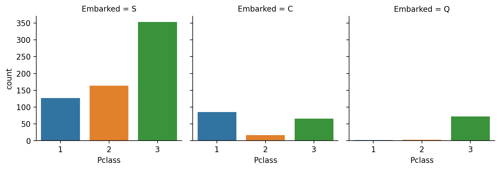

##### 3.2.2、Parch与Survived关系

```Python
sns.barplot(data=train,x='Parch',y='Survived')
```

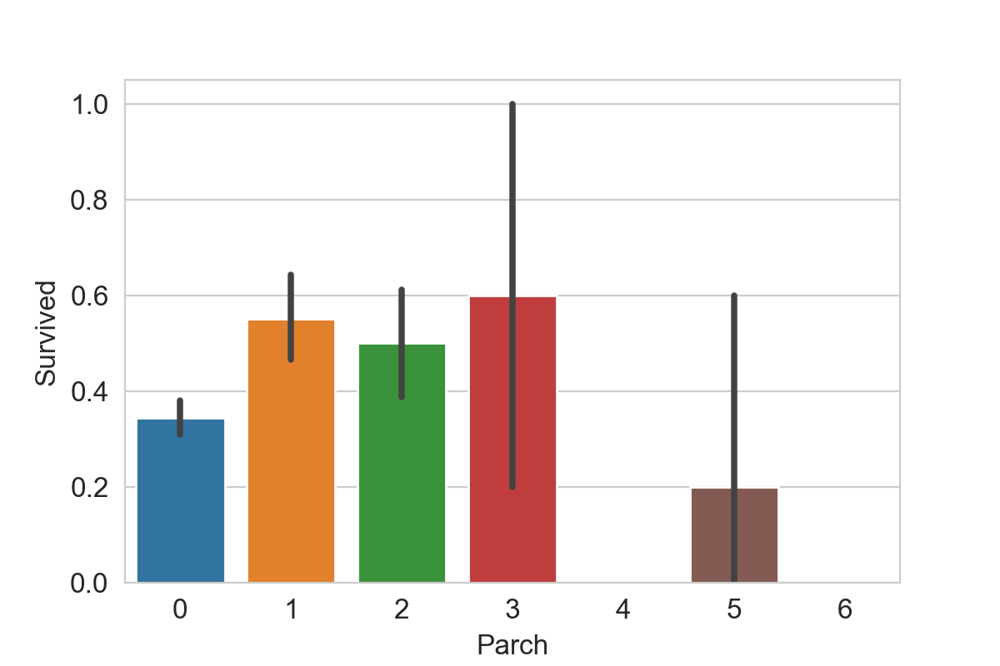

当乘客同行的父母及子女数量适中时，生存率较高

##### 3.2.3、SibSp与Survived关系

```Python
sns.barplot(data=train,x='SibSp',y='Survived')
```

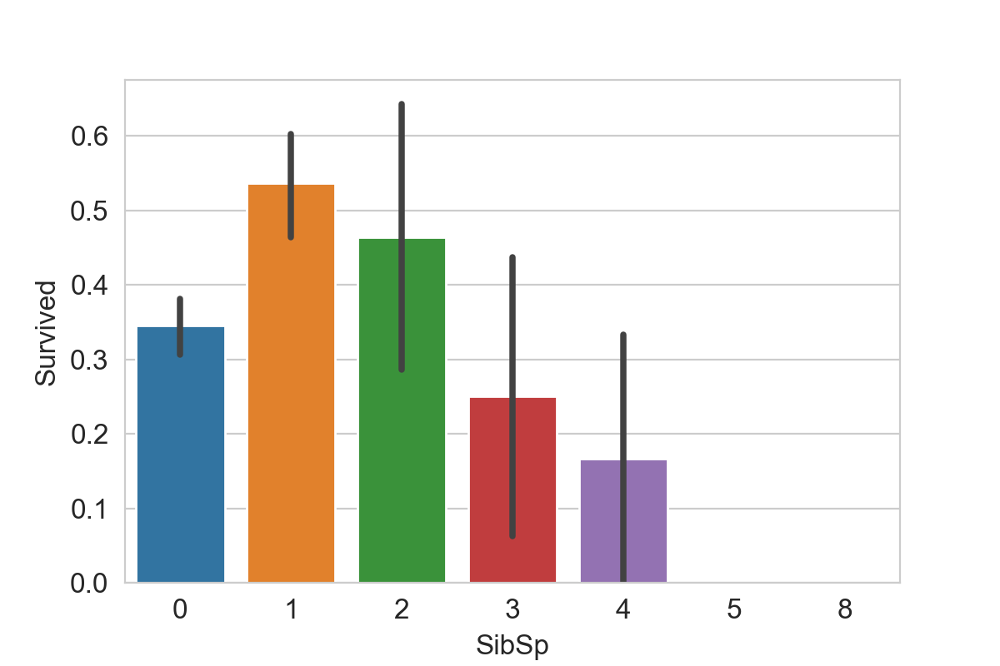

当乘客同行的同辈数量适中时生存率较高

##### 3.2.4、Pclass与Survived关系

```Python
sns.barplot(data=train,x='Pclass',y='Survived')
```

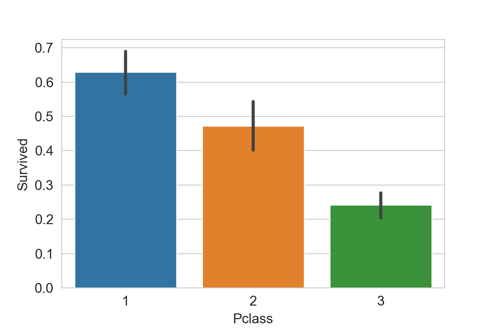

乘客客舱等级越高，生存率越高

##### 3.2.5、Sex与Survived关系

```Python
sns.barplot(data=train,x='Sex',y='Survived')
```

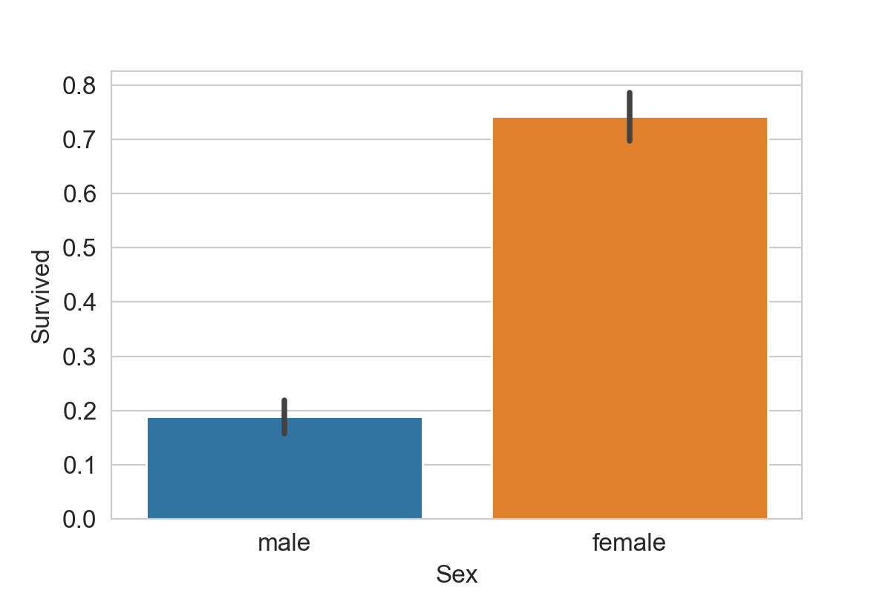

女性的生存率远高于男性

##### 3.2.6、Age与Survived关系

```Python
#创建坐标轴
ageFacet=sns.FacetGrid(train,hue='Survived',aspect=3)
#作图，选择图形类型
ageFacet.map(sns.kdeplot,'Age',shade=True)
#其他信息：坐标轴范围、标签等
ageFacet.set(xlim=(0,train['Age'].max()))
ageFacet.add_legend()
```


当乘客年龄段在0-10岁期间时生存率会较高

##### 3.2.7、Fare与Survived关系

```Python
#创建坐标轴
ageFacet=sns.FacetGrid(train,hue='Survived',aspect=3)
ageFacet.map(sns.kdeplot,'Fare',shade=True)
ageFacet.set(xlim=(0,150))
ageFacet.add_legend()
```


当票价低时乘客生存率较低，票价越高生存率一般越高！


查看票价的分布

```Python
#查看fare分布
farePlot=sns.distplot(full['Fare'][full['Fare'].notnull()],
                      label='skewness:%.2f'%(full['Fare'].skew()))
farePlot.legend(loc='best')
```

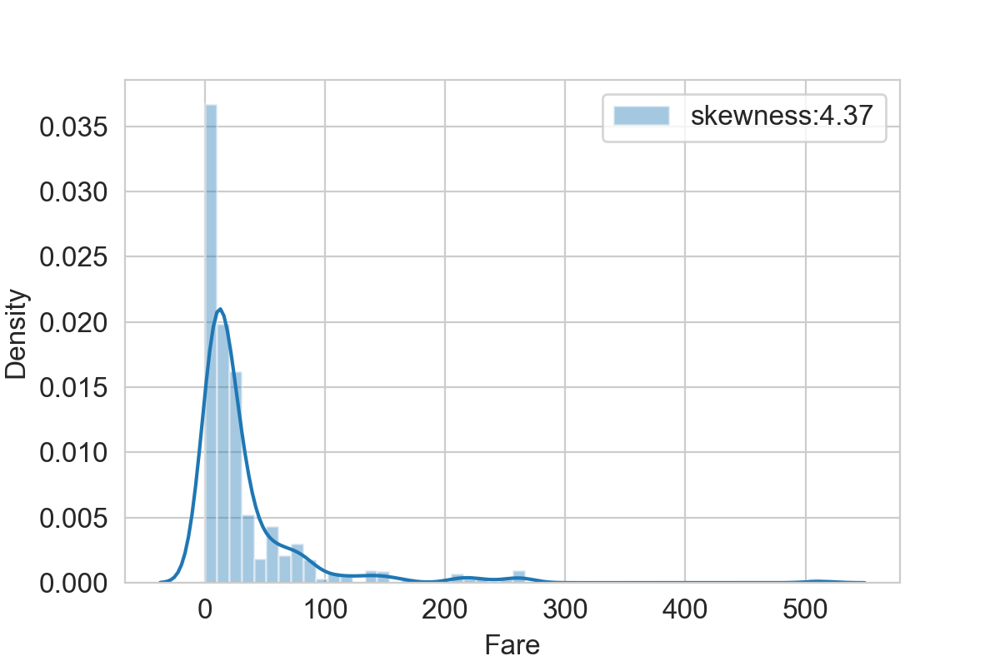


fare的分布呈左偏的形态，其偏度skewness=4.37较大，说明数据偏移平均值较多，因此我们需要对数据进行对数化处理，防止数据权重分布不均匀。

```
#对数化处理fare值
full['Fare']=full['Fare'].map(lambda x: np.log(x) if x > 0 else x)

#处理之后票价Fare分布
farePlot=sns.distplot(full['Fare'][full['Fare'].notnull()],
                      label='skewness:%.2f'%(full['Fare'].skew()))
farePlot.legend(loc='best')
plt.savefig('./10-Fare票价分布.png',dpi = 200)
```

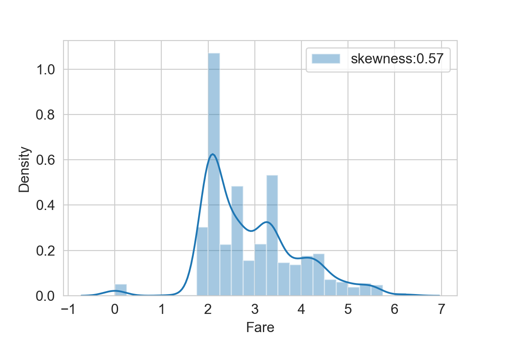

### 4、数据预处理

数据预处理主要包括以下四个方面内容：

* 数据清洗（缺失值以及异常值的处理）

* 特征工程（基于对现有数据特征的理解构造的新特征，以挖掘数据的更多特点）
* 同组识别（找出具有明显同组效应且违背整体规律的数据，对其进行规整）
* 筛选子集（对数据进行降维，选择子集）


#### 4.1、数据清洗

对数据的缺失值、异常值进行处理，便于对数据进一步分析。本数据集有四个字段的数据存在缺失情况，即**Cabin/Embarked/Fare/Age**，未发现数据存在明显异常情况。

其中Age字段缺失较多且为连续型数值，将在进行4.2特征工程章节挖取更多特征后再填充缺失值。

##### 4.1.1、Cabin（船舱）缺失值填充

```Python
#对Cabin缺失值进行处理，利用U（Unknown）填充缺失值
full['Cabin']=full['Cabin'].fillna('U')
full['Cabin'].head()
```

##### 4.1.2、Embarked（港口）缺失值填充

```Python
#对Embarked缺失值进行处理，查看缺失值情况
display(full[full['Embarked'].isnull()])

display(full['Embarked'].value_counts())
# 查看Embarked数据分布情况，可知在英国南安普顿登船可能性最大，因此以此填充缺失值。
full['Embarked']=full['Embarked'].fillna('S')
```

##### 4.1.3、Fare缺失值填充（乘客费用）

```Python
#查看缺失数据情况，该乘客乘坐3等舱，登船港口为法国，舱位未知
display(full[full['Fare'].isnull()])

# 利用3等舱，登船港口为英国，舱位未知旅客的平均票价来填充缺失值。
price = full[(full['Pclass']==3)&(full['Embarked']=='S')&(full['Cabin']=='U')]['Fare'].mean()
full['Fare']=full['Fare'].fillna(price)
full.info()
```

#### 4.2、特征工程

在理解原数据特征的基础上，特征工程通过对原有数据进行整合处理，得到新特征以反映数据更多信息。

##### 4.2.1、Name中的头衔信息-Title

旅客姓名数据中包含头衔信息，不同头衔也可以反映旅客的身份，而不同身份的旅客其生存率有可能会出现较大差异。因此我们通过Name特征提取旅客头衔Title信息，并分析Title与Survived之间的关系。

```Python
#构造新特征Title
full['Title']=full['Name'].map(lambda x:x.split(',')[1].split('.')[0].strip())
#查看title数据分布
full['Title'].value_counts()
```

将相近的Title信息整合在一起：

```Python
#将title信息进行整合
TitleDict={}
TitleDict['Mr']='Mr'
TitleDict['Mlle']='Miss'
TitleDict['Miss']='Miss'
TitleDict['Master']='Master'
TitleDict['Jonkheer']='Master'
TitleDict['Mme']='Mrs'
TitleDict['Ms']='Mrs'
TitleDict['Mrs']='Mrs'
TitleDict['Don']='Royalty'
TitleDict['Sir']='Royalty'
TitleDict['the Countess']='Royalty'
TitleDict['Dona']='Royalty'
TitleDict['Lady']='Royalty'
TitleDict['Capt']='Officer'
TitleDict['Col']='Officer'
TitleDict['Major']='Officer'
TitleDict['Dr']='Officer'
TitleDict['Rev']='Officer'

full['Title']=full['Title'].map(TitleDict)
full['Title'].value_counts()
```


可视化观察新特征与标签间关系：

```Python
#可视化分析Title与Survived之间关系
sns.barplot(data=full,x='Title',y='Survived')
```


头衔为'Mr'及'Officer'的乘客，生存率明显较低。


##### 4.2.2、FamilyNum及FamilySize信息

将Parch及SibSp字段整合得到一名乘客同行家庭成员总人数FamilyNum的字段，再根据家庭成员具体人数的多少得到家庭规模FamilySize这个新字段。

* SibSp：描述了泰坦尼克号上与乘客同行的兄弟姐妹（Siblings）和配偶（Spouse）数目；
* Parch：描述了泰坦尼克号上与乘客同行的家长（Parents）和孩子（Children）数目；

```Python
full['familyNum']=full['Parch']+full['SibSp'] + 1
#查看familyNum与Survived
sns.barplot(data=full,x='familyNum',y='Survived')
```

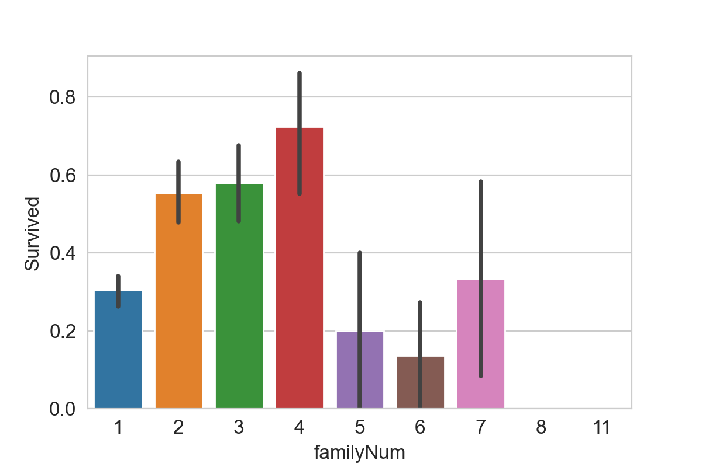

家庭成员人数在2-4人时，乘客的生存率较高，当没有家庭成员同行或家庭成员人数过多时生存率较低。


```Python
#我们按照家庭成员人数多少，将家庭规模分为小(0)、中(1)、大(2)三类：
def familysize(familyNum):
    if familyNum== 0 :
        return 0
    elif (familyNum>=1)&(familyNum<=3):
        return 1
    else:
        return 2

full['familySize']=full['familyNum'].map(familysize)
full['familySize'].value_counts()
```

查看familySize与Survived关系：

```Python
#查看familySize与Survived
sns.barplot(data=full,x='familySize',y='Survived')
```

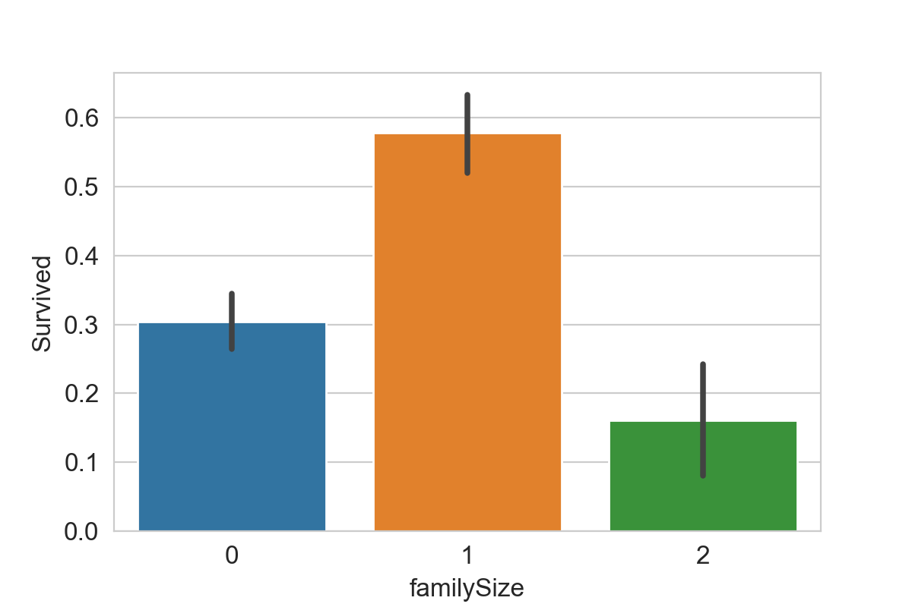

当家庭规模适中时，乘客的生存率更高。

##### 4.2.3、Cabin客舱类型信息-Deck

Cabin字段的首字母代表客舱的类型，也反映不同乘客群体的特点，可能也与乘客的生存率相关。泰坦尼克号撞击冰山时，也跟客舱位置有一定关系

```Python
#提取Cabin字段首字母
full['Deck']=full['Cabin'].map(lambda x:x[0])
#查看不同Deck类型乘客的生存率
sns.barplot(data=full,x='Deck',y='Survived')
plt.savefig('./14-Deck与Survived关系.png',dpi = 200)
```

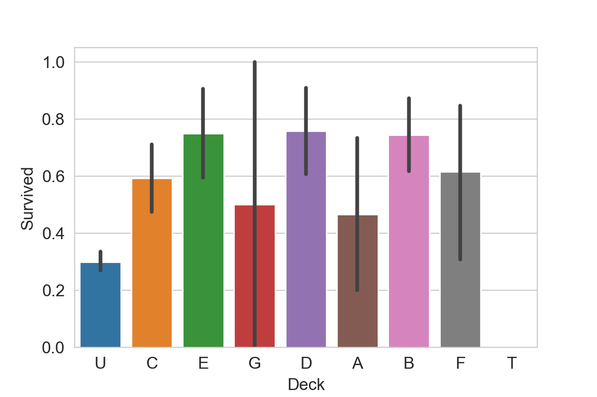

当乘客的客舱类型为B/D/E时，生存率较高；当客舱类型为U/T时，生存率较低。

##### 4.2.4、共票号乘客数量TickCom及TickGroup

同一票号的乘客数量可能不同，可能也与乘客生存率有关系

```Python
#提取各票号的乘客数量
TickCountDict=full['Ticket'].value_counts()
TickCountDict.head()
'''
CA. 2343    11
1601         8
CA 2144      8
347077       7
PC 17608     7
Name: Ticket, dtype: int64
'''
```

```Python
#将同票号乘客数量数据并入数据集中
full['TickCom']=full['Ticket'].map(TickCountDict)
full['TickCom'].head()
#查看TickCom与Survived之间关系
sns.barplot(data=full,x='TickCom',y='Survived')
```

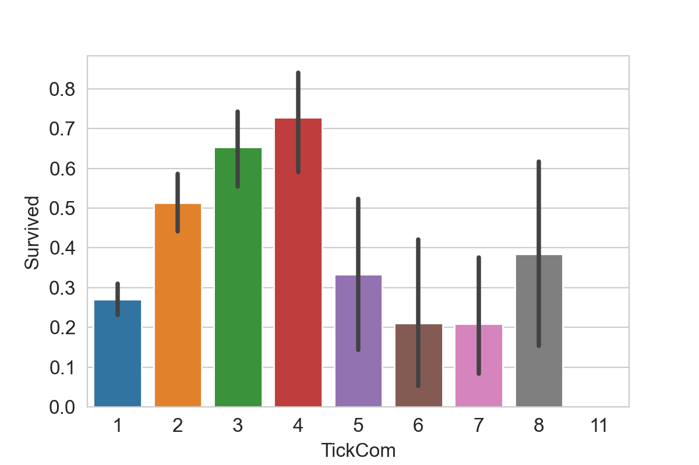

当TickCom大小适中时，乘客生存率较高。

```Python
#按照TickCom大小，将TickGroup分为三类。
def TickCountGroup(num):
    if (num>=2)&(num<=4):
        return 0
    elif (num==1)|((num>=5)&(num<=8)):
        return 1
    else :
        return 2
#得到各位乘客TickGroup的类别
full['TickGroup']=full['TickCom'].map(TickCountGroup)
#查看TickGroup与Survived之间关系
sns.barplot(data=full,x='TickGroup',y='Survived')
```

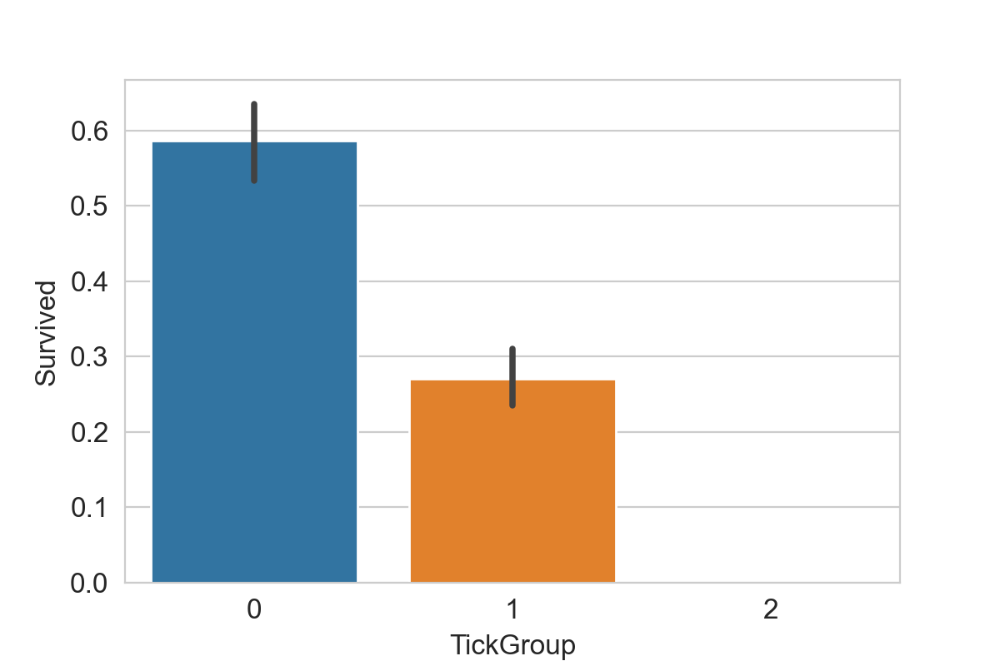

##### 4.2.5、Age缺失值填充-构建随机森林模型预测缺失的数据

查看Age与Parch、Pclass、Sex、SibSp、Title、familyNum、familySize、Deck、TickCom、TickGroup等变量的相关系数大小，筛选出相关性较高的变量构建预测模型。

```Python
full[full['Age'].notnull()].corr()
# 筛选：Pclass、SibSp、Parch、Fare、familyNum、familySize、TickCom
```

1、筛选数据

```Python
#筛选数据集
agePre=full[['Age','Parch','Pclass','SibSp','familyNum','TickCom','Title']]
# 进行one-hot编码
agePre=pd.get_dummies(agePre)
ageCorrDf=agePre.corr()
ageCorrDf['Age'].sort_values()
```

2、拆分数据并建立模型（利用随机森林构建模型）

```Python
#拆分实验集和预测集
ageKnown=agePre[agePre['Age'].notnull()]
ageUnKnown=agePre[agePre['Age'].isnull()]

#生成实验数据的特征和标签
ageKnown_X=ageKnown.drop(['Age'],axis=1)
ageKnown_y=ageKnown['Age']

#生成预测数据的特征
ageUnKnown_X=ageUnKnown.drop(['Age'],axis=1)

#利用随机森林构建模型
from sklearn.ensemble import RandomForestRegressor
rfr=RandomForestRegressor(random_state=None,n_estimators=500,n_jobs=-1)
rfr.fit(ageKnown_X,ageKnown_y)
```

3、利用模型进行预测并填入原数据集中

```Python
#模型得分
score = rfr.score(ageKnown_X,ageKnown_y)
print('模型预测年龄得分是：',score)
#预测年龄
ageUnKnown_predict = rfr.predict(ageUnKnown_X)
#填充预测数据
full.loc[full['Age'].isnull(),['Age']]=ageUnKnown_predict
full.info()  #此时已无缺失值
```

#### 4.3、同组识别

虽然通过分析数据已有特征与标签的关系可以构建有效的预测模型，但是部分具有明显共同特征的用户可能与整体模型逻辑并不一致。如果将这部分具有同组效应的用户识别出来并对其数据加以修正，就可以有效提高模型的准确率。在Titanic案例中，我们主要探究相同姓氏的乘客是否存在明显的同组效应。

提取两部分数据，分别查看其“姓氏”是否存在同组效应（因为性别和年龄与乘客生存率关系最为密切，因此用这两个特征作为分类条件）：

12岁以上男性：找出男性中同姓氏均获救的部分；
女性以及年龄在12岁以下儿童：找出女性及儿童中同姓氏均遇难的部分。

```Python
#提取乘客的姓氏及相应的乘客数
full['Surname']=full['Name'].map(lambda x:x.split(',')[0].strip())
SurNameDict=full['Surname'].value_counts()
full['SurnameNum']=full['Surname'].map(SurNameDict)

# 12岁以上男性：找出男性中同姓氏均获救的部分
MaleDf=full[(full['Sex']=='male')&(full['Age']>12)&(full['familyNum']>=2)]

#分析男性同组效应
MSurNamDf=MaleDf['Survived'].groupby(MaleDf['Surname']).mean()
MSurNamDf.head()
MSurNamDf.value_counts()
'''
0.0    89
1.0    19
0.5     3
'''
```

大多数同姓氏的男性存在“同生共死”的特点，因此利用该同组效应，我们对生存率为1的姓氏里的男性数据进行修正，提升其预测为“可以幸存”的概率。


女性及儿童同组效应分析

```Python
#提取乘客的姓氏及相应的乘客数
full['Surname']=full['Name'].map(lambda x:x.split(',')[0].strip())
SurNameDict=full['Surname'].value_counts()
full['SurnameNum']=full['Surname'].map(SurNameDict)

#将数据分为两组
FemChildDf=full[((full['Sex']=='female')|(full['Age']<=12))&(full['familyNum']>=2)]

FCSurNamDf=FemChildDf['Survived'].groupby(FemChildDf['Surname']).mean()
FCSurNamDf.head()
FCSurNamDf.value_counts()
'''
1.000000    115
0.000000     27
0.750000      2
0.333333      1
0.142857      1
'''
```

与男性组特征相似，女性及儿童也存在明显的“同生共死”的特点，因此利用同组效应，对生存率为0的姓氏里的女性及儿童数据进行修正，提升其预测为“并未幸存”的概率。


对数据集中这些姓氏的两组数据数据分别进行修正：

男性数据修正为：1、性别改为女；2、年龄改为5；

女性及儿童数据修正为：1、性别改为男；2、年龄改为60。

```Python
#获得生存率为1的姓氏
MSurNamDict=MSurNamDf[MSurNamDf.values==1].index
MSurNamDict
#获得生存率为0的姓氏
FCSurNamDict=FCSurNamDf[FCSurNamDf.values==0].index
FCSurNamDict
#对数据集中这些姓氏的男性数据进行修正：1、性别改为女；2、年龄改为5。
full.loc[(full['Survived'].isnull())&(full['Surname'].isin(MSurNamDict))&(full['Sex']=='male'),'Sex']='female'
full.loc[(full['Survived'].isnull())&(full['Surname'].isin(MSurNamDict))&(full['Sex']=='male'),'Age']=5

#对数据集中这些姓氏的女性及儿童的数据进行修正：1、性别改为男；2、年龄改为60。
full.loc[(full['Survived'].isnull())&(full['Surname'].isin(FCSurNamDict))&((full['Sex']=='female')|(full['Age']<=12)),'Sex']='male'
full.loc[(full['Survived'].isnull())&(full['Surname'].isin(FCSurNamDict))&((full['Sex']=='female')|(full['Age']<=12)),'Age']=60
```

#### 4.4、筛选子集

在对数据进行分析处理的过程中，数据的维度更高了，为提升数据有效性需要对数据进行降维处理。通过找出与乘客生存率“Survived”相关性更高的特征，剔除重复的且相关性较低的特征，从而实现数据降维。

```Python
#人工筛选
fullSel=full.drop(['Cabin','Name','Ticket','PassengerId','Surname','SurnameNum'],axis=1)
#查看各特征与标签的相关性
corrDf=pd.DataFrame()
corrDf=fullSel.corr()
corrDf['Survived'].sort_values(ascending=True)
```

通过热力图，查看Survived与其他特征间相关性大小。

```Python
#热力图，查看Survived与其他特征间相关性大小
plt.figure(figsize=(8,8))
sns.heatmap(fullSel[['Survived','Age','Embarked','Fare','Parch','Pclass',
                    'Sex','SibSp','Title','familyNum','familySize','Deck',
                     'TickCom','TickGroup']].corr(),cmap='BrBG',annot=True,
           linewidths=.5)
_ = plt.xticks(rotation=45)
```

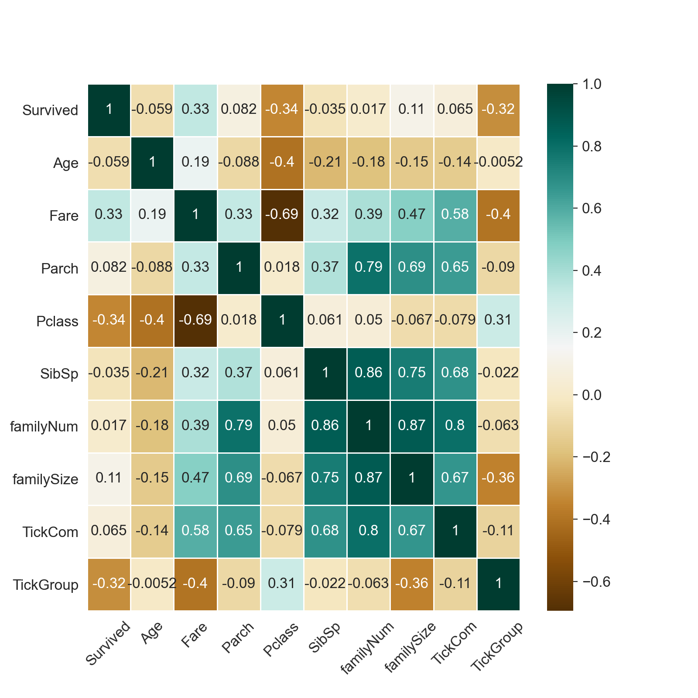

```Python
# 删除相关性系数低的属性
fullSel=fullSel.drop(['Age','Parch','SibSp','familyNum','TickCom'],axis=1)
#one-hot编码
fullSel=pd.get_dummies(fullSel)
fullSel.head()
```


### 5、构建模型

本项目比较了SCV/Decision Tree/Gradient Boosting/LDA/KNN/Logistic Regression等多种机器学习算法的结果，并对表现较好的算法做进一步的对比，最终选择Gradient Boosting对乘客生存率进行预测。

#### 5.1、模型选择

##### 5.1.1、建立模型

主要考虑使用以下常用的机器学习算法进行比较：

SCV
Decision Tree
Extra Trees
Gradient Boosting
Random Forest
KNN
Logistic Regression
Linear Discriminant Analysis

```Python
#拆分实验数据与预测数据
experData=fullSel[fullSel['Survived'].notnull()]
preData=fullSel[fullSel['Survived'].isnull()]

experData_X=experData.drop('Survived',axis=1)
experData_y=experData['Survived']
preData_X=preData.drop('Survived',axis=1)

#导入机器学习算法库
from sklearn.ensemble import RandomForestClassifier,GradientBoostingClassifier,ExtraTreesClassifier
from sklearn.discriminant_analysis import LinearDiscriminantAnalysis
from sklearn.linear_model import LogisticRegression
from sklearn.neighbors import KNeighborsClassifier
from sklearn.tree import DecisionTreeClassifier
from sklearn.svm import SVC
from sklearn.model_selection import GridSearchCV,cross_val_score,StratifiedKFold

#设置kfold，交叉采样法拆分数据集
kfold=StratifiedKFold(n_splits=10)

#汇总不同模型算法
classifiers=[]
classifiers.append(SVC())
classifiers.append(DecisionTreeClassifier())
classifiers.append(RandomForestClassifier())
classifiers.append(ExtraTreesClassifier())
classifiers.append(GradientBoostingClassifier())
classifiers.append(KNeighborsClassifier())
classifiers.append(LogisticRegression())
classifiers.append(LinearDiscriminantAnalysis())
```

##### 5.1.2、比较各种算法结果，进一步选择模型

```Python
#不同机器学习交叉验证结果汇总
cv_results=[]
for classifier in classifiers:
    cv_results.append(cross_val_score(classifier,experData_X,experData_y,
                                      scoring='accuracy',cv=kfold,n_jobs=-1))
    
#求出模型得分的均值和标准差
cv_means=[]
cv_std=[]
for cv_result in cv_results:
    cv_means.append(cv_result.mean())
    cv_std.append(cv_result.std())
    
#汇总数据
cvResDf=pd.DataFrame({'cv_mean':cv_means,
                     'cv_std':cv_std,
                     'algorithm':['SVC','DecisionTreeCla','RandomForestCla','ExtraTreesCla',
                                  'GradientBoostingCla','KNN','LR','LDA']})

cvResDf
'''
	cv_mean	cv_std	algorithm
0	0.835019	0.035179	SVC
1	0.810337	0.028974	DecisionTreeCla
2	0.821548	0.034612	RandomForestCla
3	0.815955	0.028821	ExtraTreesCla
4	0.828302	0.038513	GradientBoostingCla
5	0.823808	0.040767	KNN
6	0.830549	0.038304	LR
7	0.828327	0.039658	LDA
'''
```


可视化查看不同算法的表现情况

```Python
bar = sns.barplot(data=cvResDf.sort_values(by='cv_mean',ascending=False),
                  x='cv_mean',y='algorithm',**{'xerr':cv_std})
bar.set(xlim = (0.7,0.9))
```

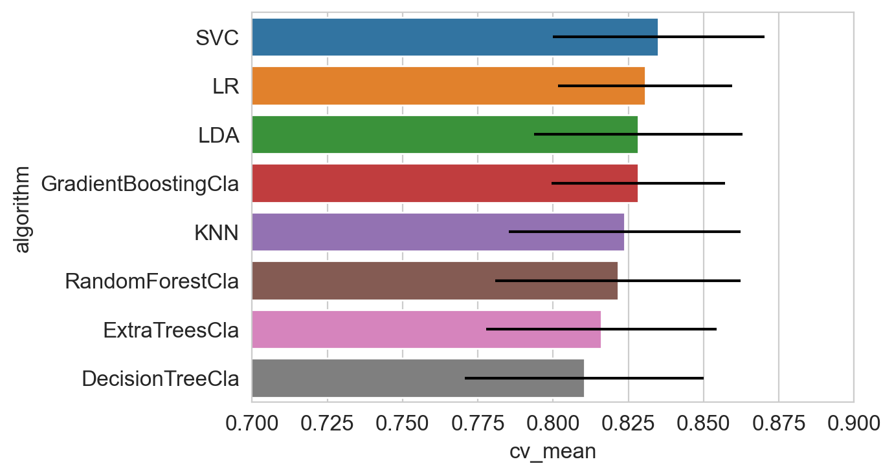

SVC、LR、LDA以及GradientBoostingCla模型在该问题中表现较好。

##### 5.1.3、模型调优

综合以上模型表现，考虑选择SVC、LDA、GradientBoostingCla、LR四种模型进一步对比。

分别建立对应模型，并进行模型调优。

```Python
#GradientBoostingClassifier模型
GBC = GradientBoostingClassifier()
gb_param_grid = {'loss' : ["deviance"],
              'n_estimators' : [100,200,300],
              'learning_rate': [0.1, 0.05, 0.01],
              'max_depth': [4, 8],
              'min_samples_leaf': [100,150],
              'max_features': [0.3, 0.1] 
              }
modelgsGBC = GridSearchCV(GBC,param_grid = gb_param_grid, cv=kfold, 
                                     scoring="accuracy", n_jobs= -1, verbose = 1)
modelgsGBC.fit(experData_X,experData_y)

#LogisticRegression模型
modelLR=LogisticRegression()
LR_param_grid = {'C' : [1,2,3],
                'penalty':['l1','l2']}
modelgsLR = GridSearchCV(modelLR,param_grid = LR_param_grid, cv=kfold, 
                                     scoring="accuracy", n_jobs= -1, verbose = 1)
modelgsLR.fit(experData_X,experData_y)

#SVC模型
svc = SVC()
gb_param_grid = {'C' : [0.1,0.5,1,2,3,5,10],
              'kernel':['rbf','poly','sigmoid']
              }
modelgsSVC = GridSearchCV(svc,param_grid = gb_param_grid, cv=kfold, 
                                     scoring="accuracy", n_jobs= -1, verbose = 1)
modelgsSVC.fit(experData_X,experData_y)

#LDA模型
lda = LinearDiscriminantAnalysis()
gb_param_grid = {'solver' : ['svd', 'lsqr', 'eigen'],
              'tol':[0.000001,0.00001,0.0001,0.001,0.01]
              }
modelgsLDA = GridSearchCV(lda,param_grid = gb_param_grid, cv=kfold, 
                                     scoring="accuracy", n_jobs= -1, verbose = 1)
modelgsLDA.fit(experData_X,experData_y)
```

#### 5.2、模型评估

##### 5.2.1、查看模型准确率

```Python
#modelgsGBC模型
print('modelgsGBC模型得分为：%.3f'%modelgsGBC.best_score_)
#modelgsLR模型
print('modelgsLR模型得分为：%.3f'%modelgsLR.best_score_)
#modelgsSVC模型
print('modelgsSVC模型得分为：%.3f'%modelgsSVC.best_score_)
#modelgsLDA模型
print('modelgsLDA模型得分为：%.3f'%modelgsLDA.best_score_)
'''
modelgsGBC模型得分为：0.840
modelgsLR模型得分为：0.831
modelgsSVC模型得分为：0.835
modelgsLDA模型得分为：0.828
'''
```

GBC模型得分（即模型准确性）更高，继续比较其他指标的差异。

##### 5.2.2、查看模型ROC曲线

```Python
#查看模型ROC曲线
#求出测试数据模型的预测值
modelgsGBCtestpre_y=modelgsGBC.predict(experData_X).astype(int)
#画图
from sklearn.metrics import roc_curve, auc  ###计算roc和auc
# Compute ROC curve and ROC area for each class
fpr,tpr,threshold = roc_curve(experData_y, modelgsGBCtestpre_y) ###计算真正率和假正率
roc_auc = auc(fpr,tpr) ###计算auc的值

plt.figure()
lw = 2
plt.figure(figsize=(10,10))
plt.plot(fpr, tpr, color='r',
         lw=lw, label='ROC curve (area = %0.3f)' % roc_auc) ###假正率为横坐标，真正率为纵坐标做曲线
plt.plot([0, 1], [0, 1], color='navy', lw=lw, linestyle='--')
plt.xlim([0.0, 1.0])
plt.ylim([0.0, 1.0])
plt.xlabel('False Positive Rate')
plt.ylabel('True Positive Rate')
plt.title('Titanic GradientBoostingClassifier Model')
plt.legend(loc="lower right")
plt.show()
```

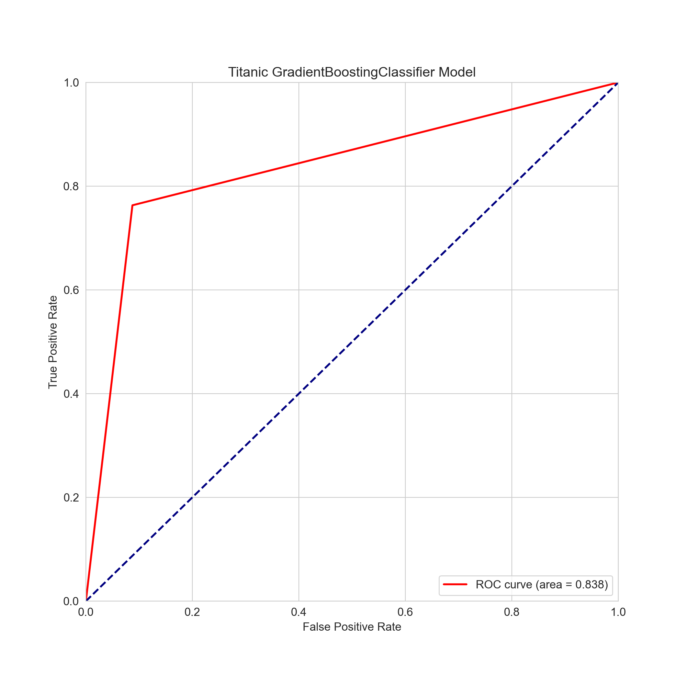

```Python
#查看模型ROC曲线
#求出测试数据模型的预测值
modelgsLRtestpre_y=modelgsLR.predict(experData_X).astype(int)
#画图
from sklearn.metrics import roc_curve, auc  ###计算roc和auc
# Compute ROC curve and ROC area for each class
fpr,tpr,threshold = roc_curve(experData_y, modelgsLRtestpre_y) ###计算真正率和假正率
roc_auc = auc(fpr,tpr) ###计算auc的值

plt.figure()
lw = 2
plt.figure(figsize=(10,10))
plt.plot(fpr, tpr, color='r',
         lw=lw, label='ROC curve (area = %0.3f)' % roc_auc) ###假正率为横坐标，真正率为纵坐标做曲线
plt.plot([0, 1], [0, 1], color='navy', lw=lw, linestyle='--')
plt.xlim([0.0, 1.0])
plt.ylim([0.0, 1.0])
plt.xlabel('False Positive Rate')
plt.ylabel('True Positive Rate')
plt.title('Titanic LogisticRegression Model')
plt.legend(loc="lower right")
plt.show()
```

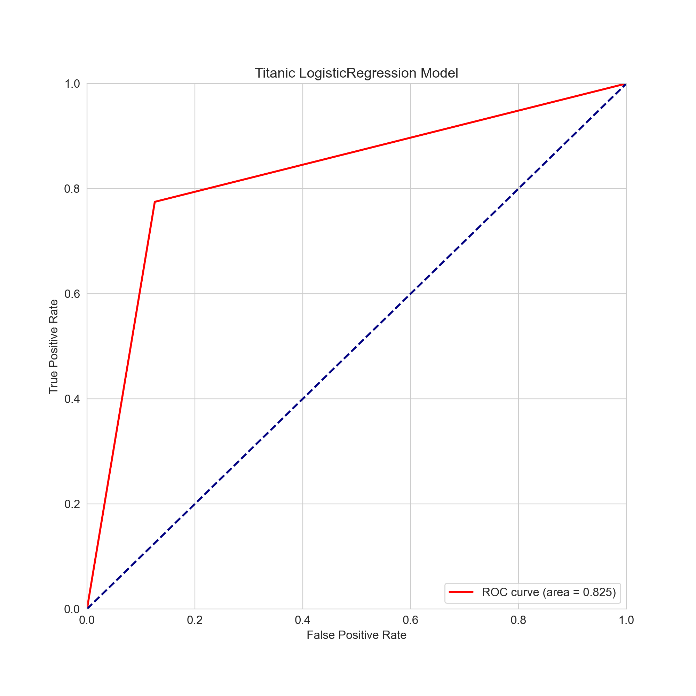

```Python
#查看模型ROC曲线
#求出测试数据模型的预测值
modelgsSVCtestpre_y=modelgsSVC.predict(experData_X).astype(int)
#画图
from sklearn.metrics import roc_curve, auc  ###计算roc和auc
# Compute ROC curve and ROC area for each class
fpr,tpr,threshold = roc_curve(experData_y, modelgsSVCtestpre_y) ###计算真正率和假正率
roc_auc = auc(fpr,tpr) ###计算auc的值

plt.figure()
lw = 2
plt.figure(figsize=(10,10))
plt.plot(fpr, tpr, color='r',
         lw=lw, label='ROC curve (area = %0.3f)' % roc_auc) ###假正率为横坐标，真正率为纵坐标做曲线
plt.plot([0, 1], [0, 1], color='navy', lw=lw, linestyle='--')
plt.xlim([0.0, 1.0])
plt.ylim([0.0, 1.0])
plt.xlabel('False Positive Rate')
plt.ylabel('True Positive Rate')
plt.title('Titanic SVC Model')
plt.legend(loc="lower right")
plt.show()
```

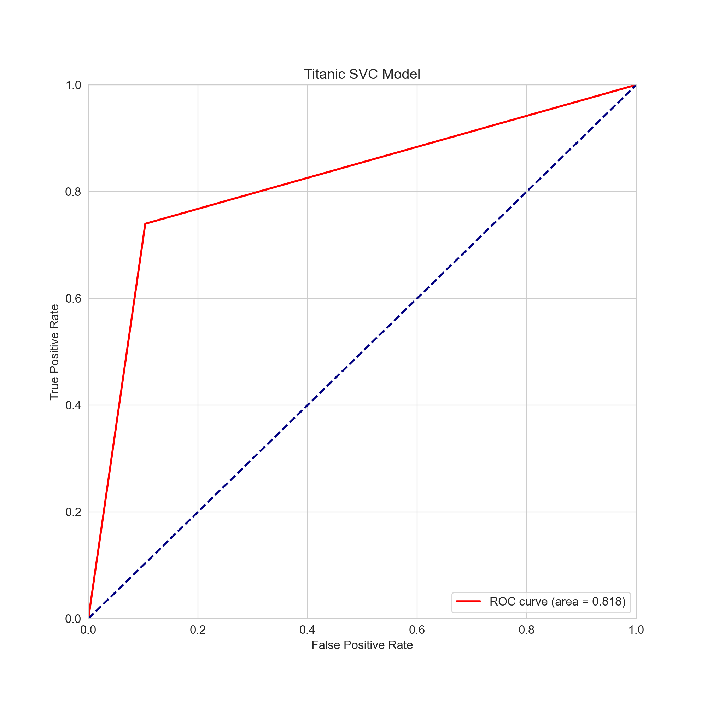

GBDT、LR和SVC模型ROC曲线均左上偏，AUC分别为0.838和0.825、0.818，即GradientBoostingClassifier模型效果较好。

##### 5.2.3、查看混淆矩阵

```Python
#混淆矩阵
from sklearn.metrics import confusion_matrix
print('GradientBoostingClassifier模型混淆矩阵为\n',confusion_matrix(experData_y,modelgsGBCtestpre_y))
print('LogisticRegression模型混淆矩阵为\n',confusion_matrix(experData_y,modelgsLRtestpre_y))
print('SVC模型混淆矩阵为\n',confusion_matrix(experData_y,modelgsSVCtestpre_y))
'''
GradientBoostingClassifier模型混淆矩阵为
 [[501  48]
 [ 81 261]]
LogisticRegression模型混淆矩阵为
 [[480  69]
 [ 77 265]]
SVC模型混淆矩阵为
 [[492  57]
 [ 89 253]]
'''
```

0表示死亡，1表示存活
通过混淆矩阵可以看出：
1、GBDT模型真正率TPR为503/(503 + 46) = 912，假正率FPR为0.236，
2、LR模型真正率TPR为0.874，假正率FPR为0.225，
3、SVC模型真正率TPR为0.896，假正率FPR为0.260
说明GBS找出正例能力很强，同时也不易将负例错判为正例。
综合考虑，本项目中将利用GBC方法进行模型预测。


综上所述，选择GBDT模型比较好~


### 6、模型预测

利用模型进行预测，并按规则导出预测结果

```Python
#TitanicGBSmodle
GBCpreData_y=modelgsGBC.predict(preData_X)
GBCpreData_y=GBCpreData_y.astype(int)
#导出预测结果
GBCpreResultDf=pd.DataFrame()
GBCpreResultDf['PassengerId']=full['PassengerId'][full['Survived'].isnull()]
GBCpreResultDf['Survived']=GBCpreData_y
GBCpreResultDf
#将预测结果导出为csv文件
GBCpreResultDf.to_csv('./TitanicGBCmodle_lufengkun.csv',index=False)
```


将结果上传至Kaggle中，最终预测得分为0.79186，排名约TOP3%。

在参与本次kaggle项目过程中，参考学习了很多其他竞赛方案的分析思路以及数据处理技巧，如：考虑同组效应、数据对数化处理、多种模型比较结果优劣等等。在项目过程中，主要从以下三个方面对模型改进来提升准确率：

模型选优：分别选取多种模型进行建模，根据模型评分进行初步比较，最终综合考虑多个性能指标来选择合适的预测模型； 特征挖掘与筛选：通过挖掘新的特征并测试选择不同特征时模型预测的准确性，来选择最终训练模型的特征集合；
数据整容：缺失值的填充方法以及“不合群”数据的处理也直接影响模型的最终预测结果。
