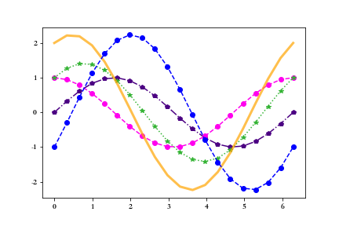
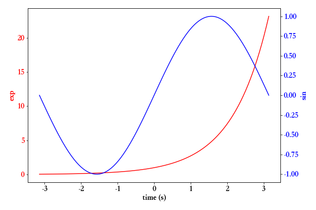
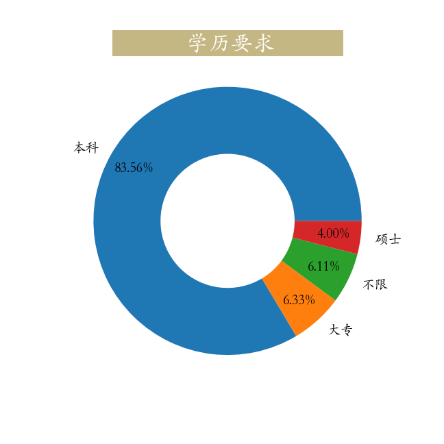

[toc]

# Matplotlib数据可视化

## 第一部分 课程介绍

pip install matplotlib -i https://pypi.tuna.tsinghua.edu.cn/simple

在数据分析与机器学习中，我们经常要用到大量的可视化操作。一张制作精美的数据图片，可以展示大量的信息，一图顶千言。


而在可视化中，Matplotlib算得上是最常用的工具。Matplotlib 是 python 最著名的绘图库，它提供了一整套 API，十分适合绘制图表，或修改图表的一些属性，如字体、标签、范围等。


Matplotlib 是一个 Python 的 2D 绘图库，它交互式环境生成出版质量级别的图形。通过 Matplotlib这个标准类库，开发者只需要几行代码就可以实现生成绘图，折线图、散点图、柱状图、饼图、直方图、组合图等数据分析可视化图表。


## 第二部分 基础知识

### 第一节 图形绘制


```python
import numpy as np
import matplotlib.pyplot as plt
# 1、图形绘制
x = np.linspace(0,2*np.pi) # x轴
# y轴
y = np.sin(x) # 正弦
# 绘制线形图
# 调整尺寸
plt.figure(figsize=(9,6))
plt.plot(x,y)
# 继续调用plot绘制多条线形图
# 2、设置网格线
plt.grid(linestyle = '--',# 样式
         color = 'green',# 颜色
         alpha = 0.75) # 透明度
# 3、设置坐标轴范围
plt.axis([-1,10,-1.5,1.5])
plt.xlim([-1,10])
plt.ylim([-1.5,1.5])
```

### 第二节 坐标轴刻度、标签、标题


```python
import numpy as np
import matplotlib.pyplot as plt
# 1、图形绘制
x = np.linspace(0,2*np.pi) # x轴
# y轴
y = np.sin(x) # 正弦
plt.plot(x,y)
# 2、设置x轴y轴刻度
plt.xticks(np.arange(0,7,np.pi/2))
plt.yticks([-1,0,1])
# 3、设置x轴y轴刻度标签
_ = plt.yticks(ticks = [-1,0,1],labels=['min','   0   ','max'],fontsize = 20,ha = 'right')
font={'family':'serif','style':'italic','weight':'normal','color':'red','size':16}
_ = plt.xticks(ticks = np.arange(0,7,np.pi/2),
               # LaTex语法，输入格式为：r'$\sigma$'  #其中的sigma对应于希腊字母的σ
               labels = ['0',r'$\frac{\pi}{2}$',r'$\pi$',r'$\frac{3\pi}{2}$',r'$2\pi$'],
               fontsize = 20,
               fontweight = 'normal',
               color = 'red')
# 4、坐标轴标签，标题
plt.ylabel('y = sin(x)',rotation = 0,
           horizontalalignment = 'right',fontstyle = 'normal',fontsize = 20)
# 获取电脑上的字体库
from matplotlib.font_manager import FontManager
fm = FontManager()
mat_fonts = set(f.name for f in fm.ttflist)
# print(mat_fonts)
plt.rcParams['font.sans-serif'] = 'Songti SC' # 设置宋体，显示中文
plt.title('正弦波')
```

### 第三节 图例


```python
import numpy as np
import matplotlib.pyplot as plt

# 1、图形绘制
x = np.linspace(0,2*np.pi) # x轴
# y轴
y = np.sin(x) # 正弦
# 绘制线形图
# 调整尺寸
plt.figure(figsize=(9,6))
plt.plot(x,y)

# 2、图例
plt.plot(x,np.cos(x)) # 余弦波
plt.legend(['Sin','Cos'],fontsize = 18,loc = 'center',ncol = 2,bbox_to_anchor = [0,1.05,1,0.2])
```

### 第四节 脊柱移动


```python
import numpy as np
import matplotlib.pyplot as plt
x = np.linspace(-np.pi,np.pi,50)
plt.rcParams['axes.unicode_minus'] = False
plt.figure(figsize=(9,6))
plt.plot(x,np.sin(x),x,np.cos(x))
ax = plt.gca() # 获取当前视图
# 右边和上面脊柱消失
ax.spines['right'].set_color('white')
ax.spines['top'].set_color('#FFFFFF')

# 设置下面左边脊柱位置，data表示数据，axes表示相对位置0~1
ax.spines['bottom'].set_position(('data',0))
ax.spines['left'].set_position(('data',0))

plt.yticks([-1,0,1],labels=['-1','0','1'],fontsize = 18)
_ = plt.xticks([-np.pi,-np.pi/2,np.pi/2,np.pi],
           labels=[r'$-\pi$',r'$-\frac{\pi}{2}$',r'$\frac{\pi}{2}$',r'$\pi$'],
           fontsize = 18)
```

### 第五节 图片保存


```python
import numpy as np
import matplotlib.pyplot as plt
# 1、图形绘制
x = np.linspace(0,2*np.pi) # x轴
# y轴
y = np.sin(x) # 正弦波
plt.figure(linewidth = 4)
plt.plot(x,y,color = 'red')
plt.plot(x,np.cos(x),color = 'k') # 余弦波

ax = plt.gca() # 获取视图
ax.set_facecolor('lightgreen') # 设置视图背景颜色
# 2、图例
plt.legend(['Sin','Cos'],fontsize = 18,loc = 'center',ncol = 2,bbox_to_anchor = [0,1.05,1,0.2])
# plt.tight_layout() # 自动调整布局空间，就不会出现图片保存不完整
plt.savefig('./基础5.png', # 文件名：png、jpg、pdf
            dpi = 100, # 保存图片像素密度
            facecolor = 'violet', # 视图与边界之间颜色设置
            edgecolor = 'lightgreen', # 视图边界颜色设置
            bbox_inches = 'tight')# 保存图片完整
```

## 第三部分 风格和样式

### 第一节 颜色、线形、点形、线宽、透明度




```python
import numpy as np
import matplotlib.pyplot as plt
x = np.linspace(0,2*np.pi,20)
y1 = np.sin(x)
y2 = np.cos(x)

# 设置颜色，线型，点型
plt.plot(x,y1,color = 'indigo',ls = '-.',marker = 'p')
plt.plot(x,y2,color = '#FF00EE',ls = '--',marker = 'o')
plt.plot(x,y1 + y2,color = (0.2,0.7,0.2),marker = '*',ls = ':')
plt.plot(x,y1 + 2*y2,linewidth = 3,alpha = 0.7,color = 'orange') # 线宽、透明度
plt.plot(x,2*y1 - y2,'bo--') # 参数连用
```

### 第二节 更多属性设置


```python
import numpy as np
import pandas as pd
def f(x):
    return np.exp(-x) * np.cos(2*np.pi*x)
x = np.linspace(0,5,50)
plt.figure(figsize=(9,6))
plt.plot(x,f(x),color = 'purple',
         marker = 'o',
         ls = '--',
         lw = 2,
         alpha = 0.6,
         markerfacecolor = 'red',# 点颜色
         markersize = 10,# 点大小
         markeredgecolor = 'green',#点边缘颜色
         markeredgewidth = 3)#点边缘宽度
plt.xticks(size = 18) # 设置刻度大小
plt.yticks(size = 18)
```

## 第四部分 多图布局

### 第一节 子视图


```python
import numpy as np
import matplotlib.pyplot as plt

x = np.linspace(-np.pi,np.pi,50)
y = np.sin(x)

# 子视图1
plt.figure(figsize=(9,6))
ax = plt.subplot(221) # 两行两列第一个子视图
ax.plot(x,y,color = 'red')
ax.set_facecolor('green') # 调用子视图设置方法，设置子视图整体属性
# 子视图2
ax = plt.subplot(2,2,2) # 两行两列第二个子视图
line, = ax.plot(x,-y) # 返回绘制对象
line.set_marker('*') # 调用对象设置方法，设置属性
line.set_markerfacecolor('red')
line.set_markeredgecolor('green')
line.set_markersize(10)
# 子视图3
ax = plt.subplot(2,1,2) # 两行一列第二行视图
plt.sca(ax) # 设置当前视图
x = np.linspace(-np.pi,np.pi,200)
plt.plot(x,np.sin(x*x),color = 'red')
```

### 第二节 嵌套


```python
import numpy as np
import matplotlib.pyplot as plt

x = np.linspace(-np.pi,np.pi,25)
y = np.sin(x)
fig = plt.figure(figsize=(9,6)) # 创建视图

plt.plot(x,y)

# 嵌套方式一，axes轴域（横纵坐标范围），子视图
ax = plt.axes([0.2,0.55,0.3,0.3]) # 参数含义[left, bottom, width, height]
ax.plot(x,y,color = 'g')

# 嵌套方式二
ax = fig.add_axes([0.55,0.2,0.3,0.3]) # 使用视图对象添加子视图
ax.plot(x,y,color = 'r')
```

### 第三节 多图布局分格显示

#### 3.3.1 均匀布局


```python
import numpy as np
import matplotlib.pyplot as plt
x = np.linspace(0,2*np.pi)
# sharex:所有小图共享x轴  sharey:表示所有小图共享y轴  坐标轴以所有小图中范围最大的进行显示
fig, ((ax11,ax12,ax13), (ax21,ax22,ax23),(ax31,ax32,ax33)) = plt.subplots(3, 3)
# 也可通过plt.subplot() 一个个添加子视图
fig.set_figwidth(9)
fig.set_figheight(6)
ax11.plot(x,np.sin(x))
ax12.plot(x,np.cos(x))
ax13.plot(x,np.tanh(x))
ax21.plot(x,np.tan(x))
ax22.plot(x,np.cosh(x))
ax23.plot(x,np.sinh(x))
ax31.plot(x,np.sin(x) + np.cos(x))
ax32.plot(x,np.sin(x*x) + np.cos(x*x))
ax33.plot(x,np.sin(x)*np.cos(x))
# 紧凑显示，边框会比较小，可以注释掉该行查看效果
plt.tight_layout()
plt.show()
```

#### 3.3.2 不均匀分布


##### 方式一

```python
import numpy as np
import matplotlib.pyplot as plt
# 需要导入gridspec模块
x = np.linspace(0,2*np.pi,200)
fig = plt.figure(figsize=(12,9))
# 使用切片方式设置子视图
ax1 = plt.subplot(3,1,1) # 视图对象添加子视图
ax1.plot(x,np.sin(10*x))
# 设置ax1的标题，xlim、ylim、xlabel、ylabel等所有属性现在只能通过set_属性名的方法设置
ax1.set_title('ax1_title')  # 设置小图的标题
ax2 = plt.subplot(3,3,(4,5))
ax2.set_facecolor('green')
ax2.plot(x,np.cos(x),color = 'red')
ax3 = plt.subplot(3,3,(6,9))
ax3.plot(x,np.sin(x) + np.cos(x))
ax4 = plt.subplot(3,3,7)
ax4.plot([1,3],[2,4])
ax5 = plt.subplot(3,3,8)
ax5.scatter([1,2,3], [0,2, 4])
ax5.set_xlabel('ax5_x',fontsize = 12)
ax5.set_ylabel('ax5_y',fontsize = 12)
plt.show()
```

##### 方式二

```python
import numpy as np
import matplotlib.pyplot as plt
x = np.linspace(0,2*np.pi,100)
plt.figure(figsize=(12,9))
# 子视图1
ax1 = plt.subplot2grid(shape = (3, 3),# 布局形状
                       loc =  (0, 0), # 布局绘制位置
                       colspan=3) # 跨几列
ax1.plot(x,np.sin(10*x))
# 设置ax1的标题，xlim、ylim、xlabel、ylabel等所有属性现在只能通过set_属性名的方法设置
ax1.set_title('ax1_title')  # 设置小图的标题
# 子视图2
ax2 = plt.subplot2grid((3, 3), (1, 0), colspan=2) # 跨两列
ax2.set_facecolor('green')
ax2.plot(x,np.cos(x),color = 'red')
# 子视图3
ax3 = plt.subplot2grid((3, 3), (1, 2), rowspan=2) # 跨两行
ax3.plot(x,np.sin(x) + np.cos(x))
# 子视图4
ax4 = plt.subplot2grid((3, 3), (2, 0))
ax4.plot([1,3],[2,4])
# 子视图5
ax5 = plt.subplot2grid((3, 3), (2, 1))
ax5.scatter([1,2,3], [0,2, 4])
ax5.set_xlabel('ax5_x',fontsize = 12)
ax5.set_ylabel('ax5_y',fontsize = 12)
```

##### 方式三

```python
import numpy as np
import matplotlib.pyplot as plt
# 需要导入gridspec模块
import matplotlib.gridspec as gridspec
x = np.linspace(0,2*np.pi,200)
fig = plt.figure(figsize=(12,9))
# 将整个视图分成3x3布局
gs = gridspec.GridSpec(3, 3)
# 使用切片方式设置子视图
ax1 = fig.add_subplot(gs[0,:]) # 视图对象添加子视图
ax1.plot(x,np.sin(10*x))
# 设置ax1的标题，xlim、ylim、xlabel、ylabel等所有属性现在只能通过set_属性名的方法设置
ax1.set_title('ax1_title')  # 设置小图的标题
ax2 = plt.subplot(gs[1, :2]) # 模块调用
ax2.set_facecolor('green')
ax2.plot(x,np.cos(x),color = 'red')
# 从第一行到最后，占1、2两行，后面的2表示只占用第二列，也就是最后的一列
ax3 = plt.subplot(gs[1:, 2])
ax3.plot(x,np.sin(x) + np.cos(x))
# 倒数第一行，只占第0列这一列
ax4 = plt.subplot(gs[-1, 0])
ax4.plot([1,3],[2,4])
# 倒数第一行，只占倒数第二列，由于总共三列，所以倒数第二列就是序号1的列
ax5 = plt.subplot(gs[-1, -2])
ax5.scatter([1,2,3], [0,2, 4])
ax5.set_xlabel('ax5_x',fontsize = 12)
ax5.set_ylabel('ax5_y',fontsize = 12)
plt.show()
```

### 第四节 双轴显示



```python
import numpy as np
import matplotlib.pyplot as plt

x = np.linspace(-np.pi,np.pi,100)
data1 = np.exp(x)
data2 = np.sin(x)

plt.figure(figsize=(9,6))
plt.rcParams['font.size'] = 16 # 设置整体字体大小

ax1 = plt.gca() # 获取当前轴域

ax1.set_xlabel('time (s)') # 设置x轴标签
ax1.set_ylabel('exp', color='red') # 设置y轴标签
ax1.plot(t, data1, color='red') # 数据绘制
ax1.tick_params(axis='y', labelcolor='red') # 设置y轴刻度属性

ax2 = ax1.twinx()  # 创建新axes实例，共享x轴，并设置
ax2.set_ylabel('sin', color='blue')
ax2.plot(t, data2, color='blue')
ax2.tick_params(axis='y', labelcolor='blue')

plt.tight_layout() # 紧凑布局
```


## 第五部分 文本、注释、箭头

常用函数如下：

|  Pyplot函数  |            API方法            |          描述            |
| :---------: | :-------------------------:  | :----------------------: |
|   text()    |     mpl.axes.Axes.text()     |在Axes对象的任意位置添加文字  |
|  xlabel()   |  mpl.axes.Axes.set_xlabel()  |         为X轴添加标签      |
|  ylabel()   |  mpl.axes.Axes.set_ylabel()  |         为Y轴添加标签      |
|   title()   |  mpl.axes.Axes.set_title()   |       为Axes对象添加标题   |
|  legend()   |    mpl.axes.Axes.legend()    |       为Axes对象添加图例   |
| annnotate() |   mpl.axes.Axes.annotate()   |为Axes对象添加注释（箭头可选）|
|  figtext()  |   mpl.figure.Figure.text()   |在Figure对象的任意位置添加文字|
| suptitle()  | mpl.figure.Figure.suptitle() | 为Figure对象添加中心化的标题|

### 第一节 文本

```python
import numpy as np
import matplotlib.pyplot as plt

# 字体属性
font = {'fontsize': 20,
        'family': 'Kaiti SC',
        'color':  'red',
        'weight': 'bold'}

x = np.linspace(0.0, 5.0, 100)
y = np.cos(2*np.pi*x) * np.exp(-x)

plt.figure(figsize=(9,6))
plt.plot(x, y, 'k')
plt.title('exponential decay',fontdict=font)
plt.suptitle('指数衰减',y = 1.05,fontdict = font,fontsize = 30)
plt.text(x = 2, y = 0.65, # 横纵坐标位置
         s = r'$\cos(2 \pi t) \exp(-t)$') # 文本内容
plt.xlabel('time (s)')
plt.ylabel('voltage (mV)')
plt.show()
```

### 第二节 箭头


```python
import matplotlib.pyplot as plt
import numpy

loc = np.random.randint(0,10,size = (10,2))
plt.figure(figsize=(10, 10))
plt.plot(loc[:,0], loc[:,1], 'g*', ms=20)
plt.grid(True)

# 路径
way = np.arange(10)
np.random.shuffle(way)

for i in range(0, len(way)-1):
    start = loc[way[i]]
    end = loc[way[i+1]]
    plt.arrow(start[0], start[1], end[0]-start[0], end[1]-start[1], # 坐标与距离
              head_width=0.2, lw=2,#箭头长度，箭尾线宽
              length_includes_head = True) # 长度计算包含箭头箭尾
    plt.text(start[0],start[1],s = i,fontsize = 18,color = 'red') # 文本
    if i == len(way) - 2: # 最后一个点
        plt.text(end[0],end[1],s = i + 1,fontsize = 18,color = 'red')
```

### 第三节 注释


```python
import numpy as np
import matplotlib.pyplot as plt
fig, ax = plt.subplots()
x = np.arange(0.0, 5.0, 0.01)
y = np.cos(2*np.pi*x)
line, = ax.plot(x,y,lw=2)
ax.annotate('local max', # 文本内容
            xy=(2, 1),  # 箭头指向位置
            xytext=(3, 1.5), # 文本位置
            arrowprops=dict(facecolor='black', shrink=0.05)) # 箭头
ax.annotate('local min',
            xy = (2.5,-1),
            xytext = (4,-1.8),
            arrowprops = dict(facecolor = 'black',
                              width = 2, # 箭头宽度
                              headwidth = 10,# 箭头头部宽度
                              headlength = 10, # 箭头头部长度
                              shrink = 0.1)) # 箭头两端收缩的百分比（占总长）
ax.annotate('median',
            xy = (2.25,0),
            xytext = (0.5,-1.8),
            arrowprops = dict(arrowstyle = '-|>'), # 箭头样式
            fontsize = 20)
ax.set_ylim(-2, 2)
```

### 第四节 注释箭头连接形状


```python
import matplotlib.pyplot as plt

def annotate_con_style(ax, connectionstyle):
    x1, y1 = 3,2
    x2, y2 = 8,6
    ax.plot([x1, x2], [y1, y2], ".")
    ax.annotate(s = '',
                xy=(x1, y1), # 相当于B点，arrow head
                xytext=(x2, y2), # 相当于A点，arrow tail
                arrowprops=dict(arrowstyle='->', color='red',
                                shrinkA = 5,shrinkB = 5,
                                connectionstyle=connectionstyle))

    ax.text(.05, 0.95, connectionstyle.replace(",", "\n"),
            transform=ax.transAxes, # 相对坐标
            ha="left", va="top")# 指定对齐方式

# 常用箭头连接样式
fig, axs = plt.subplots(3, 5, figsize=(9,6))
annotate_con_style(axs[0, 0], "angle3,angleA=90,angleB=0")
annotate_con_style(axs[1, 0], "angle3,angleA=0,angleB=90")
annotate_con_style(axs[2, 0], "angle3,angleA = 0,angleB=150")
annotate_con_style(axs[0, 1], "arc3,rad=0.")
annotate_con_style(axs[1, 1], "arc3,rad=0.3")
annotate_con_style(axs[2, 1], "arc3,rad=-0.3")
annotate_con_style(axs[0, 2], "angle,angleA=-90,angleB=180,rad=0")
annotate_con_style(axs[1, 2], "angle,angleA=-90,angleB=180,rad=5")
annotate_con_style(axs[2, 2], "angle,angleA=-90,angleB=10,rad=5")
annotate_con_style(axs[0, 3], "arc,angleA=-90,angleB=0,armA=30,armB=30,rad=0")
annotate_con_style(axs[1, 3], "arc,angleA=-90,angleB=0,armA=30,armB=30,rad=5")
annotate_con_style(axs[2, 3], "arc,angleA=-90,angleB=0,armA=0,armB=40,rad=0")
annotate_con_style(axs[0, 4], "bar,fraction=0.3")
annotate_con_style(axs[1, 4], "bar,fraction=-0.3")
annotate_con_style(axs[2, 4], "bar,angle=180,fraction=-0.2")

for ax in axs.flat:
    # 设置轴域刻度
    ax.set(xlim=(0, 10), ylim=(0, 10),xticks = [],yticks = [],aspect=1)
fig.tight_layout(pad=0.2)
```

## 第六部分 常用视图

### 第一节 折线图


```python
import numpy as np
import matplotlib.pyplot as plt
x = np.random.randint(0,10,size = 15)
# 一图多线
plt.figure(figsize=(9,6))
plt.plot(x,marker = '*',color = 'r')
plt.plot(x.cumsum(),marker = 'o')

# 多图布局
fig,axs = plt.subplots(2,1)
fig.set_figwidth(9)
fig.set_figheight(6)
axs[0].plot(x,marker = '*',color = 'red')
axs[1].plot(x.cumsum(),marker = 'o')
```

### 第二节 柱状图

堆叠柱状图


```python
import numpy as np
import matplotlib.pyplot as plt
labels = ['G1', 'G2', 'G3', 'G4', 'G5','G6'] # 级别
men_means = np.random.randint(20,35,size = 6)
women_means = np.random.randint(20,35,size = 6)
men_std = np.random.randint(1,7,size = 6)
women_std = np.random.randint(1,7,size = 6)
width = 0.35
plt.bar(labels, # 横坐标
        men_means, # 柱高
        width, # 线宽
        yerr=4, # 误差条
        label='Men')#标签
plt.bar(labels, women_means, width, yerr=2, bottom=men_means,
       label='Women')
plt.ylabel('Scores')
plt.title('Scores by group and gender')
plt.legend()
```

分组带标签柱状图


```python
import matplotlib
import matplotlib.pyplot as plt
import numpy as np

labels = ['G1', 'G2', 'G3', 'G4', 'G5','G6'] # 级别
men_means = np.random.randint(20,35,size = 6)
women_means = np.random.randint(20,35,size = 6)
x = np.arange(len(men_means))
plt.figure(figsize=(9,6))
rects1 = plt.bar(x - width/2, men_means, width) # 返回绘图区域对象
rects2 = plt.bar(x + width/2, women_means, width)

# 设置标签标题，图例
plt.ylabel('Scores')
plt.title('Scores by group and gender')
plt.xticks(x,labels)
plt.legend(['Men','Women'])

# 添加注释
def set_label(rects):
    for rect in rects:
        height = rect.get_height() # 获取高度
        plt.text(x = rect.get_x() + rect.get_width()/2, # 水平坐标
                 y = height + 0.5, # 竖直坐标
                 s = height, # 文本
                 ha = 'center') # 水平居中

set_label(rects1)
set_label(rects2)
plt.tight_layout() # 设置紧凑布局
plt.savefig('./分组带标签柱状图.png')
```

### 第三节 极坐标图

极坐标线形图


```python
import numpy as np
import matplotlib.pyplot as plt

r = np.arange(0, 4*np.pi, 0.01) # 弧度值
y = np.linspace(0,2,len(r)) # 目标值

ax = plt.subplot(111,projection = 'polar',facecolor = 'lightgreen') # 定义极坐标
ax.plot(r, y,color = 'red')
ax.set_rmax(3) # 设置半径最大值
ax.set_rticks([0.5, 1, 1.5, 2])  # 设置半径刻度
ax.set_rlabel_position(-22.5)  # 设置半径刻度位置
ax.grid(True) # 网格线

ax.set_title("A line plot on a polar axis", va='center',ha = 'center',pad = 30)
```

极坐标柱状图


```python
import numpy as np
import matplotlib.pyplot as plt
N = 8 # 分成8份
theta = np.linspace(0.0, 2 * np.pi, N, endpoint=False)
radii = np.random.randint(3,15,size = N)
width = np.pi / 4
colors = np.random.rand(8,3) # 随机生成颜色
ax = plt.subplot(111, projection='polar') # polar表示极坐标
ax.bar(theta, radii, width=width, bottom=0.0,color = colors)
```

### 第四节 直方图


```python
import numpy as np
import matplotlib.pyplot as plt

mu = 100 # 平均值
sigma = 15 # 标准差
x = np.random.normal(loc = mu,scale = 15,size = 10000)
fig, ax = plt.subplots()

n, bins, patches = ax.hist(x, 200, density=True) # 直方图

# 概率密度函数
y = ((1 / (np.sqrt(2 * np.pi) * sigma)) *
     np.exp(-0.5 * (1 / sigma * (bins - mu))**2))
plt.plot(bins, y, '--')
plt.xlabel('Smarts')
plt.ylabel('Probability density')
plt.title(r'Histogram of IQ: $\mu=100$, $\sigma=15$')

# 紧凑布局
fig.tight_layout()
plt.savefig('./直方图.png')
```

### 第五节 箱形图


```python
import numpy as np
import matplotlib.pyplot as plt
data=np.random.normal(size=(500,4)) 
lables = ['A','B','C','D']
# 用Matplotlib画箱线图
plt.boxplot(data,1,'gD',labels=lables) # 红色的圆点是异常值
```

### 第六节 散点图

散点图的英文叫做 scatter plot，它将两个变量的值显示在二维坐标中，非常适合展示两个变量之间的关系


```python
import numpy as np
import matplotlib.pyplot as plt
data = np.random.randn(100,2)
s = np.random.randint(100,300,size = 100)
color = np.random.randn(100)
plt.scatter(data[:,0], # 横坐标
            data[:,1], # 纵坐标
            s = s, # 尺寸
            c = color, # 颜色
            alpha = 0.5) # 透明度
```


### 第六节 饼图

#### 一般饼图


```python
import numpy as np
import matplotlib.pyplot as plt
# 解决中文字体乱码的问题
matplotlib.rcParams['font.sans-serif']='Kaiti SC' 

labels =["五星","四星","三星","二星","一星"] # 标签
percent = [95,261,105,30,9] # 某市星级酒店数量

# 设置图片大小和分辨率
fig=plt.figure(figsize=(5,5), dpi=150)
# 偏移中心量，突出某一部分
explode = (0, 0.1, 0, 0, 0) 
# 绘制饼图：autopct显示百分比，这里保留一位小数；shadow控制是否显示阴影
plt.pie(x = percent, # 数据
        explode=explode, # 偏移中心量
        labels=labels,  # 显示标签
        autopct='%0.1f%%', # 显示百分比
        shadow=True) # 阴影，3D效果
plt.savefig("./饼图.jpg")
```

#### 嵌套饼图


```python
import pandas as pd
import matplotlib.pyplot as plt
food = pd.read_excel('./food.xlsx')
# 分组聚合，内圈数据
inner = food.groupby(by = 'type')['花费'].sum()
outer = food['花费'] # 外圈数据
plt.rcParams['font.family'] = 'Kaiti SC'
plt.rcParams['font.size'] = 18
fig=plt.figure(figsize=(8,8))
# 绘制内部饼图
plt.pie(x = inner, # 数据
        radius=0.6, # 饼图半径
        wedgeprops=dict(linewidth=3,width=0.6,edgecolor='w'),# 饼图格式：间隔线宽、饼图宽度、边界颜色
        labels = inner.index, # 显示标签
        labeldistance=0.4) # 标签位置
# 绘制外部饼图
plt.pie(x = outer, 
        radius=1, # 半径
        wedgeprops=dict(linewidth=3,width=0.3,edgecolor='k'),# 饼图格式：间隔线宽、饼图宽度、边界颜色
        labels = food['食材'], # 显示标签
        labeldistance=1.2) # 标签位置

# 设置图例标题，bbox_to_anchor = (x, y, width, height)控制图例显示位置
plt.legend(inner.index,bbox_to_anchor = (0.9,0.6,0.4,0.4),title = '食物占比')
plt.tight_layout()
plt.savefig('./嵌套饼图.png',dpi = 200)
```

#### 甜甜圈（自学）


```python
import numpy as np
import matplotlib.pyplot as plt

plt.figure(figsize=(6,6))
# 甜甜圈原料
recipe = ["225g flour",
          "90g sugar",
          "1 egg",
          "60g butter",
          "100ml milk",
          "1/2package of yeast"]
# 原料比例
data = [225, 90, 50, 60, 100, 5]
wedges, texts = plt.pie(data,startangle=40)
bbox_props = dict(boxstyle="square,pad=0.3", fc="w", ec="k", lw=0.72)
kw = dict(arrowprops=dict(arrowstyle="-"),
          bbox=bbox_props,va="center")

for i, p in enumerate(wedges):
    ang = (p.theta2 - p.theta1)/2. + p.theta1 # 角度计算
    # 角度转弧度----->弧度转坐标
    y = np.sin(np.deg2rad(ang))
    x = np.cos(np.deg2rad(ang))
    ha = {-1: "right", 1: "left"}[int(np.sign(x))] # 水平对齐方式
    connectionstyle = "angle,angleA=0,angleB={}".format(ang) # 箭头连接样式
    kw["arrowprops"].update({"connectionstyle": connectionstyle}) # 更新箭头连接方式
    plt.annotate(recipe[i], xy=(x, y), xytext=(1.35*np.sign(x), 1.4*y),
                 ha=ha,**kw,fontsize = 18,weight = 'bold')
plt.title("Matplotlib bakery: A donut",fontsize = 18,pad = 25)
plt.tight_layout()
```

### 第七节 热力图


```python
import numpy as np
import matplotlib
import matplotlib.pyplot as plt

vegetables = ["cucumber", "tomato", "lettuce", "asparagus","potato", "wheat", "barley"]
farmers = list('ABCDEFG')

harvest = np.random.rand(7,7)*5 # 农民丰收数据

plt.rcParams['font.size'] = 18
plt.rcParams['font.weight'] = 'heavy'
plt.figure(figsize=(9,9))
im = plt.imshow(harvest)

plt.xticks(np.arange(len(farmers)),farmers,rotation = 45,ha = 'right')
plt.yticks(np.arange(len(vegetables)),vegetables)

# 绘制文本
for i in range(len(vegetables)):
    for j in range(len(farmers)):
        text = plt.text(j, i, round(harvest[i, j],1),
                       ha="center", va="center", color='r')
plt.title("Harvest of local farmers (in tons/year)",pad = 20)
fig.tight_layout()
plt.savefig('./热力图.png')
```


### 第八节 面积图


```python
import matplotlib.pyplot as plt
plt.figure(figsize=(9,6))
days = [1,2,3,4,5]  
sleeping =[7,8,6,11,7]
eating = [2,3,4,3,2]
working =[7,8,7,2,2]
playing = [8,5,7,8,13]   
plt.stackplot(days,sleeping,eating,working,playing)  
plt.xlabel('x')
plt.ylabel('y')
plt.title('Stack Plot',fontsize = 18)
plt.legend(['Sleeping','Eating','Working','Playing'],fontsize = 18)
```

### 第九节 蜘蛛图


```python
import numpy as np
import matplotlib.pyplot as plt
plt.rcParams['font.family'] = 'Kaiti SC'
labels=np.array(["个人能力","IQ","服务意识","团队精神","解决问题能力","持续学习"])
stats=[83, 61, 95, 67, 76, 88]
# 画图数据准备，角度、状态值
angles=np.linspace(0, 2*np.pi, len(labels), endpoint=False)
stats=np.concatenate((stats,[stats[0]]))
angles=np.concatenate((angles,[angles[0]]))
# 用Matplotlib画蜘蛛图
fig = plt.figure(figsize=(9,9))
ax = fig.add_subplot(111, polar=True)   
ax.plot(angles, stats, 'o-', linewidth=2) # 连线
ax.fill(angles, stats, alpha=0.25) # 填充
# 设置角度
ax.set_thetagrids(angles*180/np.pi,#角度值
                  labels,
                  fontsize = 18)
ax.set_rgrids([20,40,60,80],fontsize = 18)
```

## 第七部分 3D图形

### 第一节 三维折线图散点图


```python
import numpy as np
import matplotlib.pyplot as plt
from mpl_toolkits.mplot3d.axes3d import Axes3D # 3D引擎

x = np.linspace(0,60,300)
y = np.sin(x)
z = np.cos(x)

fig = plt.figure(figsize=(9,6)) # 二维图形
ax3 = Axes3D(fig) # 二维变成了三维
ax3.plot(x,y,z) # 3维折线图
# 3维散点图
ax3.scatter(np.random.rand(50)*60,np.random.rand(50),np.random.rand(50),
            color = 'red',s = 100)
```

### 第二节 三维柱状图


```python
import numpy as np
import matplotlib.pyplot as plt
from mpl_toolkits.mplot3d.axes3d import Axes3D # 3D引擎
month = np.arange(1,5)
# 每个月 4周 每周都会产生数据
# 三个维度：月、周、销量
fig = plt.figure(figsize=(9,6))
ax3 = Axes3D(fig)

for m in month:
    ax3.bar(np.arange(4),
            np.random.randint(1,10,size = 4),
            zs = m ,
            zdir = 'x',# 在哪个方向上，一排排排列
            alpha = 0.7,# alpha 透明度
            width = 0.5)
ax3.set_xlabel('X',fontsize = 18,color = 'red')
ax3.set_ylabel('Y',fontsize = 18,color = 'red')
ax3.set_zlabel('Z',fontsize = 18,color = 'green')
```

##  第八部分 <font color = red>实战</font>-数据分析师招聘数据分析

[十六进制颜色码](https://www.cnblogs.com/doudou618/p/4455585.html)

### 第一节 各城市对数据分析岗位的需求量

两种常用颜色：浅蓝色：<font color = '#3c7f99'> #3c7f99 </font>，淡黄色：<font color = '#c5b783'>#c5b783</font>


```python
plt.figure(figsize=(12,9))
cities = job['city'].value_counts() # 统计城市工作数量
plt.barh(y = cities.index[::-1],
        width = cities.values[::-1],
        color = '#3c7f99')
plt.box(False) # 不显示边框
plt.title(label='           各城市数据分析岗位的需求量           ', 
          fontsize=32, weight='bold', color='white', 
          backgroundcolor='#c5b783',pad = 30 )
plt.tick_params(labelsize = 16)
plt.grid(axis = 'x',linewidth = 0.5,color = '#3c7f99')
```

### 第二节 不同领域对数据分析岗的需求量


```python
# 获取需求量前10多的领域
industry_index = job["industryField"].value_counts()[:10].index
industry =job.loc[job["industryField"].isin(industry_index),"industryField"]
plt.figure(figsize=(12,9))
plt.barh(y = industry_index[::-1],
         width=pd.Series.value_counts(industry.values).values[::-1],
         color = '#3c7f99')
plt.title(label='      细分领域数据分析岗位的需求量（取前十）     ', 
          fontsize=32, weight='bold', color='white', 
          backgroundcolor='#c5b783',ha = 'center',pad = 30)
plt.tick_params(labelsize=16)
plt.grid(lw = 0.5,color = '#3c7f99',ls = '--')
```

### 第三节 各城市薪资状况


```python
plt.figure(figsize=(12,9))
city_salary = job.groupby("city")["salary"].mean().sort_values() # 分组聚合运算
plt.bar(x = city_salary.index,height = city_salary.values,
       color = plt.cm.RdBu_r(np.linspace(0,1,len(city_salary))))
plt.title(label='              各城市的薪资水平对比              ', 
         fontsize=32, weight='bold', color='white', backgroundcolor='#3c7f99')
plt.tick_params(labelsize=16)
plt.grid(axis = 'y',linewidth = 0.5,color = 'black')
plt.yticks(ticks = np.arange(0,25,step = 5,),labels = ['','5k','10k','15k','20k'])
plt.box(False) # 去掉边框
plt.savefig('./各城市薪资状况.png')
```

### 第四节  工作经验与薪水关系


```python
work_salary = job.pivot_table(index="city",columns="workYear",values="salary") # 透视表
work_salary = work_salary[["应届毕业生","1-3年","3-5年","5-10年"]]\
              .sort_values(by = '5-10年',ascending = False) # 筛选一部分工作经验
data = work_salary.values
data = np.repeat(data,4,axis = 1) # 重复4次，目的画图，美观，图片宽度拉大
plt.figure(figsize=(12,9))
plt.imshow(data,cmap='RdBu_r')
plt.yticks(np.arange(13),work_salary.index)
plt.xticks(np.array([1.5,5.5,9.5,13.5]),work_salary.columns)
# 绘制文本
h,w = data.shape
for x in range(w):
    for y in range(h):
        if (x%4 == 0) and (~np.isnan(data[y,x])):
            text = plt.text(x + 1.5, y, round(data[y,x],1),
                           ha="center", va="center", color='r',fontsize = 16)
plt.colorbar(shrink = 0.85)
plt.tick_params(labelsize = 16)
plt.savefig('./工作经验与薪水关系.png')
```

### 第五节 学历要求



```python
education = job["education"].value_counts(normalize=True)
plt.figure(figsize=(9,9))
_ = plt.pie(education,labels=education.index,autopct='%0.2f%%',
            wedgeprops=dict(linewidth=3,width = 0.5),pctdistance=0.8,
            textprops = dict(fontsize = 20))
_ = plt.title(label='             学历要求            ', 
          fontsize=32, weight='bold', 
          color='white', backgroundcolor='#c5b783')
plt.savefig('./学历要求.png')
```

### 第六节 技能要求


```python
def get_level(x):
    if x["Python/R"] == 1:
        x["skill"] = "Python/R"
    elif x["SQL"] == 1:
        x["skill"] = "SQL"
    elif x["Excel"] == 1:
        x["skill"] = "Excel"
    elif x['SPSS/SAS'] == 1:
        x['skill'] = 'SPSS/SAS'
    else:
        x["skill"] = "其他"
    return x
job = job.apply(get_level,axis=1) # 数据转换

# 获取主要技能
x = job.loc[job.skill!='其他'][['salary','skill']]
cond1 = x['skill'] == 'Python/R'
cond2 = x['skill'] =='SQL'
cond3 = x['skill'] == 'Excel'
cond4 = x['skill'] == 'SPSS/SAS'

plt.figure(figsize=(12,8))
plt.title(label='             不同技能的薪资水平对比            ', 
          fontsize=32, weight='bold', color='white', 
          backgroundcolor='#c5b783',pad = 30)
plt.boxplot(x = [job.loc[job.skill!='其他']['salary'][cond1],
                job.loc[job.skill!='其他']['salary'][cond2],
                job.loc[job.skill!='其他']['salary'][cond3],
                job.loc[job.skill!='其他']['salary'][cond4]],
           vert = False,labels = ["Python/R","SQL","Excel",'SPSS/SAS'])
plt.tick_params(axis="both",labelsize=16)
plt.grid(axis = 'x',linewidth = 0.75)
plt.xticks(np.arange(0,61,10), [str(i)+"k" for i in range(0,61,10)])
plt.box(False)
plt.xlabel('工资', fontsize=18)
plt.ylabel('技能', fontsize=18)
plt.savefig('./技能要求.png')
```

### 第七节 大公司对技能要求

colors = ['#ff0000', '#ffa500', '#c5b783', '#3c7f99', '#0000cd']


```python
skill_count = job[job['companySize'] == '2000人以上'][['Python','SQL','Tableau','Excel','SPSS/SAS']].sum()
plt.figure(figsize=(9,6))
plt.bar(np.arange(5),skill_count,
        tick_label = ['Python/R','SQL','Tableau','Excel','SPSS/SAS'],
        width = 0.5,
        color = plt.cm.RdBu_r(skill_count/skill_count.max()))
_ = plt.title(label='             大公司对技能的要求         ', 
          fontsize=32, weight='bold', color='white', 
          backgroundcolor='#c5b783',pad = 30)
plt.tick_params(labelsize=16,)
plt.grid(axis = 'y')
plt.box(False)
plt.savefig('./大公司技能要求.png')
```

### 第八节 不同规模的公司在招人要求上的差异


```python
from matplotlib import gridspec
workYear_map = {
    "5-10年": 5,
    "3-5年": 4,
    "1-3年": 3,
    "1年以下": 2,
    "应届毕业生": 1}
color_map = {
    5:"#ff0000",
    4:"#ffa500",
    3:"#c5b783",
    2:"#3c7f99",
    1:"#0000cd"}
cond = job.workYear.isin(workYear_map)
job = job[cond]
job['workYear'] = job.workYear.map(workYear_map)
# 根据companySize进行排序，人数从多到少
job['companySize'] = job['companySize'].astype('category')
list_custom = ['2000人以上', '500-2000人','150-500人','50-150人','15-50人','少于15人']
job['companySize'].cat.reorder_categories(list_custom, inplace=True)
job.sort_values(by = 'companySize',inplace = True,ascending = False)

plt.figure(figsize=(12,11))
gs = gridspec.GridSpec(10,1)
plt.subplot(gs[:8])
plt.suptitle(t='            不同规模公司的用人需求差异          ', 
         fontsize=32, 
         weight='bold', color='white', backgroundcolor='#3c7f99')
plt.scatter(job.salary,job.companySize,
            c = job.workYear.map(color_map),
            s = (job.workYear*100),alpha = 0.35)
plt.scatter(job.salary,job.companySize,
            c = job.workYear.map(color_map))
plt.grid(axis = 'x')
plt.xticks(np.arange(0,161,10), [str(i)+"k" for i in range(0,161,10)])
plt.xlabel('工资', fontsize=18)
plt.box(False)
plt.tick_params(labelsize = 18)

# 绘制底部标记
plt.subplot(gs[9:])
x = np.arange(5)[::-1]
y = np.zeros(len(x))
s = x*100
plt.scatter(x,y,s=s,c=color_map.values(),alpha=0.3)
plt.scatter(x,y,c=color_map.values())
plt.box(False)
plt.xticks(ticks=x,labels=list(workYear_map.keys()),fontsize=14)
plt.yticks(np.arange(1),labels=['  经验：'],fontsize=18)
plt.savefig('./不同规模公司招聘薪资工作经验差异.png')
```
