[toc]

## 多元线性回归

### 1、基本概念

&emsp;&emsp;线性回归是机器学习中**有监督**机器学习下的一种算法。 **回归问题**主要关注的是**因变量**(需要预测的值，可以是一个也可以是多个)和一个或多个数值型的**自变量**(预测变量)之间的关系。

&emsp;&emsp;需要预测的值:即目标变量，target，y，**连续值**预测变量。

&emsp;&emsp;影响目标变量的因素：$X_1$...$X_n$，可以是连续值也可以是离散值。

&emsp;&emsp;因变量和自变量之间的关系:即**模型**，model，是我们要求解的。

#### 1.1、连续值

 

#### 1.2、离散值


#### 1.3、简单线性回归

&emsp;&emsp;前面提到过，算法说白了就是公式，简单线性回归属于一个算法，它所对应的公式。

&emsp;&emsp;$y = wx + b$

&emsp;&emsp;这个公式中，y 是目标变量即未来要预测的值，x 是影响 y 的因素，w,b 是公式上的参数即要求的模型。其实 b 就是咱们的截距，w 就是斜率嘛！ 所以很明显如果模型求出来了，未来影响 y 值的未知数就是一个 x 值，也可以说影响 y 值 的因素只有一个，所以这是就叫**简单**线性回归的原因。

&emsp;&emsp;同时可以发现从 x 到 y 的计算，x 只是一次方，所以这是算法叫**线性**回归的原因。 其实，大家上小学时就已经会解这种一元一次方程了。为什么那个时候不叫人工智能算法呢？因为人工智能算法要求的是最优解！

#### 1.4、最优解

&emsp;&emsp;Actual value:**真实值**，一般使用 y 表示。

&emsp;&emsp;Predicted value:**预测值**，是把已知的 x 带入到公式里面和**猜**出来的参数 w,b 计算得到的，一般使用 $\hat{y}$ 表示。

&emsp;&emsp; Error:**误差**，预测值和真实值的差距，一般使用 $\varepsilon$ 表示。

&emsp;&emsp;**最优解**:尽可能的找到一个模型使得整体的误差最小，整体的误差通常叫做损失 Loss。

&emsp;&emsp;Loss:整体的误差，Loss 通过损失函数 Loss function 计算得到。

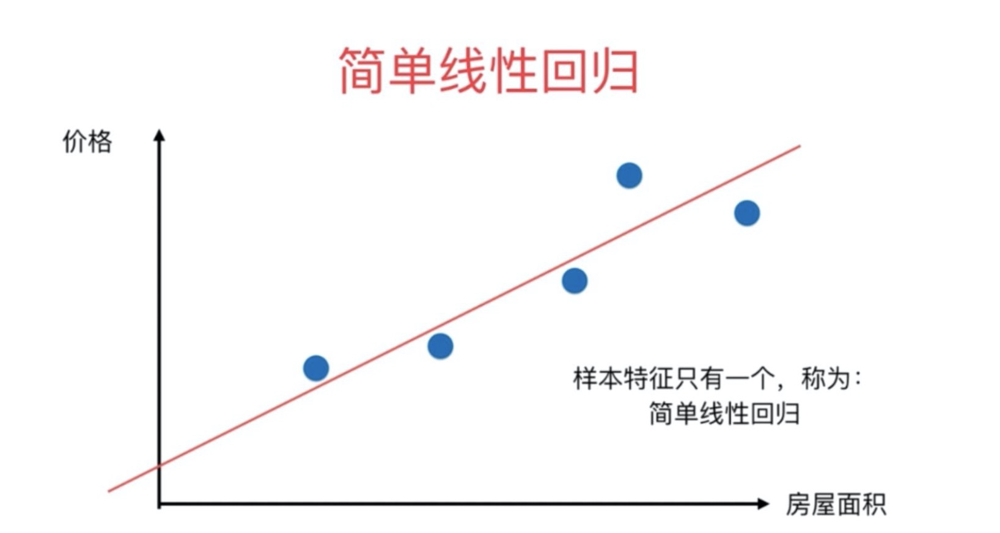

#### 1.5、多元线性回归

&emsp;&emsp;现实生活中，往往影响结果 y 的因素不止一个，这时 x 就从一个变成了 n 个，$X_1$...$X_n$ 同时简单线性回归的公式也就不在适用了。**多元线性回归**公式如下：

&emsp;&emsp;$\hat{y} = w_1X_1 + w_2X_2 + …… + w_nX_n + b$

&emsp;&emsp;b是截距，也可以使用$w_0$来表示

&emsp;&emsp;$\hat{y} = w_1X_1 + w_2X_2 + …… + w_nX_n + w_0$

&emsp;&emsp;$\hat{y} = w_1X_1 + w_2X_2 + …… + w_nX_n + w_0 * 1$

&emsp;&emsp;使用向量来表示，X表示所有的变量，是一维向量；W表示所有的系数（包含$w_0$），是一维向量，根据向量乘法规律，可以这么写：

&emsp;&emsp;$\hat{y} = W^TX$

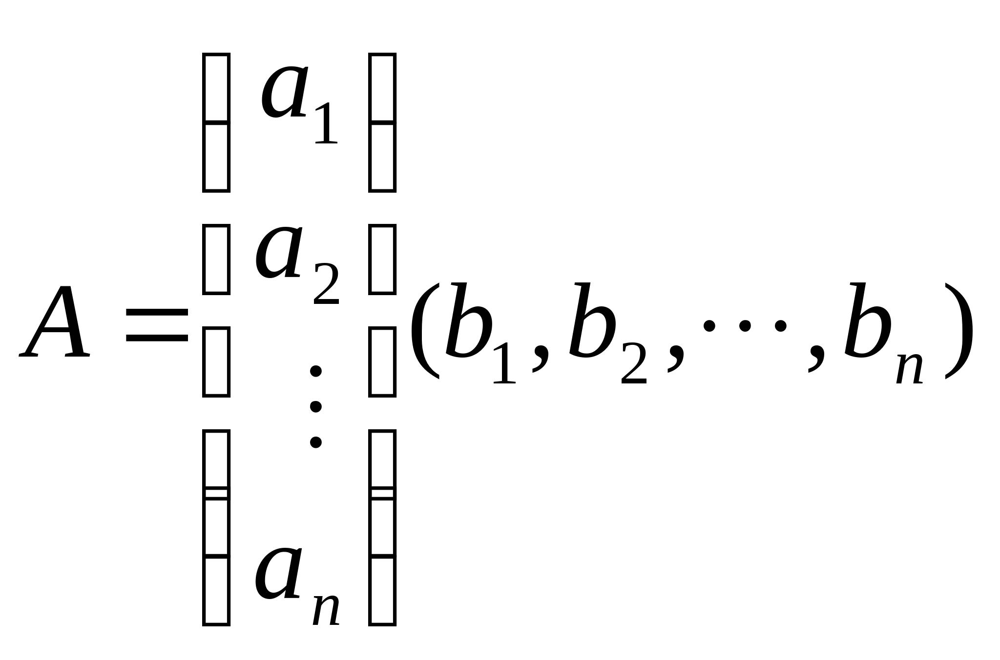

### 2、正规方程

#### 2.1、最小二乘法矩阵表示

&emsp;&emsp;**最小二乘法**可以将误差方程转化为有确定解的**代数方程组**（其方程式数目正好等于未知数的个数），从而可求解出这些未知参数。这个有确定解的代数方程组称为最小二乘法估计的**正规方程**。公式如下：

$\theta = (X^TX)^{-1}X^Ty$ 或者 $W = (X^TX)^{-1}X^Ty$ ，其中的$W、\theta$ 即使方程的解！

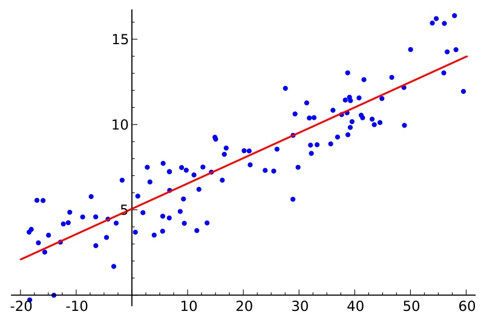

公式是如何**推导**的？

最小二乘法公式如下：

$J(\theta) = \frac{1}{2}\sum\limits_{i = 0}^n(h_{\theta}(x_i) - y_i)^2$

使用矩阵表示：

<font size = 12 color = 'green'>$J(\theta) = \frac{1}{2}\sum\limits_{i = 0}^n(h_{\theta(x_i)} - y)(h_{\theta(x_i)} - y)$</font>

<font size = 12 color = 'green'>$J(\theta) = \frac{1}{2}(X\theta - y)^T(X\theta - y)$</font>


之所以要使用转置T，是因为，矩阵运算规律是：矩阵A的一行乘以矩阵B的一列！

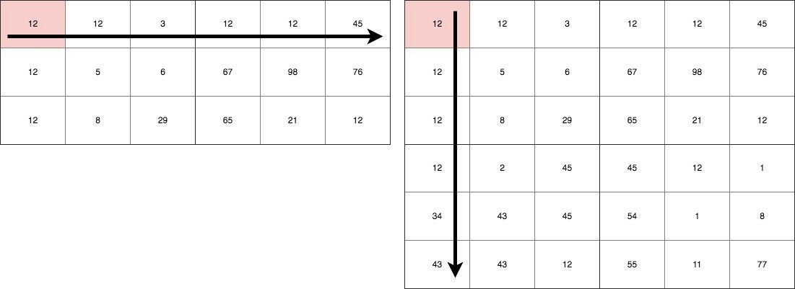


#### 2.2、多元一次方程举例

1、二元一次方程

<font size = 6 >
$\begin{cases}
x + y=14\\  2x - y = 10\\
\end{cases}$</font>


2、三元一次方程

<font size = 6>
$\begin{cases}
x - y + z = 100\\ 2x + y -z = 80\\ 3x - 2y + 6z = 256\\
\end{cases}$</font>


3、八元一次方程

<font size= 5>$\left\{\begin{align}&14x_2 + 8x_3 + 5x_5 + -2x_6 + 9x_7 + -3x_8  = 339\\&-4x_1 + 10x_2 + 6x_3 + 4x_4 + -14x_5 + -2x_6 + -14x_7 + 8x_8  = -114\\&-1x_1 + -6x_2 + 5x_3 + -12x_4 + 3x_5 + -3x_6 + 2x_7 + -2x_8  = 30\\&5x_1 + -2x_2 + 3x_3 + 10x_4 + 5x_5 + 11x_6 + 4x_7 + -8x_8  = 126\\&-15x_1 + -15x_2 + -8x_3 + -15x_4 + 7x_5 + -4x_6 + -12x_7 + 2x_8  = -395\\&11x_1 + -10x_2 + -2x_3 + 4x_4 + 3x_5 + -9x_6 + -6x_7 + 7x_8  = -87\\&-14x_1 + 4x_3 + -3x_4 + 5x_5 + 10x_6 + 13x_7 + 7x_8  = 422\\&-3x_1 + -7x_2 + -2x_3 + -8x_4 + -6x_6 + -5x_7 + -9x_8  = -309\end{align}\right.$</font>

```Python
# 上面八元一次方程对应的X数据
[[  0  14   8   0   5  -2   9  -3]
 [ -4  10   6   4 -14  -2 -14   8]
 [ -1  -6   5 -12   3  -3   2  -2]
 [  5  -2   3  10   5  11   4  -8]
 [-15 -15  -8 -15   7  -4 -12   2]
 [ 11 -10  -2   4   3  -9  -6   7]
 [-14   0   4  -3   5  10  13   7]
 [ -3  -7  -2  -8   0  -6  -5  -9]]
# 对应的y
[ 339 -114   30  126 -395  -87  422 -309]
```


#### 2.3、矩阵转置公式与求导公式：

**转置公式如下：**

* $(mA)^T = mA^T$，其中m是常数

* $(A + B)^T = A^T + B^T$

* $(AB)^T = B^TA^T$

* $(A^T)^T = A$

**求导公式如下：**

* $$\frac{\partial X^T}{\partial X} = I$$ 求解出来是单位矩阵
* $$\frac{\partial X^TA}{\partial X} = A$$
* $\frac{\partial AX^T}{\partial X} = A$
* $$\frac{\partial AX}{\partial X} = A^T$$
* $$\frac{\partial XA}{\partial X} = A^T$$
* $\frac{\partial X^TAX}{\partial X} = (A + A^T)X;$ A不是对称矩阵
* $\frac{\partial X^TAX}{\partial X} = 2AX;$ A是对称矩阵


#### 2.4、推导正规方程 $\theta$ 的解：

1. **矩阵乘法公式展开**

* <font size = 5 color = 'green'>$J(\theta) = \frac{1}{2}(X\theta - y)^T(X\theta - y)$</font>

* <font size = 5 color = 'green'>$J(\theta) = \frac{1}{2}(\theta^TX^T - y^T)(X\theta - y)$</font>

* <font size = 5 color = 'green'>$J(\theta) = \frac{1}{2}(\theta^TX^TX\theta - \theta^TX^Ty -y^TX\theta + y^Ty)$</font>

2. **进行求导（注意X、y是已知量，$\theta$ 是未知数）：**

* <font size = 5 color = 'green'>$J'(\theta) = \frac{1}{2}(\theta^TX^TX\theta - \theta^TX^Ty -y^TX\theta + y^Ty)'$</font>

3. **根据上面求导公式进行运算：**

* <font size = 5 color = 'green'>$J'(\theta) = \frac{1}{2}(X^TX\theta + (\theta^TX^TX)^T-X^Ty - (y^TX)^T)$</font>
* <font size = 5 color = 'green'>$J'(\theta) = \frac{1}{2}(X^TX\theta + X^TX\theta -X^Ty - X^Ty)$</font>
* <font size = 5 color = 'green'>$J'(\theta) = \frac{1}{2}(2X^TX\theta -2X^Ty)$</font>
* <font size = 5 color = 'green'>$J'(\theta) =X^TX\theta -X^Ty$</font>
* <font size = 5 color = 'green'>$J'(\theta) =X^T(X\theta -y)$</font>  矩阵运算分配律

4. **令导数$J'(\theta) = 0：$**

* <font size = 5 color = 'green'>$0 =X^TX\theta -X^Ty$</font>

* <font size = 5 color = 'green'>$X^TX\theta = X^Ty$</font>

5. **矩阵没有除法，使用逆矩阵进行转化：**

* <font size = 5 color = 'green'>$(X^TX)^{-1}X^TX\theta = (X^TX)^{-1}X^Ty$</font>
* <font size = 5 color = 'green'>$I\theta = (X^TX)^{-1}X^Ty$</font> 
* <font size = 5 color = 'green'>$\theta = (X^TX)^{-1}X^Ty$</font> 

到此为止，公式推导出来了~


#### 2.5、凸函数判定

判定损失函数是凸函数的好处在于我们可能很肯定的知道我们求得的极值即最优解，一定是全局最优解。

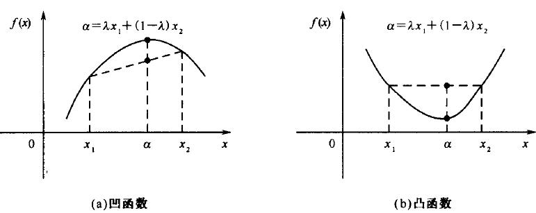

如果是非凸函数，那就不一定可以获取全局最优解~

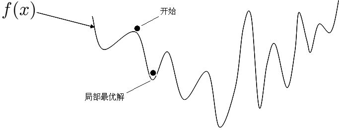

来一个更加立体的效果图：

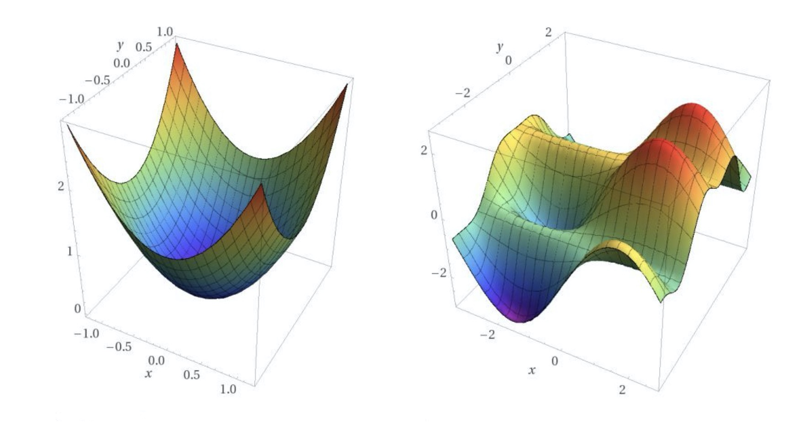

判定凸函数的方式: 判定凸函数的方式非常多，其中一个方法是看**黑塞矩阵**是否是**半正定**的。 

黑塞矩阵(hessian matrix)是由目标函数在点 X 处的二阶偏导数组成的对称矩阵。

对于我们的式子来说就是在导函数的基础上再次对θ来求偏导，结果就是 $X^TX$。所谓正定就是 $X^TX$ 的特征值全为正数，半正定就是 $X^TX$ 的特征值大于等于 0， 就是半正定。

<font size = 12 color = 'green'>$J'(\theta) =X^TX\theta -X^Ty$</font>

<font size = 12 color = 'green'>$J''(\theta) =X^TX$</font>

这里我们对 $J(\theta)$ 损失函数求二阶导数的黑塞矩阵是 $X^TX$ ，得到的一定是半正定的，自己和自己做点乘嘛！

这里不用数学推导证明这一点。在机器学习中往往损失函数都是**凸函数**，到**深度学习**中损失函数往往是**非凸函数**，即找到的解**未必**是全局最优，只要模型堪用就好！机器学习特点是：不强调模型 100% 正确，只要是有价值的，堪用的，就Okay！

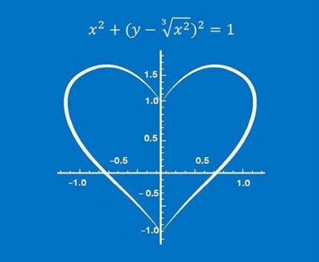

### 3、线性回归算法推导

#### 3.1、深入理解回归

&emsp;&emsp;**回归**简单来说就是“回归平均值”(regression to the mean)。但是这里的 mean 并不是把 历史数据直接当成未来的预测值，而是会把期望值当作预测值。 追根溯源**回归**这个词是一个叫高尔顿的人发明的，他通过大量观察数据发现:父亲比较高，儿子也比较高；父亲比较矮，那么儿子也比较矮！正所谓“龙生龙凤生凤老鼠的儿子会打洞”！但是会存在一定偏差~

&emsp;&emsp;父亲是 1.98，儿子肯定很高，但有可能不会达到1.98
&emsp;&emsp;父亲是 1.69，儿子肯定不高，但是有可能比 1.69 高

&emsp;&emsp;大自然让我们**回归**到一定的区间之内，这就是**大自然神奇**的力量。

&emsp;&emsp;高尔顿是谁?**达尔文**的表弟，这下可以相信他说的十有八九是**对的**了吧！

&emsp;&emsp;人类社会很多事情都被大自然这种神奇的力量只配置：身高、体重、智商、相貌……

&emsp;&emsp;这种神秘的力量就叫**正态分布**。大数学家高斯，深入研究了正态分布，最终推导出了线性回归的原理：**最小二乘法**！

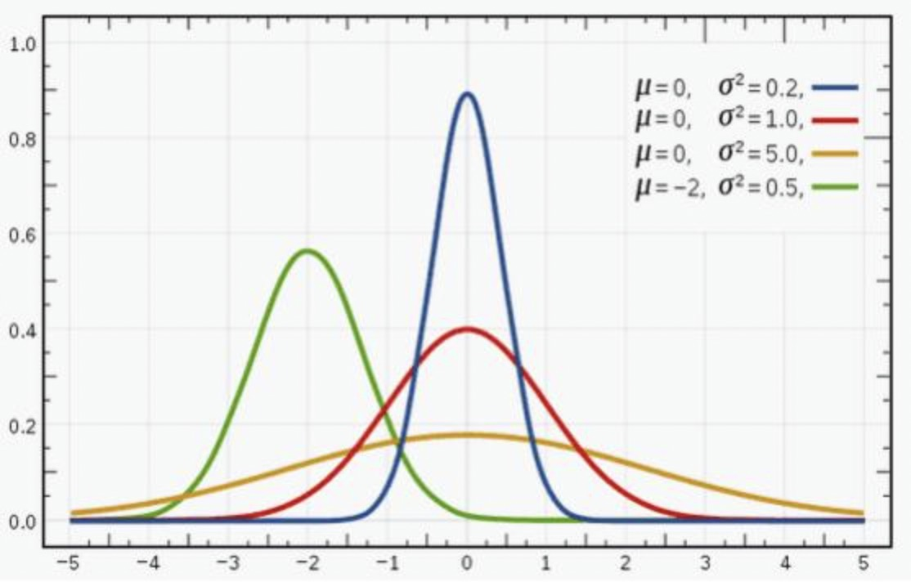


&emsp;&emsp;接下来，我们跟着高斯的足迹继续向下走~

#### 3.2、误差分析

&emsp;&emsp;误差 $\varepsilon_i$ 等于第 i 个样本实际的值 $y_i$ 减去预测的值 $\hat{y}$ ，公式可以表达为如下：

&emsp;&emsp;$\varepsilon_i = |y_i - \hat{y}|$

&emsp;&emsp;$\varepsilon_i = |y_i - W^Tx_i|$

&emsp;&emsp;假定所有的样本的误差都是**独立的**，有上下的震荡，震荡认为是随机变量，足够多的随机变量叠加之后形成的分布，它服从的就是正态分布，因为它是正常状态下的分布，也就是高斯分布！**均值**是某一个值，**方差**是某一个值。 方差我们先不管，均值我们总有办法让它去等于零 0 的，因为我们这里是有截距b， 所有误差我们就可以认为是独立分布的，1<=i<=n，服从均值为 0，方差为某定值的**高斯分布**。机器学习中我们**假设**误差符合均值为0，方差为定值的正态分布！！！

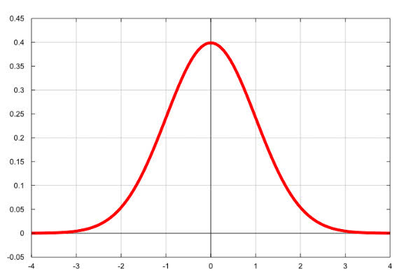

#### 3.3、最大似然估计

&emsp;&emsp;最大似然估计(maximum likelihood estimation, MLE)一种重要而普遍的求估计量的方法。**最大似然估计**明确地使用概率模型，其目标是寻找能够以较高概率产生观察数据的系统发生树。最大似然估计是一类完全基于**统计**的系统发生树重建方法的代表。

&emsp;&emsp;是不是，有点看不懂，**太学术**了，我们举例说明~

&emsp;&emsp;假如有一个罐子，里面有**黑白**两种颜色的球，数目多少不知，两种颜色的**比例**也不知。我们想知道罐中白球和黑球的比例，但我们**不能**把罐中的球全部拿出来数。现在我们可以每次任意从已经**摇匀**的罐中拿一个球出来，**记录**球的颜色，然后把拿出来的球再**放回**罐中。这个过程可以**重复**，我们可以用记录的球的颜色来估计罐中黑白球的比例。假如在前面的一百次重复记录中，有七十次是白球，请问罐中白球所占的比例**最有可能**是多少？


请告诉我答案！


很多小伙伴，甚至不用算，凭感觉，就能给出答案：**70%**！


 **下面是详细推导过程：**

* 最大似然估计，计算

* 白球概率是p，黑球是1-p（罐子中非黑即白）

* 罐子中取一个请问是白球的概率是多少？
  * $$p$$
  
* 罐子中取两个球，两个球都是白色，概率是多少？
  * $$p^2$$
  
* 罐子中取5个球都是白色，概率是多少？
  * $$p^5$$
  
* 罐子中取10个球，9个是白色，一个是黑色，概率是多少呢？
  
  
  
  * $C_{10}^1 = C_{10}^1$ 这个两个排列组合公式是**相等的**~
  * $$C_{10}^9p^9(1-p) = C_{10}^1p^9(1-p)$$
  
* 罐子取100个球，70次是白球，30次是黑球，概率是多少？
  * $$P = C_{100}^{30}p^{70}(1-p)^{30}$$

* 最大似然估计，什么时候P最大呢？

  $C_{100}^{30}$是常量，可以**去掉**！

  p > 0，1- p > 0，所以上面概率想要求最大值，那么求**导数**即可！

* $$P' = 70*p^{69}*(1-p)^{30} + p^{70}*30*(1-p)^{29}*(-1)$$

  **令导数为0：**

* $$0 = 70*p^{69}*(1-p)^{30} +p^{70}*30*(1-p)^{29}*(-1)$$

  **公式化简：**

* $$0 = 70*(1-p) - p*30$$

* $$0 = 70 - 100*p$$

* **p = 70%**

#### 3.4、高斯分布-概率密度函数

最常见的连续概率分布是**正态分布**，也叫**高斯分布**，而这正是我们所需要的，其概率密度函数如下:

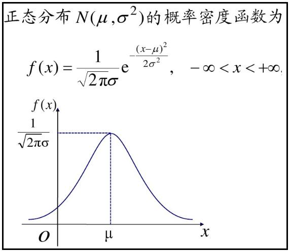

公式如下：

<font size = 6>$f(x|\mu,\sigma^2) = \frac{1}{\sqrt{2\pi}\sigma}e^{-\frac{(x - \mu)^2}{2\sigma^2}}$</font>


随着参数μ和σ**变化**，概率分布也产生变化。 下面重要的步骤来了，我们要把一组数据误差出现的**总似然**，也就是一组数据之所以对应误差出现的**整体可能性**表达出来了，因为数据的误差我们假设服从一个高斯分布，并且通过**截距**项来平移整体分布的位置从而使得**μ=0**，所以样本的误差我们可以表达其概率密度函数的值如下:

<font size = 20 color = 'green'>$f(\varepsilon|\mu = 0,\sigma^2) = \frac{1}{\sqrt{2\pi}\sigma}e^{-\frac{(\varepsilon - 0)^2}{2\sigma^2}}$</font>

**简化**如下：

<font size = 20 color = 'green'>$f(\varepsilon| 0,\sigma^2) = \frac{1}{\sqrt{2\pi}\sigma}e^{-\frac{\varepsilon ^2}{2\sigma^2}}$</font>

#### 3.5、误差总似然

和前面黑球白球问题**类似**，也是一个**累乘**问题~

<font size = 6>$P = \prod\limits_{i = 0}^{n}f(\varepsilon_i|0,\sigma^2) = \prod\limits_{i = 0}^{n}\frac{1}{\sqrt{2\pi}\sigma}e^{-\frac{\varepsilon_i ^2}{2\sigma^2}}$</font>


&emsp;&emsp;根据前面公式$\varepsilon_i = |y_i - W^Tx_i|$可以推导出来如下公式：

<font size = 6>$P = \prod\limits_{i = 0}^{n}f(\varepsilon_i|0,\sigma^2) = \prod\limits_{i = 0}^{n}\frac{1}{\sqrt{2\pi}\sigma}e^{-\frac{(y_i - W^Tx_i)^2}{2\sigma^2}}$</font>

公式中的**未知变量**就是$W^T$，即方程的系数，系数包含截距~如果，把上面当成一个方程，就是概率P关于W的方程！其余符号，都是常量！

<font size = 20 color = 'green'>$P_W= \prod\limits_{i = 0}^{n}\frac{1}{\sqrt{2\pi}\sigma}e^{-\frac{(y_i - W^Tx_i)^2}{2\sigma^2}}$</font>


现在问题，就变换成了，求**最大似然**问题了！不过，等等~

累乘的最大似然，求解是非常麻烦的！

接下来，我们通过，求**对数**把**累乘**问题，转变为**累加**问题（加法问题，无论多复杂，都难不倒我了！）

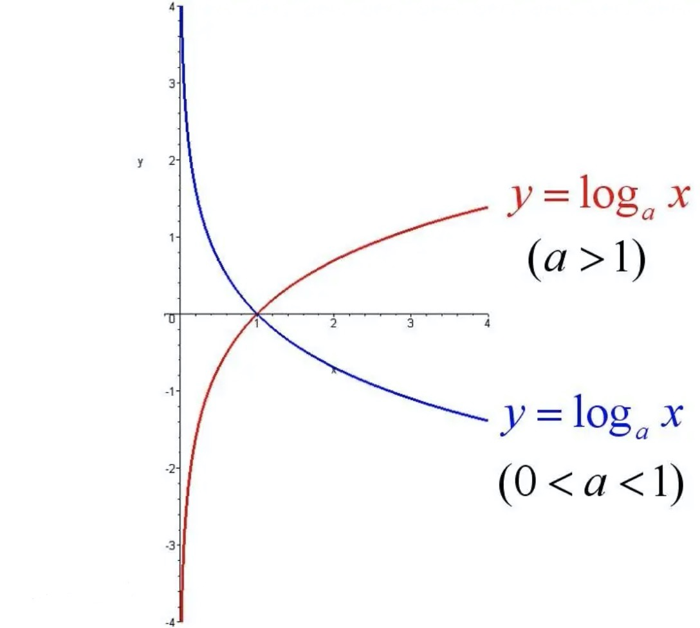

#### 3.6、最小二乘法MSE

$P_W = \prod\limits_{i = 0}^{n}\frac{1}{\sqrt{2\pi}\sigma}e^{-\frac{(y_i - W^Tx_i)^2}{2\sigma^2}}$

根据对数，单调性，对上面公式求自然底数e的对数，效果不变~

$log_e(P_W) = log_e(\prod\limits_{i = 0}^{n}\frac{1}{\sqrt{2\pi}\sigma}e^{-\frac{(y_i - W^Tx_i)^2}{2\sigma^2}})$

接下来 log 函数继续为你带来惊喜，数学上连乘是个大麻烦，即使交给计算机去求解它也得**哭出声来**。惊喜是:

* $log_a(XY) = log_aX + log_aY$
* $log_a\frac{X}{Y} = log_aX - log_aY$
* $log_aX^n = n*log_aX$
* $log_a(X_1X_2……X_n) = log_aX_1 + log_aX_2 + …… + log_aX_n$
* $log_xx^n = n(n\in R)$
* $log_a\frac{1}{X} = -log_aX$
* $log_a\sqrt[x]{N^y} = \frac{y}{x}log_aN$


$log_e(P_W) = log_e(\prod\limits_{i = 0}^{n}\frac{1}{\sqrt{2\pi}\sigma}e^{-\frac{(y_i - W^Tx_i)^2}{2\sigma^2}})$

&emsp;&emsp;&emsp;&emsp;&emsp;&emsp;<font color = 'green'>$=\sum\limits_{i = 0}^{n}log_e(\frac{1}{\sqrt{2\pi}\sigma}e^{-\frac{(y_i - W^Tx_i)^2}{2\sigma^2}})$</font>累乘问题变成**累加**问题~


**乘风破浪，继续推导--->**


&emsp;&emsp;&emsp;&emsp;&emsp;&emsp;<font size = 12 color = 'red'>$=\sum\limits_{i = 0}^{n}(log_e\frac{1}{\sqrt{2\pi}\sigma} - \frac{(y_i - W^Tx_i)^2}{2\sigma^2})$</font>

&emsp;&emsp;&emsp;&emsp;&emsp;&emsp;<font size = 12 color = 'green'>$=\sum\limits_{i = 0}^{n}(log_e\frac{1}{\sqrt{2\pi}\sigma} - \frac{1}{\sigma^2}\cdot\frac{1}{2}(y_i - W^Tx_i)^2)$</font>


上面公式是最大似然求对数后的变形，其中$\pi、\sigma$都是常量，而$(y_i - W^Tx_i)^2$肯定大于**零**！上面求最大值问题，即可转变为如下求**最小值**问题：

$L(W) = \frac{1}{2}\sum\limits_{i = 0}^n(y^{(i)} - W^Tx^{(i)})^2$   L代表Loss，表示损失函数，损失函数**越小**，那么上面最大似然就**越大**~

有的书本上公式，也可以这样写，用$J(\theta)$表示一个意思，$\theta$ 的角色就是W：

$J(\theta) = \frac{1}{2}\sum\limits_{i = 1}^n(y^{(i)} - \theta^Tx^{(i)})^2 = \frac{1}{2}\sum\limits_{i = 1}^n(\theta^Tx^{(i)} - y^{(i)})^2$

**进一步提取：**

<font size = 12 color = 'purple'>$J(\theta) = \frac{1}{2}\sum\limits_{i = 1}^n(h_{\theta}(x^{(i)}) - y^{(i)})^2$</font>

其中：

&emsp;&emsp;$\hat{y} = h_{\theta}(X) =X \theta$ 表示全部数据，是矩阵，X表示多个数据，进行矩阵乘法时，放在前面

&emsp;&emsp;$\hat{y}_i = h_{\theta}(x^{(i)}) = \theta^Tx^{(i)}$ 表示第i个数据，是向量，所以进行乘法时，其中一方需要转置

因为最大似然公式中有个**负号**，所以最大总似然变成了**最小化**负号后面的部分。 到这里，我们就已经推导出来了 MSE 损失函数$J(\theta)$，从公式我们也可以看出来 MSE 名字的来 历，mean squared error，上式也叫做最小二乘法！

#### 3.7、归纳总结升华

&emsp;&emsp;这种最小二乘法估计，其实我们就可以认为，假定了误差服从正太分布，认为样本误差的出现是随机的，独立的，使用最大似然估计思想，利用损失函数最小化 MSE 就能求出最优解！所以反过来说，如果我们的数据误差不是互相独立的，或者不是随机出现的，那么就不适合去假设为正太分布，就不能去用正太分布的概率密度函数带入到总似然的函数中，故而就不能用 MSE 作为损失函数去求解最优解了！所以，最小二乘法不是万能的~

&emsp;&emsp;还有譬如假设误差服从泊松分布，或其他分布那就得用其他分布的概率密度函数去推导出损失函数了。

&emsp;&emsp;所以有时我们也可以把线性回归看成是广义线性回归。比如，逻辑回归，泊松回归都属于广义线性回归的一种，这里我们线性回归可以说是最小二乘线性回归。


### 4、线性回归实战

#### 4.1、使用正规方程进行求解

##### 4.1.1、简单线性回归

<font size = 20>$y = wx + b$</font>

一元一次方程，在机器学习中一元表示一个特征，b表示截距，y表示目标值。

```Python
import numpy as np
import matplotlib.pyplot as plt
# 转化成矩阵
X = np.linspace(0,10,num = 30).reshape(-1,1)
# 斜率和截距，随机生成
w = np.random.randint(1,5,size = 1)
b = np.random.randint(1,10,size = 1)
# 根据一元一次方程计算目标值y，并加上“噪声”，数据有上下波动~
y = X * w + b + np.random.randn(30,1)
plt.scatter(X,y)
# 重新构造X，b截距，相当于系数w0，前面统一乘以1
X = np.concatenate([X,np.full(shape = (30,1),fill_value= 1)],axis = 1)
# 正规方程求解
θ = np.linalg.inv(X.T.dot(X)).dot(X.T).dot(y).round(2)
print('一元一次方程真实的斜率和截距是：',w, b)
print('通过正规方程求解的斜率和截距是：',θ)
# 根据求解的斜率和截距绘制线性回归线型图
plt.plot(X[:,0],X.dot(θ),color = 'green')
```

效果如下（random.randn是随机生成正太分布数据，所以每次执行图形会有所不同）：


##### 4.1.2、多元线性回归

<font size = 20>$y = w_1x_1 + w_2x_2 + b$</font>

二元一次方程，$x_1、x_2$ 相当于两个特征，b是方程截距

```Python
import numpy as np
import matplotlib.pyplot as plt
from mpl_toolkits.mplot3d.axes3d import Axes3D # 绘制三维图像
# 转化成矩阵
x1 = np.random.randint(-150,150,size = (300,1))
x2 = np.random.randint(0,300,size = (300,1))
# 斜率和截距，随机生成
w = np.random.randint(1,5,size = 2)
b = np.random.randint(1,10,size = 1)
# 根据二元一次方程计算目标值y，并加上“噪声”，数据有上下波动~
y = x1 * w[0] + x2 * w[1] + b + np.random.randn(300,1)
fig = plt.figure(figsize=(9,6))
ax = Axes3D(fig)
ax.scatter(x1,x2,y) # 三维散点图
ax.view_init(elev=10, azim=-20) # 调整视角
# 重新构造X，将x1、x2以及截距b，相当于系数w0，前面统一乘以1进行数据合并
X = np.concatenate([x1,x2,np.full(shape = (300,1),fill_value=1)],axis = 1)
w = np.concatenate([w,b])
# 正规方程求解
θ = np.linalg.inv(X.T.dot(X)).dot(X.T).dot(y).round(2)
print('二元一次方程真实的斜率和截距是：',w)
print('通过正规方程求解的斜率和截距是：',θ.reshape(-1))
# # 根据求解的斜率和截距绘制线性回归线型图
x = np.linspace(-150,150,100)
y = np.linspace(0,300,100)
z = x * θ[0] + y * θ[1] + θ[2]
ax.plot(x,y,z ,color = 'red')
```

效果如下：

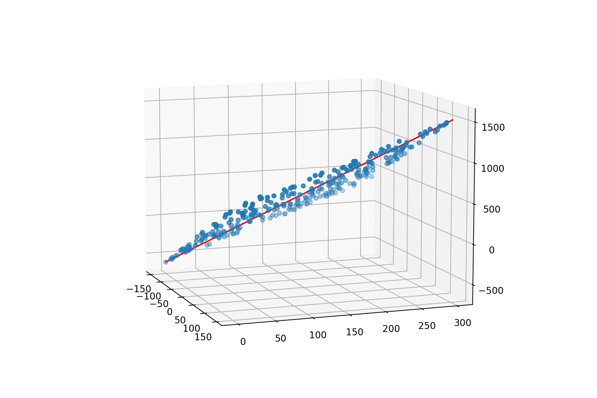

#### 4.2、机器学习库scikit-learn

##### 4.2.1、[scikit-learn简介](https://scikit-learn.org/stable/index.html)

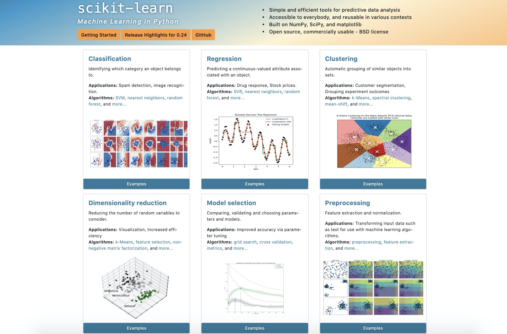

##### 4.2.2、scikit-learn实现简单线性回归

```Python
from sklearn.linear_model import LinearRegression
import numpy as np
import matplotlib.pyplot as plt
# 转化成矩阵
X = np.linspace(0,10,num = 30).reshape(-1,1)
# 斜率和截距，随机生成
w = np.random.randint(1,5,size = 1)
b = np.random.randint(1,10,size = 1)
# 根据一元一次方程计算目标值y，并加上“噪声”，数据有上下波动~
y = X * w + b + np.random.randn(30,1)
plt.scatter(X,y)
# 使用scikit-learn中的线性回归求解
model = LinearRegression()
model.fit(X,y)
w_ = model.coef_
b_ = model.intercept_
print('一元一次方程真实的斜率和截距是：',w, b)
print('通过scikit-learn求解的斜率和截距是：',w_,b_)
plt.plot(X,X.dot(w_) + b_,color = 'green')
```

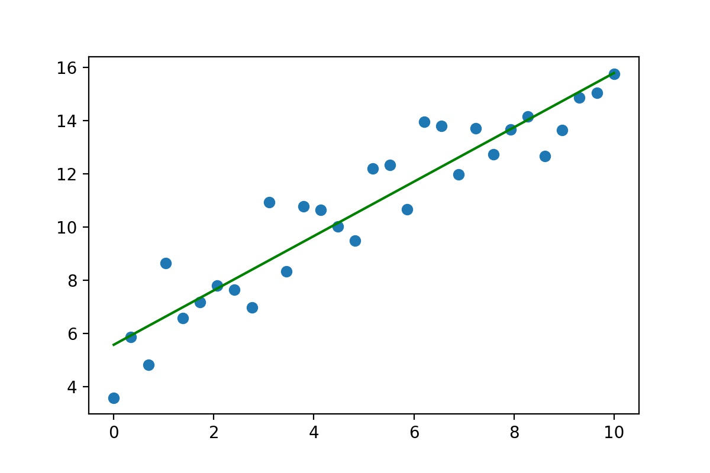

##### 4.2.3、scikit-learn实现多元线性回归

```Python
import numpy as np
import matplotlib.pyplot as plt
from mpl_toolkits.mplot3d.axes3d import Axes3D
# 转化成矩阵
x1 = np.random.randint(-150,150,size = (300,1))
x2 = np.random.randint(0,300,size = (300,1))
# 斜率和截距，随机生成
w = np.random.randint(1,5,size = 2)
b = np.random.randint(1,10,size = 1)
# 根据二元一次方程计算目标值y，并加上“噪声”，数据有上下波动~
y = x1 * w[0] + x2 * w[1] + b + np.random.randn(300,1)
fig = plt.figure(figsize=(9,6))
ax = Axes3D(fig)
ax.scatter(x1,x2,y) # 三维散点图
ax.view_init(elev=10, azim=-20) # 调整视角
# 重新构造X，将x1、x2以及截距b，相当于系数w0，前面统一乘以1进行数据合并
X = np.concatenate([x1,x2],axis = 1)
# 使用scikit-learn中的线性回归求解
model = LinearRegression()
model.fit(X,y)
w_ = model.coef_.reshape(-1)
b_ = model.intercept_
print('二元一次方程真实的斜率和截距是：',w,b)
print('通过scikit-learn求解的斜率和截距是：',w_,b_)
# # 根据求解的斜率和截距绘制线性回归线型图
x = np.linspace(-150,150,100)
y = np.linspace(0,300,100)
z = x * w_[0] + y * w_[1] + b_
ax.plot(x,y,z ,color = 'green')
```

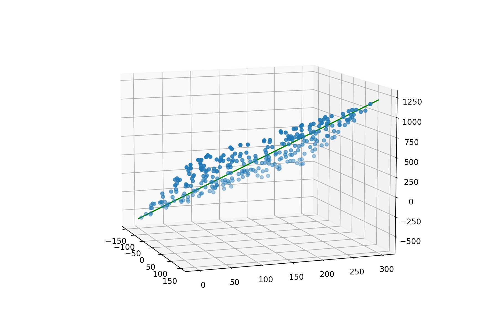

